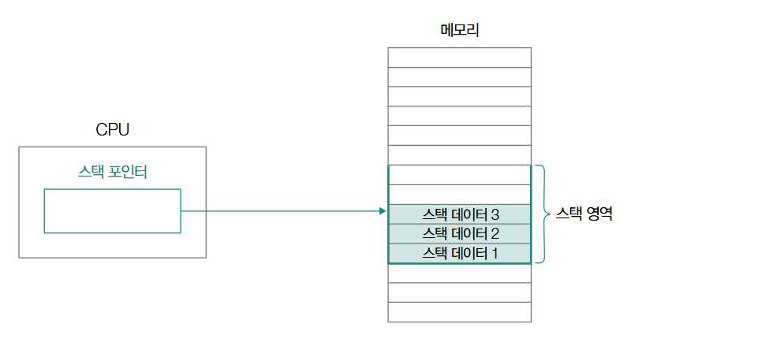

# 컴퓨터 구조
## 1. 컴퓨터 구조의 큰 그림

- 데이터: 숫자, 문자, 이미지 등 **정적인 정보**
  - 명령어에 종속적인 정보
- 명령어: 데이터를 활용해 동작을 지정
  - 명령어를 이해하고 실행하는 주체는 **CPU**

### 컴퓨터의 핵심 부품
: CPU(중앙처리장치), 메모리(주기억장치), 캐시메모리, 보조기억장치, 입출력장치
1. CPU
  - 데이터와 명령어 등 정보를 **읽고 해석하고 실행하는 부품**
  - Central Processing Unit
  
  - 산술논리연산장치(ALU, Arithmetic and Logic Unit)
    - 연산을 수행할 회로로 구성되어 있는 일종의 계산기
  - 제어장치(CU, Control Unit)
    - 명령어를 해석해 **제어 신호(control signal)**를 통해 부품을 작동시킴
  - 레지스터(register)
    - CPU 내부의 임시 저장장치

2. 메모리와 캐시 메모리
: **메인 메모리** 역할을 하는 하드웨어는 RAM, ROM
  -> 일반적으로 '(메인)메모리'는 RAM을 지칭

  - 메모리 = 현재 **실행 중인 프로그램**을 구성하는 데이터와 명령어를 저장하는 부품
  * 메모리는 휘발성 저장장치로 메모리에 저장된 정보는 컴퓨터의 전원이 꺼지면 모두 삭제
  
  **캐시 메모리**
  -> CPU가 메모리에 저장된 값에 조금이라도 더 빨리 접근하기 위해 사용하는 저장장치

3. 보조 기억장치
: 전원이 꺼져도 저장된 데이터가 사라지지 않는 비휘발성 저장장치
-> CD-ROM, DVD, 하드디스크, SSD, USB 등

4. 입출력장치
: 컴퓨터 외부에 연결되어 내부와 정보를 교환하는 장치
-> 마우스, 키보드, 마이크 등 입력장치 / 스피커, 모니터, 프린터 등 출력장치

5. 메인 보드와 버스
: 부품들을 고정하고 연결하는 기판(메인보드), 각 부품이 정보를 주고받는 통로(버스)

## 2. 컴퓨터가 이해하는 정보


### 데이터 - 0과 1로 숫자 표현하기
: 컴퓨터는 정보를 이해하기 위해 2진법 혹은 16진법 사용

-> Not Equal 출럭
-> 컴퓨터는 **부동 소수점** 표현 방식(IEEE 754) 사용, 정밀도에 한계가 있다.

EX)
```
1101011.1010101은 110101110.10101 * 2^-2가 아닌 1.1010111010101 * 2^6으로 저장
```


### 데이터 - 0과 1로 문자 표현하기
문자 인코딩: 문자를 0과 1로 이루어진 문자 코드로 변환하는 과정
문자 디코딩: 0과 1로 표현된 무자를 사람이 이해하는 문자로 변환하는 과정
-> 가장 기본적인 문자 집합에는 **아스키(ASCII)**가 있다.

1. 아스키 코드
- 0부터 127까지의 숫자 중 하나의 고유한 수에 대응되는 문자들


2. 유니코드
- 한글을 포함해 EUC-KR에 비해 훨씬 많은 언어, 특수문자, 화살표, 이모티콘까지 코드로 표현할 수 있는 통일된 무자 집합
- **UTF-8, UTF-16, UTF-32** 등의 **가변 길이 인코딩** 방식 사용
- **base64** 인코딩: 데이터를 아스키 문자 형태로 표현하는 인코딩 방식

### 명령어
: 명령어는 **수행할 동작**과 **수행할 대상**으로 이루어져 있다.

- 연산 코드: 명령어가 수행할 동작

- 오퍼랜드: 동작에 사용될 데이터 혹은 동작에 사용될 데이터가 저장된 위치

### 기계어와 어셈블리어
- 기계어: 0과 1로 표현된 정보를 있는 그대로 표현한 언어
- 어셈블리어: 0과 1로 표현된 기계어를 읽기 편한 형태로 단순 번역한 언어

### 명령어 사이클
: CPU가 명령어를 처리하는 과정에서 프로그램 속 명령어가 실행되는 주기
- 인출 사이클: 메모리에 있는 명령어를 CPU에서 가지고 오는 단계
- 실행 사이클: CPU로 가져온 명령어를 실행하는 단계
- 간접 사이클: 명령어를 실행하기 위해 한 번 더 메모리에 접근하는 단계
- 인터럽트 사이클: 인터럽트를 처리하는 사이클

## 3. CPU
### 레지스터
- CPU 내 작은 임시 저장장치
1. 프로그램 카운터
  - 메모리에서 다음으로 읽어들일 명령어의 주소를 저장
  - 명령어 포인터라고 부르기도 함
  - 일반적으로 1씩 증가(1씩 증가하기 때문에 메모리에 저장된 프로그램이 순차적으로 실행됨)
  
  ** 조건문이나 리턴문 같은 경우는 순차적으로 실행되지 않기 때문에 임의의 위치로 변경되기도 함
  

2. 명령어 레지스터
  - 해석할 명령어(메모리에서 읽어들인 명령어)를 저장하는 레지스터
  - 해석 후 ALU(산술논리연산장치)로 연산을 시키거나 다른 부품으로 제어 신호를 보내 작동시킴

3. 범용 레지스터
  - 일반적인 상황에서 자유롭게 사용할 수 있는 레지스터
  - 데이터, 명령어, 주소 모두 저장 가능

4. 플래그 레지스터
  - 연산 결과 혹은 플래그(CPU 상태에 대한 부가 정보)값을 저장하는 레지스터
  

5. 스택 포인터
  - 메모리 내 스택 영역의 최상단 스택 데이터 위치를 가리키는 특별한 레지스터
  

### 인터럽트
: CPU의 작업을 방해하는 신호, 동기 인터럽트(Exception)와 비동기 인터럽트(입출력 문제)로 나뉨

1. 하드웨어 인터럽트
  - CPU는 효율적으로 명령어를 처리하기 위해 하드웨어 인터럽트 사용
  ```
  1) 입출력장치는 CPU에게 인터럽트 요청 신호 보냄
  2) CPU는 실행 사이클 후 명령어 인출 전 인터럽트 여부 확인
  3) CPU는 인터럽트 요청 확인 후 인터럽트 플래그로 받아들일 수 있는지 여부 확인
  4) 인터럽트를 받아들일 수 있다면 작업 백업
  5) CPU는 인터럽트 벡터를 참조해 인터럽트 서비스 루틴 실행
  6) 인터럽트 서비스 루틴 실행 후 백업해 둔 작업 복구해 실행 재개
  ```
  - 인터럽트 요청 신호: CPU에 인터럽트 가능 여부 확인하는 것
  - 인터럽트 플래그: 하드웨어 인터럽트를 받아들일지, 무시할지 결정하는 플래그. 플래그 레지스터에 존재
  - 인터럽트 서비스 루틴: 인터럽트를 처리하기 위한 프로그램, 인터럽트 핸들러라고도 불림. 인터럽트 발생 시 어떻게 처리하고 작동할지에 대한 정보
  
  - 인터럽트 벡터: 인터럽트 서비스 루틴을 식별하기 위한 정보. 장치에서 인터럽트와 함께 CPU로 전송하면 메모리에서 해당 인터럽트 서비스 루틴 찾아 실행. 이 때 작동하던 작업 백업은 메모리 내 스택에 저장됨

2. 예외
  - 예외(동기 인터럽트)의 종류에는 폴트, 트랩, 중단, 소프트웨어 인터럽트 등이 존재
  - 폴트: 예외 처리 직후 예외가 발생한 명령어부터 실행을 재개하는 예외
  - 트랩: 예외 처리 직후 예외 발생한 명령어 다음 명령어부터 실행 재개하는 예외
  - 중단: CPU가 실행중인 프로그램을 강제로 중단시킬 수 밖에 없는 심각한 오류 발견했을 때 발생하는 예외
  - 소프트웨어 인터럽트: 시스템 콜이 발생했을 때 발생하는 예외

### CPU 성능 향상을 위한 설계
1. CPU 클럭 속도
  - 클럭: 컴퓨터의 부품을 움직일 수 있게 하는 시간의 단위, Hz 단위로 측정, CPU의 속도 단위로 간주되기도 함

2. 멀티코어와 멀티스레드
  - 코어: CPU 내 명령어를 읽어들이고, 해석하고, 실행하는 부품
  - 멀티코어 CPU / 멀티코어 프로세서: 여러 개의 코어를 포함하고 있는 CPU
  - 스레드: 실행 흐름의 단위
    - 하드웨어 스레드: 하나의 코어가 동시에 처리하는 명령어의 단위
    -> 부품 하나가 한 번에 하나의 명령어를 처리한다면 1코어 1스레드 CPU
    -> 부품 두 개가 4개의 명령어를 처리한다면 2코어 4스레드 CPU
    - 소프트웨어 스레드: 하나의 프로그램에서 독립적으로 실행되는 단위
    - 병렬설: 작업을 물리적으로 동시에 처리하는 성질. EX) 하드웨어 스레드가 4개인 CPU가 4개의 명령어를 동시에 실행하는 경우
    - 동시성: 동시에 작업을 처리하는 것처럼 보이는 성질. EX) CPU가 빠르게 작업을 번갈아가며 처리할 경우 동시에 처리되는 것처럼 보이지만 물리적으로 같은 시점에 여러 작업이 동시에 처리되고 있는 것은 아님
    

### 파이프라이닝을 통한 명령어 병렬 처리
: **명령어 병렬 처리 기법**은 여러 명령어를 동시에 처리해 CPU를 계속 작동시켜 성능을 높이는 기법
1. 명령어 인출
2. 명령어 해석
3. 명령어 실행
4. 결과 저장
-> 하나의 명령어가 처리되는 과정
-> 같은 단계가 겹치지만 않는다면 CPU가 각각의 단계를 동시에 실행할 수 있다.

- CISC(Complex Instruction Set Computer)
  - 다채로운 기능을 지원하는 복잡한 명령어들로 구성된 명령어 집합
- RISC(Reduced Instruction Set Computer)
  - CISC에 비해 활용 가능한 명령어 종류 적음(짧고 규격화된 명령어-1클럭 내외로 실행되는 명령어-지향)

※ 파이프라이닝이 CPU 성능 향상에 실패하는 경우
  - 파이프라인 위험 상황이라고 부름
  - 데이터 위험: 명령어 간 데이터 의존성에 의해 발생(의존성이 있는 두 명령어를 무작정 겹쳐서 실행 시 발생 가능)
  - 제어 위험: 프로그램 카운터의 갑작스러운 변화에 의해 발생, JUMP, CONDITIONAL JUMP, 인터럽트 등으로 프로그램 실행 흐름이 바뀌어 카운터 값에 갑작스러운 변화가 생기면 미리 인출하거나 해석중인 명령어들이 의미없어지게 되는 위험
  - 구조적 위험: 명령어들을 겹쳐 실행하는 과정에서 서로 다른 명령어가 동시에 ALU, 레지스터 등 같은 CPU 부품을 사용하려 할 때 발생

## 4. 메모리
### RAM
: 휘발성 저장장치, 용량이 클수록 보조기억장치로부터 많은 데이터를 가져와 미리 저장 가능해 동시에 많은 프로그램 실행하는 데 유리

1. DRAM
  - Dynamic RAM, 저장된 데이터가 동적으로 변하는 특성
  - 시간이 지나면 저장된 데이터가 점차 사라지는 RAM
  - 비교적 소비전력이 낮고 저렴하며 집적도가 높아 메모리의 대용량 설계가 용이하여 많이 사용됨

2. SRAM
  - Static RAM, 저장된 데이터가 변하지 않는 RAM
  - 시간이 지나도 저장된 데이터가 사라지지 않음
  - DRAM에 비해 속도는 빠르지만 소비 전력이 크고 비싸며 집적도도 낮지만, 속도가 빨라야 하는 저장장치(캐시 메모리 등)에 사용됨

3. SDRAM
  - 클럭 신호와 동기화된, 보다 발전된 형태의 DRAM

4. DDR SDRAM
  - Double Data Rate SDRAM, 대역폭을 넓혀 속도를 빠르게 만든 SDRAM
  - 대역폭: 데이터를 주고받을 길의 너비
  - SDRAM이 한 클럭 당 한 번씩 CPU와 데이터를 주고받는다면 DDR SDRAM은 두 배의 데역폭으로 주고받기 가능

### 메모리에 바이트를 밀어 넣는 순서 - 빅 엔디안과 리틀 엔디안
- 빅 엔디안: 낮은 번지의 주소에 상위 바이트부터 저장하는 방식
- 리틀 엔디안: 낮은 번지의 주소에 하위 바이트부터 저장하는 방식
- 빅 엔디안은 일상적으로 숫자 체계를 읽고 쓰는 순서와 동일해 메모리 값을 직접 읽거나 디버깅 시 편리
- 리틀 엔디안은 읽고 쓰기는 불편하지만 수치 계산이 편리

### 캐시 메모리
: CPU가 프로그램 실행 시 메모리에 빈번히 접근하게 되는데, 레지스터에 접근하는 속도보다 메모리에 접근하는 속도가 느려 연산 속도에 불리

- 캐시 메모리: CPU와 메모리 사이에 위치한 SRAM 기반의 저장장치
  - 코어와 가장 가까운 캐시 메모리를 L1 캐시, 그 다음으로 가장 가까운 캐시 메모리를 L2 캐시, 그 다음으로는 L3 캐시라고 함(L3 캐시만 코어 외부에 위치)
  -> 크기 - L1 < L2 < L3, 속도 - L1 > L2 > L3

1. 캐시 히트와 캐시 미스
  - 캐시 히트: 캐시 메모리가 예측하여 저장한 데이터가 CPU에 의해 실제 사용되는 경우
  - 캐시 미스: 틀린 예측으로 CPU가 메모리로부터 필요한 데이터를 직접 가져와야 하는 경우

2. 참조 지역성의 원리
  - 시간 지역성: CPU는 최근에 접근했던 메모리 공간에 다시 접근하려는 경향이 있다.
  - 공간 지역성: CPU는 접근한 메모리 공간의 근처에 접근하려는 경향이 있다.

3. 캐시 메모리의 쓰기 정책과 일관성
  - CPU가 캐시 메모리에 데이터를 쓸 때 일관성을 유지해야 함
  - CPU가 메모리에 저장된 값을 변경하려 할 때 직접 바꾸는 것은 캐시메모리의 값을 바꾸지 않기 때문에 예상치 못 한 결과가 나올 수 있다.
  - 즉시 쓰기: 캐시 메모리와 메모리에 동시에 쓰는 방법, 데이터를 쓸 때마다 메모리를 참조하여 버스의 사용 시간과 쓰기 시간이 늘어난다는 단점이 있다.
  - 지연 쓰기: 캐시 메모리에만 값을 써두었다가 추후 수정된 데이터를 한 번에 메모리에 반영하는 방법, 메모리와 캐시 메모리 간 일관성이 깨질 수 있다는 위험이 있다.

## 5. 보조기억장치와 입출력장치
### RAID
: 오늘 날 대중적으로 활용되고 있는 보조기억장치에는 하드디스크드라이브와 플래시 메모리 기반 저장장치가 있다.
1. RAID
  - 데이터의 안정성 혹은 성능을 확보하기 위해 여러 개의 독립적인 보조기억장치를 마치 하나의 보조기억장치처럼 사용하는 기술.
  - 하드디스크나 SSD로 RAID를 구성할 수 있다. 방법에 따라 RAID 레벨로 표현한다.

2. RAID0
  - 데이터를 여러 보조 기억장치에 단순하게 나누어 저장하는 구성 방식
  - 데이터가 줄무늬처럼 분산되어 저장되어 스트라입(stripe)이라고 하고, 저장하는 동작을 striping이라고 함
  - 빠른 입출력 속도가 장점이지만 저장된 정보가 안전하지 않다.

3. RAID1
  - 완벽한 복사본을 만들어 저장하는 구성 방식, 미러링이라고도 함
  - 복구가 간단하고 안정성이 높지만 사용 가능한 용량이 적어진다는 단점도 있다.

4. RAID4
  - 패리티 정보를 저장하는 디스크를 따로 두는 구성 방식
  - 패리티: 오류를 검출할 수 있는 정보
  - RAID1에 비해 적은 하드 디스크로도 안전하게 데이터 보관 가능
  - 패리티 저장 장치에 병목 현상이 발생한다는 단점이 존재

5. RAID5
  - 패리티를 분산하여 저장하는 구성방식
  - RAID4의 병목 현상을 보완

6. RAID6
  - 서로 다른 2개으 ㅣ패리티를 두는 구성 방식
  - 오류를 검출하고 복구할 수 있는 수단이 2개가 생긴 셈이라 안전성이 높음
  - 정보 저장 시 함께 저장할 패리티가 2개라 일반적으로 느린 속도

### 입출력 기법
1. 장치 컨트롤러와 장치 드라이버
  - 장치 컨트롤러: CPU와 입출력장치 사이 통신을 중개하는 중개자 역할의 하드웨어
  - 장치 드라이버: 장치 컨트롤러의 동작을 알고 장치 컨트롤러가 컴퓨터 내부와 정보를 주고받을 수 있도록 하는 프로그램

2. 프로그램 입출력
: 프로그램 속 명령어로 입출력 작업을 수행하는 방법

3. 인터럽트 기반 입출력: 다중 인터럽트
: 키보드, 마우스, 모니터, 스피커 등의 입출력 장치를 동시에 사용하는 경우 등
  - 우선순위가 더 높은 인터럽트가 우선적으로 처리되는 경우가 일반적
  - NMI(Non-Maskable interrupt): 인터럽트 비트를 비활성화해도 무시할 수 없는 인터럽트
  - 다중 인터럽트를 처리하기 위해 프로그래머블 인터럽트 컨트롤러(PIC, Programmable Interrupt Controller)라는 하드웨어가 사용

4. DMA 입출력
: 프로그램 기반 입출력과 인터럽트 기반 입출력의 공통점은 CPU가 입출력장치와 메모리 간 데이터 이동을 주도하며 데이터는 반드시 CPU를 거친다는 점
  - DMA: 직접 메모리에 접근할 수 있는 입출력 기능, DMA 컨트롤러라는 하드웨어가 필요
  - 과정
    1) CPU가 DMA 컨트롤러에게 입출력장치의 주소, 수행연산, 연산할 메모리 주소 등의 정보와 함께 명령
    2) DMA 컨트롤러가 CPU 대신 장치 컨트롤러와 상호작용하며 입출력 작업 수행. 이 때 주고받을 데이터는 CPU를 거치지 않음
    3) DMA 컨트롤러는 입출력 작업 종료 시 CPU에 인터럽트 걸어 작업이 끝났음을 고지

