# 1. 자료구조의 큰 그림

## 자료구조와 알고리즘

- 자료구조는 데이터를 효율적으로 저장하고 관리하는 방법이다.
- 메모리의 스택 영역이나 운영체제의 스케줄링 큐도 자료구조의 일종이다.
- 알고리즘은 어떤 목적을 이루기 위해 필요한 일련의 효율적인 연산 절차이다.

## 시간 복잡도와 공간 복잡도

프로그램 개발 과정에서 개발자는 소스 코드를 통해 다양한 데이터를 다루고(자료구조), 특정 목적을 이루기 위한 연산(알고리즘)을 구현하게 된다.

이때 자료구조와 알고리즘을 신중하게 고려하여 작성된 코드는 그렇지 않은 코드에 비해 훨씬 더 높은 품질과 성능을 보일 가능성이 크다.

실제로 같은 목적을 가진 프로그램이라도 자료구조와 알고리즘의 고려 여부에 따라 극명한 성능 차이를 나타낼 수 있다.

그렇다면, 이러한 성능 차이를 객관적으로 판단할 수 있는 방법은 무엇일까?

바로 시간 복잡도와 공간 복잡도를 통해 알 수 있다. 이 두 가지는 소스 코드나 프로그램이 얼마나 효율적인지를 판단하는 중요한 척도이다.

### 시간 복잡도 (Time Complexity)

- **정의**
  - 시간 복잡도는 입력 데이터의 크기(N)가 변함에 따라 프로그램의 실행 시간(정확히는 연산 횟수)이 어떻게 달라지는지를 나타내는 관계이다.
- **입력 크기와의 관계**
  - 프로그램의 실행 시간과 입력의 크기는 밀접한 관계가 있다. 예를 들어, N개의 데이터를 처리하는 프로그램이 있을 때, N이 1일 때보다 100일 때, 10000일 때 평균적으로 더 오랜 실행 시간이 소요될 것이다.
- **연산 횟수**
  - 시간 복잡도는 입력의 크기에 따른 연산 횟수의 변화로 이해할 수도 있다.
  - 예시 1: `1+1` 연산은 입력 크기와 관계없이 항상 1번의 연산이 필요하다.
  - 예시 2: `for _ in range(n): 1+1` 코드는 입력 n에 비례하여 n번의 연산이 필요하다.
  - 예시 3: `for _ in range(n): for _ in range(n): 1+1` 코드는 입력 n의 제곱에 비례하여 n²번의 연산이 필요하다.
- **반복문의 영향**
  - 예시에서 보듯, 코드 내의 반복문 구조(특히 중첩 반복문)는 시간 복잡도에 가장 큰 영향을 미치는 요소 중 하나이다.

### 최악의 경우와 빅 오 표기법

- **실행 시간의 가변성**
  - 현실의 프로그램은 입력 크기가 같더라도 데이터의 상태(최선, 평균, 최악)에 따라 연산 횟수와 실행 시간이 달라질 수 있다.
- **점근적 분석의 필요성**
  - 이런 가변성 속에서 프로그램의 성능을 일관되게 표현하기 위해, 입력 크기 n이 매우 커질 때의 성능 경향성을 분석하는 점근적 분석 방법을 사용한다.
- **빅 오 표기법 (Big O Notation)**
  - 시간 복잡도를 표현하는 가장 대중적인 방법으로, 함수의 점근적 상한을 나타낸다.
  - 의미: "입력 크기 n이 특정 값 이상일 때, 프로그램의 실행 시간(연산 횟수)은 아무리 커져도 cg(n)을 넘지 않는다"는 의미를 내포한다. 수학적으로는 다음과 같이 표현할 수 있다:
    - c > 0, n₀ > 0, n ≥ n₀: f(n) ≤ c·g(n)
    - 이는 f(n) = O(g(n))으로 표기한다.
  - 표기 규칙: 빅 오 표기법에서는 연산 횟수에 가장 큰 영향을 미치는 최고차항만을 남기고, 계수와 상수항은 무시하여 복잡도를 간결하게 표현한다.
    - 예시: n² + 3n + 2 = O(n²)
    - 예시: 2n³ + 5n² + 3n + 1 = O(n³)

### 주요 시간 복잡도
시간 복잡도는 아래로 갈수록 비효율적이다:

| 복잡도 | 설명 | 예시 |
|--------|------|------|
| O(1) | 상수 시간 | 배열의 인덱스 접근 |
| O(log n) | 로그 시간 | 이진 탐색 |
| O(n) | 선형 시간 | 순차 탐색 |
| O(n log n) | 선형 로그 시간 | 효율적인 정렬 알고리즘 |
| O(n²) | 이차 시간 | 단순 정렬 알고리즘 |
| O(2ⁿ) | 지수 시간 | 피보나치 수열 재귀 |
| O(n!) | 팩토리얼 시간 | 순열 알고리즘 |

### 정렬 알고리즘 시간 복잡도
| 알고리즘 | 시간 복잡도 | 특징 |
|----------|------------|------|
| 삽입 정렬 | O(n²) | 작은 데이터에 효율적 |
| 선택 정렬 | O(n²) | 구현이 간단 |
| 버블 정렬 | O(n²) | 구현이 간단하나 비효율적 |
| 병합 정렬 | O(n log n) | 안정적인 성능 |
| 퀵 정렬 | O(n log n) | 평균적으로 가장 빠름 |
| 힙 정렬 | O(n log n) | 추가 메모리 필요 없음 |

### 공간 복잡도 (Space Complexity)

- **정의**
  - 공간 복잡도는 시간 복잡도와 유사하게, 입력 데이터의 크기(N)가 변함에 따라 프로그램 실행 시 필요한 메모리 자원의 양이 어떻게 달라지는지를 나타내는 척도이다.
- **표현**
  - 공간 복잡도 역시 빅 오 표기법으로 표현할 수 있다.
- **중요도**
  - 알고리즘 성능을 판단할 때 시간 복잡도와 공간 복잡도 모두 중요하지만, 일반적으로 시간 복잡도가 주요 평가 척도로 더 자주 사용되는 경향이 있다.

<br/><br/>

# 2. 배열과 연결 리스트

## 배열 (Array)

### 정의

- 일정한 메모리 공간을 차지하는 여러 요소들이 순차적으로 나열된 자료구조
- 각 요소는 0부터 시작하는 고유한 인덱스(Index)를 가짐

### 주요 특징

#### 1. 인덱스 기반 접근

- RAM과 유사하게 인덱스를 통한 요소 접근 시간이 일정
- 시간 복잡도: O(1)
- 특정 인덱스의 요소 읽기/수정이 매우 빠름

#### 2. 순차 검색 (Linear Search)

- 정렬되지 않은 배열에서 특정 값 탐색
- 시간 복잡도: O(N)
- 모든 요소를 순차적으로 확인해야 함

#### 3. 삽입 및 삭제 연산

- 특정 위치에 요소 추가/삭제 시 이후 요소들의 이동 필요
- 시간 복잡도: O(N)
- 중간 위치의 삽입/삭제가 비효율적

#### 4. 다차원 배열

- 1차원 배열을 기반으로 확장 가능
- 2차원: 행과 열 인덱스 사용
- 3차원: 세 개의 인덱스 사용
- N차원으로 확장 가능
- 메모리상에서는 선형적으로 저장

### 배열의 종류

#### 1. 정적 배열 (Static Array)

- 프로그램 실행 전 크기가 고정
- 실행 중 크기 변경 불가
- 예: 5개 원소 선언 시 6개 이상 할당 불가

#### 2. 동적 배열 (Dynamic Array)

- 프로그램 실행 중 크기 변경 가능
- 요소 개수가 동적으로 변할 수 있음
- 일부 언어에서는 '벡터(Vector)'로 구현

### 활용

- 가장 기본적이면서 활용도가 높은 자료구조
- 데이터의 순차적 관리에 적합
- 다른 복잡한 자료구조나 알고리즘의 기반으로 활용

## 연결 리스트 (Linked List)

### 기본 개념

- 노드(Node)들의 모음으로 구성된 자료구조
- 각 노드는 다음 두 가지 정보를 포함:
  1. 저장하고자 하는 데이터
  2. 다음 노드의 위치(메모리 주소)

### 주요 특징

#### 1. 노드 연결 방식

- 각 노드는 다음 노드의 위치 정보를 통해 연결
- 헤드(Head): 첫 번째 노드
- 테일(Tail): 마지막 노드
- 마지막 노드는 NULL로 표시

#### 2. 비연속적 저장

- 메모리 내 순차적 저장 불필요
- 연속적 데이터를 비연속적으로 저장 가능

### 연산 복잡도

#### 1. 요소 접근 (Access)

- 시간 복잡도: O(N)
- 헤드부터 순차적 접근 필요
- 배열의 O(1) 접근과 대비

#### 2. 삽입 및 삭제 (Insertion & Deletion)

- 시간 복잡도: O(1) (위치가 주어진 경우)
- 노드 연결만 변경하면 됨
- 배열의 O(N) 재정렬과 대비

### 연결 리스트의 종류

#### 1. 단일 연결 리스트 (Singly Linked List)

- 각 노드가 다음 노드만 가리킴
- 단방향 탐색만 가능
- 이전 노드 접근 불가

#### 2. 이중 연결 리스트 (Doubly Linked List)

- 각 노드가 이전/다음 노드 모두 가리킴
- 양방향 탐색 가능
- 추가 메모리 공간 필요

#### 3. 원형 연결 리스트 (Circular Linked List)

- 테일이 헤드를 가리키는 구조
- 환형 연결 리스트라고도 함
- 순환적 데이터 처리에 유용
- 이중 연결 리스트로도 구현 가능


# 3. 스택과 큐

## 스택 (Stack)

### 정의

- 한쪽 끝에서만 데이터의 삽입과 삭제가 가능한 자료구조
- 후입선출(LIFO, Last In First Out) 구조
- 기본 연산: Push(삽입), Pop(삭제)

### 특징

#### 기본 연산

- Push: 데이터를 스택의 최상단에 추가
- Pop: 스택의 최상단 데이터를 제거하고 반환
- Peek/Top: 최상단 데이터를 제거하지 않고 확인

#### 시간 복잡도

- 삽입(Push): O(1)
- 삭제(Pop): O(1)
- 탐색(Search): O(n)

### 활용

#### 함수 호출 관리

- 함수 호출 시 매개변수, 지역변수, 반환 주소 저장
- 재귀 함수의 호출 스택 관리
- 함수 실행 완료 시 LIFO 순서로 메모리 해제

#### 웹 브라우저 뒤로가기

- 방문한 URL을 스택에 저장
- 뒤로가기 시 최근 URL부터 Pop
- 예시:
  ```
  Push(google.com) → [google.com]
  Push(naver.com) → [google.com, naver.com]
  Push(daum.net) → [google.com, naver.com, daum.net]
  Pop() → [google.com, naver.com] (daum.net으로 이동)
  ```

#### 미로 탐색

- 현재 위치를 스택에 저장
- 막다른 길 발견 시 Pop으로 이전 위치로 복귀
- 예시:
  ```
  Push(1) → [1]
  Push(6) → [1, 6]
  Push(7) → [1, 6, 7]
  Push(8) → [1, 6, 7, 8]
  Pop() → [1, 6, 7] (8에서 7로 복귀)
  ```

## 구현

### 배열 기반 구현
- 고정된 크기의 메모리 할당
- 빠른 접근 속도
- 스택 오버플로우 가능성

### 연결 리스트 기반 구현
- 동적 메모리 할당
- 메모리 효율적
- 약간의 오버헤드 발생

## 큐 (Queue)

### 개념

- 한쪽 끝(rear)에서 삽입, 다른 한쪽 끝(front)에서 삭제하는 선형 자료구조
- FIFO(First In First Out) 원칙을 따르는 자료구조
- 먼저 들어온 데이터가 먼저 나가는 구조

### 기본 연산

- 삽입(Enqueue): O(1)
- 삭제(Dequeue): O(1)
- 탐색(Search): O(n)

### 활용

#### 프린터 작업 대기열

- 인쇄 요청을 순서대로 처리
- 먼저 요청된 문서부터 인쇄
- 예시:
  ```
  Enqueue(문서1) → [문서1]
  Enqueue(문서2) → [문서1, 문서2]
  Enqueue(문서3) → [문서1, 문서2, 문서3]
  Dequeue() → [문서2, 문서3] (문서1 인쇄)
  ```

#### CPU 작업 스케줄링

- 프로세스 실행 순서 관리
- 라운드 로빈 스케줄링에 활용
- 예시:
  ```
  Enqueue(프로세스A) → [프로세스A]
  Enqueue(프로세스B) → [프로세스A, 프로세스B]
  Dequeue() → [프로세스B] (프로세스A 실행)
  ```

### 변형

#### 원형 큐 (Circular Queue)

- 배열의 처음과 끝을 연결한 형태
- 메모리 재사용이 가능한 구조
- 고정된 크기의 메모리로 구현

#### 덱 (Deque)

- 양쪽 끝에서 삽입/삭제 가능
- 스택과 큐의 기능을 모두 가짐
- 양방향 대기열 구현에 활용

#### 우선순위 큐 (Priority Queue)

- 우선순위가 높은 데이터가 먼저 처리
- 힙(Heap) 자료구조로 구현
- 작업 스케줄링, 이벤트 처리에 활용

## 구현

### 배열 기반 구현

- 고정된 크기의 메모리 사용
- 빠른 접근 속도
- 메모리 낭비 가능성

### 연결 리스트 기반 구현

- 동적 메모리 할당
- 메모리 효율적
- 약간의 오버헤드 발생


# 4. 해시 테이블 (Hash Table)

## 개요

해시 테이블(Hash Table)은 키(Key)와 값(Value)의 쌍으로 이루어진 데이터를 효율적으로 저장하고 검색할 수 있는 자료구조입니다.

## 핵심 원리

1. **키(Key)**: 데이터를 고유하게 식별하는 역할
2. **해시 함수(Hash Function)**: 키를 해시 값(Hash Value)으로 변환
3. **버킷(Bucket)**: 키-값 쌍을 저장하는 공간
4. **인덱스**: 해시 값을 통해 버킷 배열의 위치를 결정

## 동작 방식

- 키를 해시 함수에 입력 → 해시 값 생성
- 해시 값을 인덱스로 사용하여 버킷 접근
- 해당 버킷에 키-값 쌍 저장 또는 검색

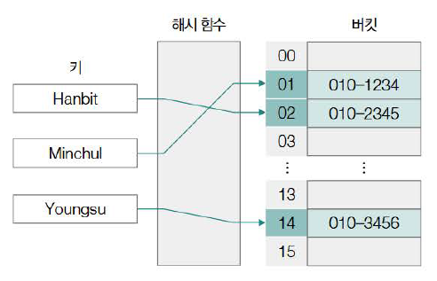

## 활용 예시

- **운영체제**: 페이지 캐시, 아이노드 캐시
- **데이터베이스**: 인덱싱
- **네트워크**: 라우팅 테이블
- **컴파일러**: 심볼 테이블

## 성능 지표

### 로드 팩터 (Load Factor)

- 정의: 저장된 데이터 수 / 전체 버킷 수
- 영향: 높을수록 해시 충돌 증가, 성능 저하

## 해시 함수 (Hash Function)

해시 함수는 임의의 길이를 가진 입력 데이터(키)를 고정된 길이의 해시 값(해시 코드)으로 변환하는 함수입니다.

### 해시 함수의 특징

1. **단방향성**
   - 입력 데이터로부터 해시 값 계산은 쉽지만
   - 해시 값으로부터 원본 데이터 추론은 매우 어려움

2. **해시 알고리즘**
   - 해시 함수를 구현하는 구체적인 연산 방식
   - 대표적인 알고리즘: SHA-256, SHA-512
   - (참고: MD5, SHA-1은 보안 취약점으로 사용 권장되지 않음)

3. **입력 민감성 (눈사태 효과)**
   - 입력 데이터의 미세한 변화도 해시 결과값을 크게 변경
   - 예측 불가능성 향상

### 해시 함수의 활용

1. **데이터 무결성 검증**
   - 원본 데이터와 수신/저장 데이터의 해시 값 비교
   - 예: 파일 다운로드 시 체크섬

2. **비밀번호 저장**
   - 원본 비밀번호 대신 해시 값 저장
   - 로그인 시 입력값의 해시와 저장된 해시 비교
   - 권장: bcrypt, scrypt, PBKDF2, Argon2 등 키 스트레칭 기능 포함 함수

### 모듈러 연산 기반 해시 함수

1. **원리**
   - 키 값을 버킷 수(m)로 나눈 나머지를 인덱스로 사용
   - `index = hash_function(key) % m`

2. **예시**
   - 버킷 수 15, 키 해시값 200 → 200 mod 15 = 5번 인덱스
   - 버킷 수 15, 키 해시값 100 → 100 mod 15 = 10번 인덱스

3. **특징**
   - 장점: 구현 간단, 연산 빠름
   - 고려사항: 버킷 수는 보통 소수(prime number) 사용 권장

### 해시 테이블의 성능

1. **평균 성능**
   - 검색, 삽입, 삭제: O(1) 시간 복잡도
   - 이상적 조건: 해시 충돌 최소화, 효율적 해시 함수

2. **단점**
   - 메모리 사용량이 상대적으로 많음
   - 데이터가 적을 경우 배열/리스트보다 비효율적

## 해시 충돌 (Hash Collision)

### 정의

- 서로 다른 키(Key)가 동일한 해시 값(버킷 인덱스)을 갖는 현상

### 발생 원인

1. **비둘기집 원리**
   - 입력 키의 종류: 거의 무한대
   - 해시 테이블 버킷 수: 유한
   - → 충돌 발생 불가피

2. **실제 사례**
   - 'shattered-1.pdf'와 'shattered-2.pdf'
   - SHA-1 해시 알고리즘 사용 시 동일한 해시값 도출

### 문제점

1. **성능 저하**
   - O(1) → O(N) 시간복잡도로 성능 저하 가능
   - 특정 버킷에 데이터 집중 시 탐색 시간 증가

2. **극단적 상황**
   - 모든 키가 하나의 버킷으로 충돌
   - 연결 리스트와 유사한 O(N) 성능

### 해결 방법

#### 1. 체이닝 (Chaining)

- **원리**: 충돌 데이터를 연결 리스트로 관리
- **장점**
  - 구현 간단
  - 로드 팩터 > 1에서도 정상 동작
- **단점**
  - 충돌 많을 경우 O(N) 성능
  - 추가 메모리 필요

#### 2. 개방 주소법 (Open Addressing)

- **원리**: 다른 빈 버킷을 찾아 데이터 저장

##### 탐사 방식

1. **선형 탐사**
   - f(key), f(key)+1, f(key)+2, ...
   - 단점: 군집화 현상

2. **이차 탐사**
   - f(key), f(key)+1², f(key)+2², ...
   - 단점: 이차 군집화, 일부 버킷 미탐색

3. **이중 해싱**
   - f1(key), f1(key) + 1*f2(key), ...
   - 장점: 군집화 최소화, 우수한 성능

### 프로그래밍 언어별 구현

- C++: `std::unordered_map`
- Java: `java.util.HashMap`, `java.util.Hashtable`
- Python: `dict`
- JavaScript: `Map`
- Go: `map`

# 5. 트리 (Tree)

# 트리 (Tree)

## 개요
- 계층적 구조(Hierarchical Structure)를 표현하는 자료구조
- 구현이 단순하고 다양한 변형이 가능
- 기술 면접에서 빈번하게 출제되는 주제

## 구성 요소
- **노드(Node)**: 데이터를 저장하는 기본 단위
- **간선(Edge/Link)**: 노드 간의 연결 관계
- **계층 관계**: 간선으로 연결된 노드들 간의 상하 관계

## 트리 관련 용어

### 기본 용어
| 용어 | 설명 |
|------|------|
| 노드 (Node) | 데이터를 저장하는 기본 구성 요소 |
| 간선 (Edge/Link) | 노드와 노드를 연결하는 구성 요소 |
| 부모 노드 (Parent Node) | 상위에 위치한 노드 |
| 자식 노드 (Child Node) | 하위에 위치한 노드 |

### 관계 용어
| 용어 | 설명 |
|------|------|
| 형제 노드 (Sibling Node) | 같은 부모 노드를 공유하는 노드들 |
| 조상 노드 (Ancestor Node) | 루트 노드까지의 경로상의 모든 부모 노드들 |
| 자손 노드 (Descendant Node) | 모든 하위 노드들 |

### 특수 노드
| 용어 | 설명 |
|------|------|
| 루트 노드 (Root Node) | 최상단 노드, 부모 노드 없음 |
| 리프 노드 (Leaf Node) | 자식 노드가 없는 최하단 노드들 |

### 구조적 특성
| 용어 | 설명 |
|------|------|
| 차수 (Degree) | 자식 노드의 수 |
| 레벨 (Level) | 루트 노드로부터의 간선 수 |
| 높이 (Height) | 최대 레벨 값 |
| 서브트리 (Subtree) | 트리 내부의 작은 트리 |

## 메모리 구현 방식

### 노드 구조
1. **데이터 필드**
   - 실제 데이터 저장
2. **자식 노드 포인터**
   - 자식 노드의 메모리 주소 저장
   - 이진 트리: 왼쪽/오른쪽 자식 포인터
   - NULL: 자식 노드 없음

### 메모리 표현 예시

#### 메모리 상의 표현
- 각 노드는 메모리의 특정 번지에 위치
- 각 번지에는 노드의 데이터와 자식 노드들의 주소가 저장
- 자식 노드가 없는 경우 해당 포인터는 NULL로 표시

#### 메모리 구조 예시
| 메모리 번지 | 노드 | 데이터 | 왼쪽 자식 | 오른쪽 자식 |
|------------|------|--------|-----------|-------------|
| 10번지 | a | 데이터A | 20번지(b) | 30번지(c) |
| 20번지 | b | 데이터B | 40번지(d) | 50번지(e) |
| 30번지 | c | 데이터C | NULL | NULL |
| 40번지 | d | 데이터D | NULL | NULL |
| 50번지 | e | 데이터E | NULL | NULL |

#### 특징
- 각 노드는 독립적인 메모리 공간에 위치
- 포인터를 통해 계층적으로 연결
- 메모리 주소를 통해 노드 간의 관계를 추적

## 트리의 순회

- **전위 순회**: 루트 노드 → 왼쪽 서브트리 전위 순회 → 오른쪽 서브트리 전위 순회
- **중위 순회**: 왼쪽 서브트리 중위 순회 → 루트 노드 → 오른쪽 서브트리 중위 순회
- **후위 순회**: 왼쪽 서브트리 후위 순회 → 오른쪽 서브트리 후위 순회 → 루트 노드

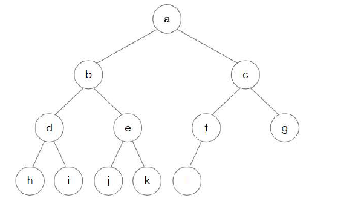

- **전위 순회**: a-b-d-h-i-e-j-k-c-f-l-g
- **중위 순회**: h-d-i-b-j-e-k-a-l-f-c-g
- **후위 순회**: h-i-d-j-k-e-b-l-f-g-c-a

## 트리의 종류

### 이진 트리

자식 노드의 개수가 2개 이하인 트리이다.

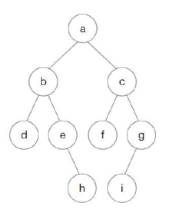

#### 편향 이진 트리

모든 자식 노드가 한 쪽으로 치우친 트리이다.

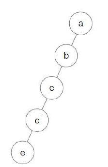

#### 정 이진 트리

자식 노드의 개수가 1개가 아닌 이진 트리이다.

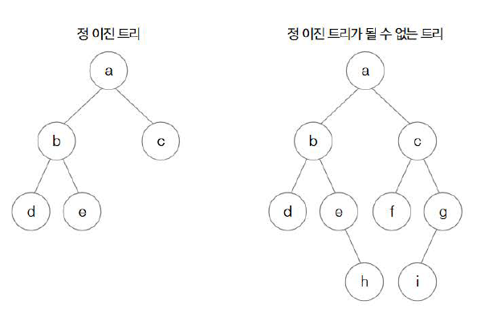

#### 포화 이진 트리

모든 레벨이 꽉 찬 이진 트리이다.

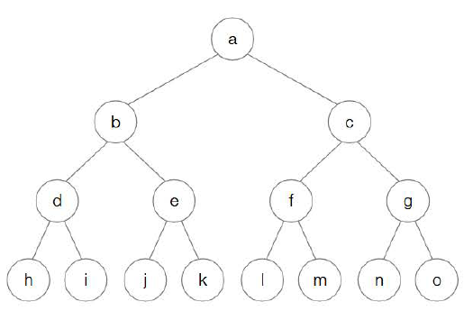

#### 완전 이진 트리

마지막 레벨의 모든 노드들이 왼쪽부터 존재하는 이진 트리이다.

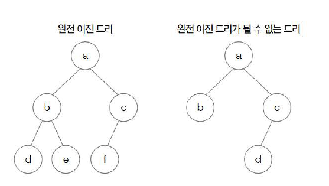

#### 이진 탐색 트리 (BST)

왼쪽 서브 트리의 모든 노드는 루트 노드보다 작고, 오른쪽 서브 트리의 모든 노드는 루트 노드보다 큰, 특정 값 탐색에 특화된 이진 트리이다.

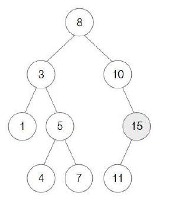

#### 힙 (Heap)

탐색에 특화된 이진 트리 중 하나로, 최댓값 또는 최솟값을 빠르게 찾고 제거하기 위해 설계된 트리이다.

우선순위 큐 구현에 핵심적으로 사용된다.

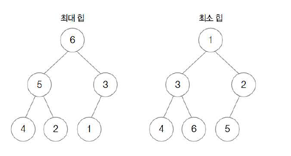

### 균형 이진 트리

이진 탐색 트리는 삽입과 삭제 연산 순서에 따라 편향 이진 트리가 될 가능성이 있고, 이 경우 탐색 성능에 문제가 발생한다.

따라서 루트 노드 기준 왼쪽 서브트리와 오른쪽 서브트리의 높이 차이를 최소화할 필요가 있는데, 이를 구현한 것이 바로 균형 이진 트리이다.

### 레드-블랙 트리 (Red-Black Tree)

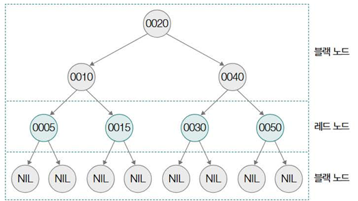

##### 1. 이진 탐색 트리의 문제점과 RB 트리의 등장 배경
- **이진 탐색 트리(BST)의 한계**: 일반적인 이진 탐색 트리는 데이터의 삽입 및 삭제 순서에 따라 한쪽으로 치우친 편향 트리(skewed tree)가 될 수 있다.
- **성능 저하**: 편향 트리가 되면 탐색 속도가 최악의 경우 O(n)으로 저하되어, 연결 리스트와 다를 바 없게 된다. 이는 이진 탐색 트리를 사용하는 의미를 퇴색시킨다.
- **해결책**: 이러한 문제를 해결하고 탐색 성능을 항상 일정하게 유지하기 위해 등장한 것이 자가 균형 이진 탐색 트리(self-balancing binary search tree)이다. 대표적인 예로 AVL 트리와 레드-블랙 트리(RB 트리)가 있다.

#### 2. 레드-블랙 트리란?
- 스스로 균형을 맞추는 이진 탐색 트리 중 하나로, 컴퓨터 과학 전반에 널리 사용되는 핵심적인 자료구조이다.
- **활용 예시**:
  - 리눅스 커널의 CPU 스케줄러인 CFS(Completely Fair Scheduler)
  - C++의 std::map (키-값 데이터를 저장하는 컨테이너) 내부 구현
  - 데이터베이스 인덱싱, 파일 시스템 등

#### 3. 레드-블랙 트리의 핵심 규칙 (Properties)
RB 트리는 다음의 5가지 규칙을 만족하도록 노드의 색깔(레드 또는 블랙)을 지정하고, 삽입/삭제 시 회전(rotation)과 색상 변경(recoloring)을 통해 이 규칙들을 유지한다.
- 루트 노드는 블랙(Black)이다.
- 모든 리프 노드(NIL 노드, 외부 노드)는 블랙이다. (이미지에서는 NIL 노드로 표현)
- 레드(Red) 노드의 자식 노드는 반드시 블랙이다. (즉, 레드 노드가 연속으로 두 번 나타날 수 없다.)
- 루트 노드에서 임의의 리프 노드에 이르는 모든 경로에는 동일한 개수의 블랙 노드가 존재한다. (이를 블랙 높이 - Black Height 라고도 한다.)
- (모든 노드는 레드 아니면 블랙이다 - 기본적인 전제)

이러한 규칙들을 통해 트리의 높이가 대략 logN으로 유지되어, 탐색, 삽입, 삭제 연산이 평균적으로 O(log N)의 시간 복잡도를 보장받게 된다.

#### 4. 레드-블랙 트리의 연산
- **삽입(Insertion)**:
  - 새로운 노드는 일단 레드로 삽입된다. (루트 노드가 아니라면)
  - 일반적인 이진 탐색 트리처럼 삽입 연산을 수행한다.
  - 삽입 후 RB 트리의 규칙에 위배되는 경우가 발생하면, 회전(Rotation)과 색상 변경(Recoloring)을 통해 규칙을 만족하도록 트리를 재조정한다.
  - 예시: 부모 노드가 레드인데 삽입된 자식 노드도 레드인 경우 (규칙 3 위반)

- **삭제(Deletion)**:
  - 일반적인 이진 탐색 트리처럼 삭제 연산을 수행한다.
  - 삭제 후 RB 트리의 규칙에 위배되는 경우가 발생하면, 마찬가지로 회전과 색상 변경을 통해 트리를 재조정한다.

- **회전(Rotation)**:
  - 트리의 구조를 변경하여 균형을 맞추는 연산이다. 특정 노드를 기준으로 왼쪽 또는 오른쪽으로 회전한다.
  - 왼쪽 회전(Left Rotation): 특정 노드 R을 기준으로 오른쪽 자식 노드 N을 R의 위치로 올리고, R은 N의 왼쪽 자식이 된다. N의 기존 왼쪽 자식은 R의 새로운 오른쪽 자식이 된다.
  - 오른쪽 회전(Right Rotation): 특정 노드 N을 기준으로 왼쪽 자식 노드 L을 N의 위치로 올리고, N은 L의 오른쪽 자식이 된다. L의 기존 오른쪽 자식은 N의 새로운 왼쪽 자식이 된다.
  - 회전은 이진 탐색 트리의 특성(왼쪽 서브트리 < 루트 < 오른쪽 서브트리)을 유지하면서 트리의 높이 균형을 맞춘다.

#### 5. C++ std::map과 RB 트리
- 이미지에서 C++ std::map을 사용하는 간단한 코드를 보여주고, uftrace라는 도구를 통해 내부 호출을 추적한 결과, std::Rb_tree 관련 함수들이 호출되는 것을 확인할 수 있다.
- 이는 std::map이 내부적으로 RB 트리를 사용하여 키-값 쌍을 저장하고 관리한다는 것을 보여준다. (정확히는 std::map은 정렬된 키를 유지해야 하므로 RB 트리가 적합하다. std::unordered_map은 해시 테이블을 사용한다.)

#### 6. 리눅스 커널에서의 RB 트리 활용
- RB 트리는 리눅스 커널 내에서도 다양하게 활용된다.
  - 프로세스 스케줄링 (CFS)
  - 메모리 관리 (Virtual Memory Areas - VMAs)
  - 파일 시스템 디렉토리 항목 관리
  - 네트워크 패킷 관리 등

### 다진 트리
### B트리

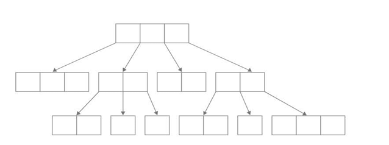

**1. B-트리의 정의 및 특징**
- **균형 유지**: B-트리는 레드-블랙 트리(RB 트리)와 마찬가지로 스스로 균형을 유지하는 트리이다.
- **다진 탐색 트리 (Multiway Search Tree)**:
  - 가장 큰 차이점은 B-트리가 이진 탐색 트리가 아닌 다진 탐색 트리의 한 종류라는 것이다.
  - 다진 탐색 트리는 하나의 노드가 여러 개의 자식 노드를 가질 수 있는 트리 구조를 의미한다.
- **자식 노드의 수**:
  - 여러 자식 노드를 가질 수 있는 다진 탐색 트리인 B-트리에서 한 노드가 가질 수 있는 자식 노드의 수는 최소, 최대 개수가 정해져 있다.
  - 한 노드가 가질 수 있는 최대 자식 노드의 개수가 M개인 B-트리를 M차 B-트리라고 부른다.
  - M차 B-트리가 (루트 노드와 리프 노드를 제외하고) 가질 수 있는 최소 자식 노드의 개수는 ⌈M/2⌉ (M/2의 올림 값) 이다.
  - 예시: 5차 B-트리의 한 노드는 최대 5개의 자식 노드를 가질 수 있고, (루트와 리프 노드를 제외한) 노드들은 최소 ⌈5/2⌉ = 3개의 자식 노드를 가진다.
- **노드 내 키(Key) 저장**:
  - B-트리의 각 노드에는 하나 이상의 키(key) 값이 존재하며, 이 키들은 오름차순으로 정렬되어 저장된다.
  - 예시: 루트 노드에 2개의 키(key1, key2)가 존재하고 key1 < key2 인 경우.
- **키와 자식 노드의 관계**:
  - 이진 탐색 트리는 왼쪽 자식 노드의 크기가 오른쪽 자식 노드의 크기보다 작다. 
  - B-트리에서는 이와 유사하게 각 키 값 사이에 있는 자식 노드(혹은 서브트리)의 위치를 저장하며, 키가 가리키는 자식 노드(혹은 서브트리)가 가질 수 있는 값의 범위를 나타내는 역할을 한다.
  - 키가 N개인 노드가 가질 수 있는 자식 노드의 수는 반드시 (N + 1)개가 된다.
  - 예시: 노드 A에 key1, key2 (2개 키)가 있다면, 자식 노드는 3개 (B, C, D)가 된다.
    - 서브트리 L (자식 노드 B)의 모든 키 < key1
    - key1 < 서브트리 M (자식 노드 C)의 모든 키 < key2
    - 서브트리 R (자식 노드 D)의 모든 키 > key2
- **균형 및 높이**:
  - B-트리의 모든 리프 노드의 깊이가 같다는 특징이 있다. 이로 인해 특정 노드에만 자식 노드가 존재하는 편향된 형태는 발생하지 않는다.

**2. B-트리의 주요 사용처 및 장점**
- **대용량 데이터 처리**: B-트리는 파일 시스템, 데이터베이스와 같이 대량의 데이터를 기반으로 탐색, 접근, 저장을 수행할 때 활용된다.
- **입출력 연산 최소화**:
  - 파일 시스템, 데이터베이스와 같은 프로그램을 실행할 때는 입출력 연산 횟수를 최소화하는 것이 좋다. 
  - 앞서 학습했듯 입출력 연산은 일반적인 메모리 접근에 비해 수행 속도가 느리기 때문이다.
  - 운영체제는 블록 단위로 보조기억장치를 읽고 쓴다. 
  - 한 블록은 여러 데이터를 포함하고 있으므로, 한 노드에 여러 개의 데이터 저장이 가능한 B-트리는 이진 탐색 트리에 비해, 한 번에 한 블록 단위의 여러 데이터를 저장할 수 있어 보조기억장치에 대한 입출력 연산을 줄일 수 있어 성능 면에서 이득이다.
  - 키를 찾기 위한 인덱스로 활용되어 '키를 알면 키에 대응되는 데이터를 알 수 있다'고 이해하면 된다.

3. 면접에서의 B-트리
- 면접에서 B-트리를 소스 코드로 표현하라는 질문이 등장할 가능성은 앞서 학습한 트리들에 비해 상대적으로 적다.
- 하지만 B-트리의 주된 사용처와 사용 이유를 묻는 질문은 충분히 출제될 수 있으므로, B-트리의 구성과 사례, 장점에 주안점을 두고 알아두는 것이 좋다.

### B+트리

**1. B+트리의 정의 및 특징**
- **B-트리의 변형**: B+트리는 B-트리의 변형으로, 데이터베이스와 파일 시스템에서 널리 사용되는 자료구조이다.
- **데이터 저장 위치**:
  - B+트리의 가장 큰 특징은 모든 데이터(키와 값)가 리프 노드에만 저장된다는 점이다.
  - 내부 노드에는 키만 저장되며, 이는 단지 인덱스 역할을 한다.
- **리프 노드 연결**:
  - 모든 리프 노드는 연결 리스트로 서로 연결되어 있어 순차적 접근이 용이하다.
  - 이 특성으로 인해 범위 검색(range query)이 매우 효율적으로 수행된다.
- **데이터 중복**:
  - 내부 노드의 키 값은 리프 노드에도 중복되어 저장된다.
  - 이로 인해 저장 공간은 더 필요하지만, 검색과 순차 접근 성능이 향상된다.
- **균형 및 높이**:
  - B-트리와 마찬가지로 모든 리프 노드는 같은 레벨에 위치하여 균형을 유지한다.
  - 이는 일관된 검색 성능을 보장한다.

**2. B+트리의 주요 사용처 및 장점**
- **데이터베이스 인덱싱**: 대부분의 관계형 데이터베이스 시스템(RDBMS)에서 인덱스 구현에 B+트리를 사용한다.
- **파일 시스템**: 많은 현대 파일 시스템에서 디렉토리 구조와 파일 위치 관리에 활용된다.
- **범위 검색 효율성**:
  - 리프 노드가 연결 리스트로 연결되어 있어 범위 검색이 매우 효율적이다.
  - 특정 범위의 데이터를 순차적으로 접근할 때 B-트리보다 우수한 성능을 보인다.
- **높은 팬아웃(Fan-out)**: 내부 노드에 데이터 없이 키만 저장하므로 더 많은 키를 저장할 수 있어 트리의 높이가 낮아진다.
- **일관된 검색 성능**: 모든 데이터가 리프 노드에만 있어 검색 알고리즘이 단순화되고 성능이 일관된다.

### B*트리

**1. B*트리의 정의 및 특징**
- **B-트리의 또 다른 변형**: B*트리는 B-트리를 더욱 최적화한 자료구조이다.
- **노드 활용도 향상**:
  - B-트리에서는 각 노드가 최소 절반(⌈m/2⌉)만 채워져 있어도 되지만, B*트리에서는 노드의 최소 채움률이 2/3로 높아진다.
  - 이는 저장 공간 활용도를 높이고 트리의 높이를 더 낮출 수 있게 한다.
- **노드 분할 지연**:
  - B*트리는 노드가 가득 찼을 때 바로 분할하지 않고, 형제 노드와의 재분배를 먼저 시도한다.
  - 형제 노드도 가득 찼을 경우에만 두 노드를 세 노드로 분할(2-to-3 split)한다.
  - 이러한 지연 분할 전략은 트리의 높이 증가를 최소화한다.
- **균형 유지**: B-트리와 마찬가지로 모든 리프 노드는 같은 레벨에 위치하여 균형을 유지한다.

**2. B*트리의 주요 사용처 및 장점**
- **데이터베이스 시스템**: 일부 고성능 데이터베이스 시스템에서 인덱싱에 활용된다.
- **공간 효율성**:
  - 노드의 최소 채움률이 높아 저장 공간을 더 효율적으로 사용한다.
  - 노드 분할이 적게 발생하여 전체적인 트리 구조가 더 컴팩트해진다.
- **안정적인 성능**:
  - 노드 분할이 덜 자주 발생하므로 삽입 연산 시 성능 변동이 적다.
  - 트리의 높이가 낮게 유지되어 검색 성능이 향상된다.
- **입출력 연산 감소**: 노드 분할이 줄어들어 디스크 입출력 연산이 감소하므로 외부 저장장치에서 특히 효율적이다.

**3. B-트리, B+트리, B*트리 비교**
- **데이터 저장 위치**:
  - B-트리: 모든 노드에 키와 데이터 저장
  - B+트리: 리프 노드에만 데이터 저장, 내부 노드는 인덱스 역할
  - B*트리: B-트리와 유사하나 노드 채움률과 분할 전략이 다름
- **노드 채움률**:
  - B-트리: 최소 50% (⌈m/2⌉)
  - B+트리: 최소 50% (⌈m/2⌉)
  - B*트리: 최소 66% (2/3)
- **주요 최적화 포인트**:
  - B-트리: 기본적인 균형 유지
  - B+트리: 순차 접근 및 범위 검색 최적화
  - B*트리: 공간 활용도 및 분할 연산 최적화


# 6. 그래프

## 그래프의 종류와 구현

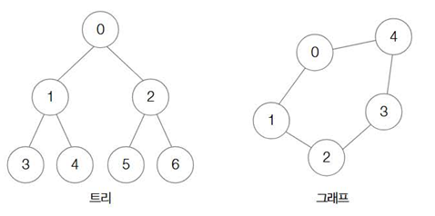

### 연결/비연결 그래프

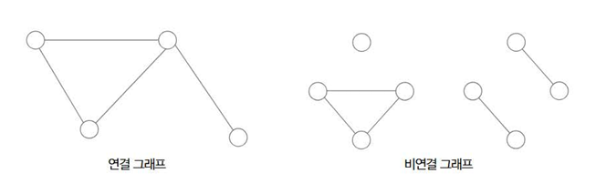

### 방향/무방향 그래프

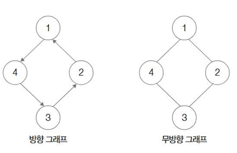

### 가중치 그래프

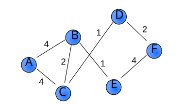

### 서브 그래프

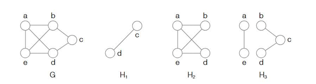


## 깊이 우선 탐색과 너비 우선 탐색

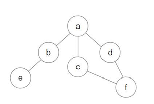

위 그래프 기준으로 깊이 우선 탐색과 너비 우선 탐색을 순서로 구분하면 다음과 같다.

### 깊이 우선 탐색 (DFS)

a -> b -> e -> c -> f -> d

### 너비 우선 탐색 (BFS)

a -> b -> c -> d -> e -> f

## 최단 경로 알고리즘

### 다익스트라

### 다익스트라 (Dijkstra)

**정의**: 그래프에서 특정 정점(노드)에서 다른 모든 정점까지의 최단 거리를 구해내는 알고리즘입니다.

**활용 분야**: 
- 내비게이션 시스템에서 가장 빠른 경로 찾기
- 네트워크 라우팅 프로토콜에서 최적 경로 계산
- 다양한 경로 탐색 문제 해결

**알고리즘의 핵심 아이디어 (동작 방식)**:
1. **초기화**:
   - 출발 정점까지의 거리는 0, 나머지 정점까지의 거리는 무한대로 설정
   - 모든 정점을 '미방문' 상태로 표시
2. **가장 가까운 정점 선택**:
   - 미방문 정점 중 현재까지 계산된 거리가 가장 짧은 정점 선택
   - 선택된 정점을 '방문' 상태로 변경
3. **거리 갱신**:
   - 새로 방문한 정점을 경유하여 다른 정점으로 가는 경로가 기존 경로보다 짧으면 거리 갱신
4. **반복**:
   - 모든 정점을 방문할 때까지 2번과 3번 과정 반복

**특징 및 제약사항**:
- **음의 가중치 간선 불가**: 음수 가중치가 있는 그래프에서는 사용 불가 (벨만-포드 알고리즘 사용 필요)
- **그리디 알고리즘**: 각 단계에서 가장 비용이 적은 경로를 선택하는 방식
- **우선순위 큐 활용**: 효율성을 높이기 위해 우선순위 큐 자료구조 사용

**시간 복잡도**:
- 인접 행렬 구현: O(V²) (V는 정점의 개수)
- 인접 리스트와 우선순위 큐 구현: O(E log V) (E는 간선의 개수)
