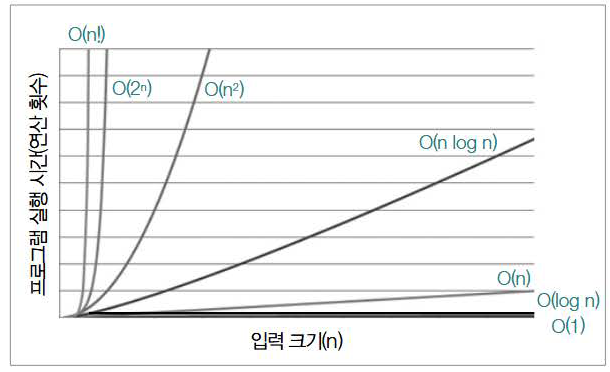
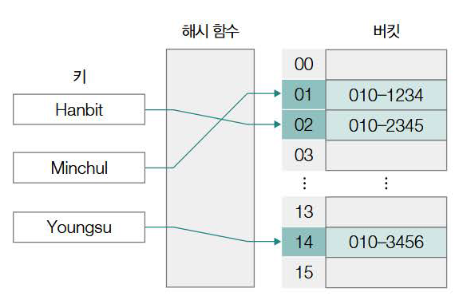
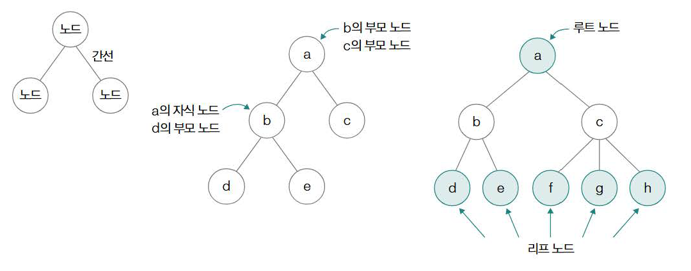
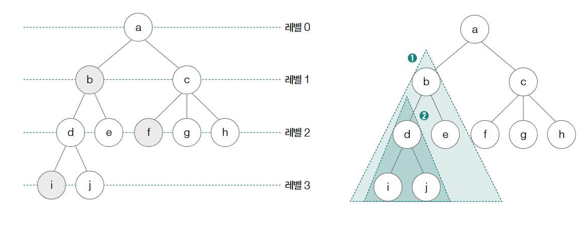
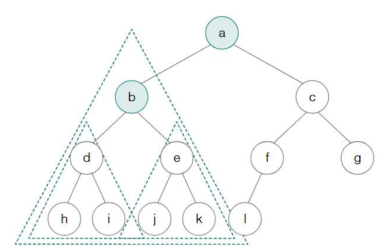
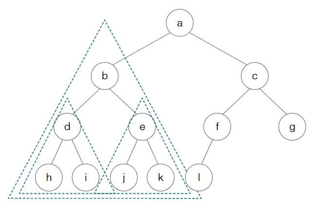
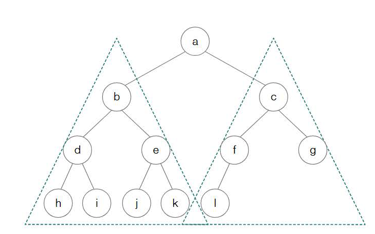
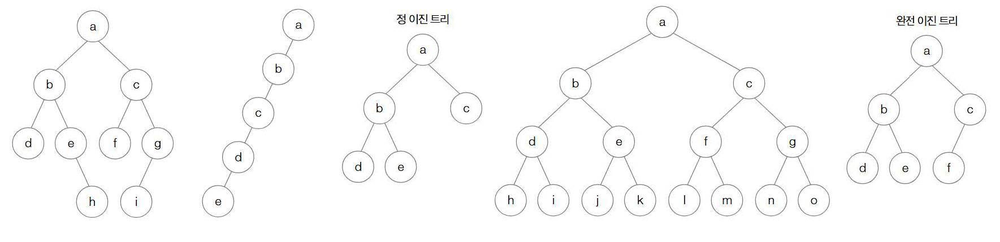

# 자료구조
# 1. 자료구조의 큰 그림
## 자료구조와 알고리즘
자료구조: 어떠한 구조로 데이터를 다룰지에 대해 학습하는 과목
알고리즘: 어떠한 목적을 이루기 위해 필요한 일련의 연산 절차

## 시간 복잡도와 공간 복잡도
### 시간 복잡도
- 입력의 크기에 따른 실행시간/연산 횟수
- **빅 오 표기법**이 대중적으로 사용
  - 점근적 상한을 표기하는 방법
  - n이 점점 증가해 무한대로 커진다고 해도 실행 시간이 대략 이 이상(상한) 커지지 않을 것을 의미
  - O(n) 형태로 표현
- 빅 세타 표기법, 빅 오메가 표기법도 있음

### 빅 오 표기법

: 대표적인 시간 복잡도

### 공간 복잡도
- 프로그램이 실행되었을 때 필요한 메모리 자원의 양
- 오늘 날 알고리즘 성능 판단에 사용되는 척도는 주로 시간 복잡도

# 2. 배열과 연결 리스트
## 배열
: 일정한 메모리 공간을 차지하는 여러 요소들이 순차적으로 나열된 자료구조
-> 각 요소에는 0부터 시작하는 인덱스가 매겨짐
※ 인덱스를 통해 배열의 특정 요소에 접근하는 시간은 O(1)

- 한 쪽 방향으로 요소가 나열되는 일차원적인 구조
- 이차원, 삼차원, ...로 확장 가능

### 정적 배열과 동적 배열
- 정적 배열: 프로그램을 실행하기 전 크기가 고정되어 있는 배열
- 동적 배열: 실행 과정에서 크기가 변할 수 있는 배열

## 연결 리스트
: 노드의 모음으로 구성된 자료구조
- 헤드(첫 번째 노드) - 중간 노드들 - 꼬리(마지막 노드)로 이루어짐
- 메모리 내 순차적으로 저장되어 있을 필요가 없어 **연속적으로 구성되어 있는 데이터를 불연속적으로 저장**할 때 유용
- 특정 요소에 접근할 때 앞에서 순차적으로 접근해야 하기 때문에 O(n)이 소요
- 노드 삽입 혹은 삭제 시 노드에 접근하는 시간이 동일하여 O(1)이 소요
- 싱글 연결 리스트는 노드 안에 다음 노드에 관한 정보만 저장, 이중 연결 리스트는 노드 내 이전 노드와 다음 노드의 주소까지 저장

# 3. 스택과 큐
## 스택
: 한 쪽에서만 데이터의 삽입 및 삭제가 가능한 자료구조
- push(스택에 데이터를 저장), pop(스택에서 데이터를 빼내는 연산)으로 구성
- LIFO(Last In First Out, 후입선출) 자료구조

## 큐
: 한 쪽으로 데이터를 삽입하고 다른 한 쪽으로 데이터를 삭제하는 자료구조
- FIFO(First In First Out) 자료구조
- enqueue(데이터를 삽입하는 연산), dequeue(데이터를 빼내는 연산)
- 각종 버퍼로 활용됨
- 원형 큐, 덱(deque), 우선순위 큐 등

# 4. 해시 테이블
: **Key**와 **Value**의 대응으로 이루어진 테이블 형태의 자료구조

- 키를 통해 얻고자 하는 데이터는 **버킷**에 저장
- 버킷들은 배열을 형성, 키를 인자로 활용해 인덱스를 반환

## 해시 함수
: 임의의 길이를 지닌 데이터를 고정된 길이의 데이터로 변환하는 단방향 함수
- **해시 알고리즘**으로 연산, MD5, SHA-1, SHA-256, SHA-512, SHA3, HMAC 등
- 계산 과정
  1. 데이터를 송신하는 쪽에서 보낼 데이터에 대한 해시 값을 계산
  2. 데이터를 수신하는 쪽에서 데이터에 대한 해시 값을 계산하여 비교
- 해시 테이블을 사용하는 이유: **빠른 검색 속도**
  - 일반적으로 해시 테이블을 활용한 검색, 삽입, 삭제 연산의 시간 복잡도는 O(1)
  - 많은 메모리 공간이 소모된다는 단점이 존재
  - 해시 충돌 문제도 주의

## 해시 충돌
: 서로 다른 키에 대해 같은 해시 값이 대응되는 상황
- 발생 가능한 문제점
  - 두 파일을 같은 데이터라 판단 가능 -> 데이터의 무결성 깨짐
  - 전송 과정에서 데이터를 가로채 바꾸는 보안 위험 발생 가능
- 해결 방안
  - 체이닝: 충돌이 발생한 데이터를 연결 리스트로 추가하는 방법 -> 하나의 테이블 인덱스에 여러 데이터가 연결 리스트의 노드로써 존재
    -> 해시 테이블의 장점인 조회시 시간복잡도가 증가할 수 있음(연결 리스트를 사용했기 때문)
  - 개방 주소법: 충돌 발생 시 충돌이 발생한 버킷의 인덱스가 아닌 다른 인덱스에 데이터를 저장하는 방법
    -> 충돌 발생 시 충돌 인덱스의 다음 인덱스부터 순차적으로 가용한 인덱스를 찾는 방식인 **선형 조사법** 등 여러 조사 방법이 존재
    -> 선형 조사법은 해시 충돌이 발생하는 인덱스 근처에 충돌이 발생한 여러 데이터가 몰려 저장될 수 있다는 문제(**군집화**)가 발생 가능
  - 이중 해상: 2개의 해시 함수를 사용하는 방법
    -> 충돌 발생 시 다른 해시 함수(보조 해시 함수)에 대한 해시 값만큼 떨어진 거리에 위치한 인덱스를 찾는 방법

# 5. 트리
: 계층적인 구조를 표현하기 위한 자료구조, 노드와 간선으로 이루어짐

- 부모 노드: 노드 간 상하관계 중 상위 노드
- 자식 노드: 노드 간 상하관계 중 하위 노드
- 형제 노드: 같은 부모를 공유하는 노드
- 조상 노드: 부모 노드와 그 부모 노드들
- 자손 노드: 자식 노드와 그 자식 노드들
- 루트 노드: 부모 노드가 없는 최상단 노드
- 리프 노드: 자식 노드가 없는 최하단 노드

- 차수: 각 노드가 가지는 자시 ㄱ노드의 수
- 레벨: 루트 노드에서 시작해 특정 노드에 이르기까지 거치는 간선 수, 트리의 깊이와 같은 개념
- 서브트리: 트리 내 포함된 트리

※트리 자료구조는 마치 연결 리스트처럼 하나의 노드를 **데이터**를 저장할 공간과 **자식 노드의 위치 정보(메모리 상 주소)**를 저장할 공간의 모음으로 구현

## 트리의 순회
: 트리의 모든 노드를 한 번씩 방문하는 것
### 전위 순회
: (1) 루트 노드 -> (2) 왼쪽 서브트리 전위 순회 -> (3) 오른쪽 서브트리 전위 순회

- a -> b -> d -> h -> i -> e -> j -> k -> c -> f -> l -> g
### 중위 순회
: (1) 왼쪽 서브트리 중위 순회 -> (2) 루트 노드 -> (3) 오른쪽 서브트리 중위 순회

- h -> d -> i -> b -> j -> e -> k -> a -> l -> f -> c -> g
### 후위 순회
: (1) 왼쪽 서브트리 후위 순회 -> (2) 오른쪽 서브트리 후위 순회 -> (3) 루트 노드

- h -> i -> d -> j -> k -> e -> b -> l -> f -> g -> c -> a

## 트리의 종류
### 이진 트리
: 자식 노드의 개수가 2개 이하인 트리

- 편향된 이진트리: 모든 자식 노드가 한 쪽으로 치우친 이진 트리
- 정 이진 트리: 자식 노드의 개수가 1개가 아닌 이진 트리(0 or 2)
- 리프 노드를 제위한 모든 노드들이 자식 노드를 2개씩 가지고 모든 리프 노드의 레벨이 동일한 이진 트리
- 완전 이진 트리: 마지막 레벨을 제외한 모든 레벨이 2개의 자식 노드를 가지고 있으며 마지막 레벨의 모든 노드들이 왼쪽부터 존재하는 이진 트리
### 탐색에 활용되는 트리: 이진 탐색 트리와 힙
- 이진 탐색 트리: 특정 노드의 왼쪽 서브트리에는 해당 노드보다 작은 값을 지닌 노드들이 있고 오른쪽 서브트리에는 해당 노드보다 큰 값을 지닌 노드들이 있는 구조의 이진 트리
  - O(log n)의 시간복잡도를 가지지만 편향된 이진트리의 경우 O(n)
- 힙
  - 최대 힙: 부모 노드가 자식 노드의 값보다 큰 값으로 이루어진 이진 트리
  - 최소 힙: 부모 노드가 자식 노드의 값보다 작은 값으로 이루어진 이진 트리
  -> 우선순위 큐의 원리

### 균형을 맞추는 트리: RB 트리
## 균형을 맞추는 트리: RB 트리
: **Red-Black Tree(레드 블랙 트리)**는 이진 탐색 트리의 일종으로, 트리의 높이를 **자동으로 균형 있게 유지**하여 탐색 성능이 나빠지는 것을 방지하는 자료구조

- 각 노드는 **빨간색** 또는 **검은색** 중 하나의 색을 가짐
- 노드 삽입/삭제 후 트리의 균형을 맞추기 위해 색상 변경 및 회전 연산 수행

### RB 트리의 주요 규칙
1. 모든 노드는 빨간색 또는 검은색이다
2. 루트 노드는 항상 검은색이다
3. 모든 리프 노드(NIL, NULL)는 검은색이다
4. 빨간 노드의 자식은 반드시 검은색이다 (즉, 빨간색 노드는 연속될 수 없다)
5. 어떤 노드에서 리프 노드까지 가는 모든 경로에 포함된 검은색 노드의 수는 같다

### RB 트리의 시간 복잡도
- 삽입, 삭제, 탐색: O(log n)

## 대용량 입출력을 위한 트리: B 트리
: **B 트리(Balanced Tree)**는 다진 트리(M-ary tree)로, 대용량 데이터를 다룰 때 **디스크 입출력을 줄이기 위해 고안된 자료구조**

- 한 노드에 여러 개의 키와 자식 포인터를 저장 가능
- 자식 노드의 수는 항상 키의 수 + 1
- 트리의 높이를 줄여서 디스크 접근 횟수 감소
- 모든 리프 노드는 동일한 레벨에 위치함

### B 트리의 시간 복잡도
- 탐색, 삽입, 삭제: O(log n)

## 6. 그래프

## 그래프의 종류와 구현
: 정점(Vertex)과 간선(Edge)으로 이루어진 자료구조

- 무방향 그래프: 간선의 방향 없음 (ex. 친구 관계)
- 방향 그래프: 간선에 방향 있음 (ex. 팔로우 관계)
- 가중 그래프: 간선에 비용(가중치)이 존재
- 비가중 그래프: 간선에 가중치 없음

### 그래프 구현 방법
1. **인접 행렬(Adjacency Matrix)**  
   - 2차원 배열로 정점 간 연결 여부 표시  
   - 연결: 1 또는 가중치, 비연결: 0 또는 ∞  
   - 공간 복잡도: O(V²)

2. **인접 리스트(Adjacency List)**  
   - 각 정점에 연결된 정점들을 리스트로 저장  
   - 공간 복잡도: O(V + E)

## 깊이 우선 탐색(DFS)
: 한 정점에서 시작해 최대한 깊이까지 탐색한 뒤 다시 돌아와 다른 경로 탐색

- 구현: 재귀 함수 또는 스택
- 시간 복잡도: O(V + E)

## 너비 우선 탐색(BFS)
: 한 정점에서 시작해 가까운 정점부터 차례대로 탐색

- 구현: 큐(Queue)
- 시간 복잡도: O(V + E)

## 최단 경로 알고리즘
: 두 정점 사이의 최단 거리(최소 비용)를 구하는 알고리즘

### 1. 다익스트라 알고리즘
- 가중치가 양수일 때 사용
- 우선순위 큐를 이용해 가장 가까운 정점부터 탐색
- 시간 복잡도: O((V + E) log V)

### 2. 벨만-포드 알고리즘
- 음수 가중치 허용
- 음수 사이클 존재 여부 확인 가능
- 시간 복잡도: O(VE)

### 3. 플로이드-워셜 알고리즘
- 모든 정점 쌍 간의 최단 경로 계산
- 동적 프로그래밍 방식
- 시간 복잡도: O(V³)
