# 1. 운영체제의 큰 그림

운영체제는 매우 많은 종류와 다양한 기능이 있지만, 핵심적인 기능은 모두 비슷하다.

이 핵심적인 기능을 담당하는 부분을 **커널(Kernel)**이라고 부른다.

운영체제의 핵심 기능은 **자원 할당 및 관리**와 **프로세스 및 스레드 관리** 두 가지가 있다.

이 두 가지 핵심 기능을 정리하고, 프로그램들이 운영체제의 기능을 제공받는 방법을 살펴보도록 하자.

## 운영체제의 역할

운영체제의 역할은 크게 4개로 나누어 볼 수 있다.

1. **CPU 관리**
   * 어떤 프로세스에 CPU를 할당하고, 얼마나 오랫동안 사용할지 결정한다.
2. **메모리 관리**
   * 프로세스에 메모리 공간을 할당하고, 실제 메모리보다 큰 공간을 사용할 수 있도록 관리한다.
3. **파일/디렉토리 관리**
   * 파일과 디렉토리를 생성, 삭제, 접근하고 관리하는 체계를 제공한다.
4. **프로세스 및 스레드 관리**
   * 실행 중인 프로그램(프로세스)과 그 내부의 실행 흐름(스레드)을 생성하고 관리한다.

## 시스템 콜과 이중 모드

컴퓨터 메모리는 크게 커널 영역(Kernel Space)과 사용자 영역(User Space)으로 나뉜다. 

운영체제의 핵심 코드, 즉 커널은 커널 영역에 상주하며 시스템의 모든 자원에 접근할 수 있는 특별한 권한을 가진다. 

반면, 우리가 일반적으로 사용하는 응용 프로그램(웹 브라우저, 게임 등)은 사용자 영역에서 실행되며, 하드웨어나 중요한 시스템 자원에 직접 접근하는 것이 엄격히 제한된다. 

이는 시스템의 안정성과 보안을 유지하기 위한 필수적인 조치이다.

하지만 응용 프로그램이 파일을 읽거나, 네트워크 통신을 하거나, 새로운 프로세스를 생성하는 등 작업을 수행하려면 반드시 운영체제의 도움이 필요하다. 

사용자 영역의 응용 프로그램이 어떻게 커널 영역의 기능을 안전하게 사용할 수 있는가?

여기서 등장하는 개념이 바로 **시스템 콜(System Call)** 과 **이중 모드(Dual Mode)** 이다.

### 이중 모드 (Dual Mode)
   * CPU는 현재 실행되는 코드가 운영체제 커널인지, 아니면 일반 응용 프로그램인지 구분하기 위해 최소 두 가지 모드, 즉 커널 모드(Kernel Mode)와 사용자 모드(User Mode)로 작동한다.
   * **커널 모드**: 운영체제 커널 코드가 실행되는 모드이며, 모든 하드웨어 접근과 시스템 명령 실행이 가능하다.
   * **사용자 모드**: 일반 응용 프로그램이 실행되는 모드이며, 직접적인 하드웨어 접근이나 중요한 시스템 설정 변경이 불가능하다.

### 시스템 콜 (System Call)
   * 사용자 모드에서 실행되는 응용 프로그램이 커널 모드의 운영체제 서비스를 요청하는 공식적인 통로(인터페이스)이다. 
   * 응용 프로그램은 특정 작업을 수행하기 위해 해당하는 시스템 콜을 호출한다. 
   * 예를 들어, 파일을 열기 위해 open(), 새로운 프로세스를 만들기 위해 fork()와 같은 시스템 콜을 사용한다.

### 시스템 콜의 작동 과정

1. **요청 (Request)**: 사용자 영역의 응용 프로그램이 파일 읽기 같은 OS 서비스가 필요하면, 시스템 콜을 호출한다.
2. **소프트웨어 인터럽트 (Trap)**: 시스템 콜 호출은 일종의 '소프트웨어 인터럽트'를 발생시킨다.
3. **모드 전환 (Mode Switch)**: CPU는 이 인터럽트를 감지하고, 현재 실행 모드를 사용자 모드에서 커널 모드로 전환한다. 동시에 프로그램 실행 제어를 운영체제 커널 내의 해당 시스템 콜 처리 루틴으로 넘긴다.
4. **커널 작업 수행 (Kernel Execution)**: 커널 모드로 전환된 CPU는 요청받은 운영체제 서비스(예: 디스크에서 파일 읽기)를 안전하게 수행한다.
5. **결과 반환 및 모드 복귀 (Return & Mode Switch)**: 작업이 완료되면, CPU는 다시 커널 모드에서 사용자 모드로 전환하고, 시스템 콜의 결과를 응용 프로그램에게 돌려준다. 응용 프로그램은 시스템 콜 호출 이후의 코드를 계속 실행한다.
   
이처럼 시스템 콜과 이중 모드는 응용 프로그램이 필요한 운영체제 기능을 안전하고 통제된 방식으로 사용할 수 있도록 하는 핵심 메커니즘이다. 

간단해 보이는 "hello world" 출력 프로그램조차 내부적으로 수많은 시스템 콜을 호출하며 운영체제와 상호작용한다. 

이는 운영체제가 어떻게 응용 프로그램에게 안정적인 실행 환경을 제공하고 시스템 자원을 보호하는지를 보여주는 중요한 원리이다.

<br/><br/>


# 2. 프로세스와 스레드

프로세스는 실행 방식과 사용자와의 상호작용 여부에 따라 **포그라운드 프로세스(Foreground Process)** 와 **백그라운드 프로세스(Background Process)** 로 나눌 수 있다. 

- 포그라운드 프로세스
  - 사용자가 직접 입력하고 결과를 확인하는 등 상호작용하는 프로세스

- 백그라운드 프로세스
  - 사용자 인터페이스 없이 뒤에서 조용히 실행되는 프로세스이다. 
  - 특히, 시스템 운영을 위해 백그라운드에서 특정 기능을 수행하며 계속 실행되는 프로세스를 유닉스 계열에서는 **데몬(Daemon)**, 윈도우에서는 **서비스(Service)** 라고 부른다.

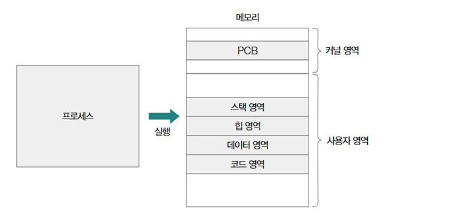

각 프로세스는 운영체제에 의해 관리되며 고유한 메모리 구조를 가진다. 

이 메모리 공간은 크게 **커널 영역(Kernel Area)** 과 **사용자 영역(User Area)** 으로 구분된다. 

**커널 영역**에는 운영체제가 해당 프로세스를 관리하기 위한 핵심 정보, 즉 **프로세스 제어 블록(PCB, Process Control Block)** 이 저장된다. 

**사용자 영역**은 실제 프로그램 코드가 실행되는 공간으로, 일반적으로 다음과 같은 세부 영역으로 나뉜다:

- **코드 영역(Code Area)**
  - 실행할 프로그램의 코드가 저장되는 영역이다.
  - 텍스트 영역이라고도 불린다.
  - 쓰기가 금지된 읽기 전용 공간이다.
- **데이터 영역(Data Area)**
  - 전역 변수, 정적(static) 변수 등 프로그램 실행 중에 사용되는 데이터가 저장되는 영역이다.
  - 정적 할당 영역이라고도 불린다.
- **힙 영역(Heap Area)**
  - 프로그래머가 동적으로 할당하고 해제하는 메모리 공간이다 (예: `malloc`, `new` 연산자로 할당).
  - 힙 영역에 할당된 메모리는 언젠간 해당 영역을 반드시 해제해야 한다.
  - 그렇지 않으면 메모리 누수가 발생할 수 있다.
  - 프로그래밍 언어들은 사용되지 않는 힙 메모리 영역을 자동으로 해제해주는 가비지 컬렉션 기능을 제공한다.
- **스택 영역(Stack Area)**
    - 함수 호출 시 생성되는 지역 변수, 매개변수, 함수 반환 주소 등이 임시로 저장되는 영역이다. 
    - 함수 호출이 완료되면 해당 정보는 스택에서 제거된다.

---

### PCB와 문맥 교환

운영체제는 동시에 여러 프로세스를 처리해야 하므로, 각 프로세스의 상태와 정보를 관리해야 한다. 

이를 위해 사용하는 자료구조가 바로 **프로세스 제어 블록(PCB, Process Control Block)** 이다. 

PCB는 커널 영역에 생성되며, 프로세스를 식별하고 관리하는 데 필요한 모든 정보를 담고 있다.

#### PCB 주요 정보
*   프로세스 식별자 (PID)
*   프로세스 상태 (생성, 준비, 실행, 대기, 종료 등)
*   프로그램 카운터 (다음에 실행할 명령어 주소)
*   CPU 레지스터 값 (문맥 교환 시 저장 및 복원될 레지스터 값들)
*   CPU 스케줄링 정보 (우선순위, 스케줄링 큐 포인터 등)
*   메모리 관리 정보 (페이지 테이블, 세그먼트 테이블 등)
*   입출력 상태 정보 (할당된 입출력 장치, 열린 파일 목록 등)

아래는 리눅스 커널 코드의 실제 PCB 구조체(`task_struct`)의 일부 예시이다.

```c++
struct task_struct {
    pid_t pid;                       // PID
    Int prio;                        // 스케줄링 관련 정보
    unsigned int_state;              // 프로세스 상태 관련 정보
    struct mm_struct * mm;           // 메모리 관련 정보
    void * stack;                    // 스택 관련 정보
    struct files_struct * files;     // 파일 관련 정보
}
```

운영체제는 이러한 PCB들을 **프로세스 테이블** 형태로 관리한다.

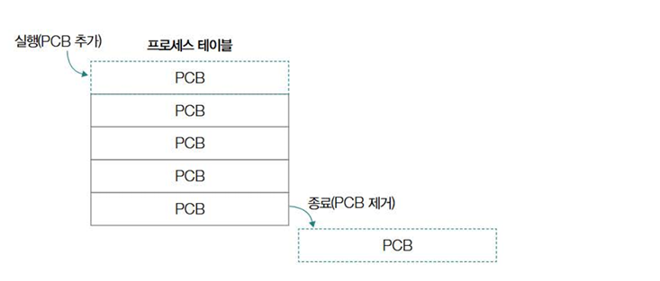

---

<br/>

일반적으로 메모리에 적재된 프로세스들은 **한정된 시간 동안 번갈아 가며 실행**된다.
*   **'프로세스가 실행된다'** 는 것은 운영체제에 의해 **CPU 자원을 할당받았다**는 의미이다.
*   CPU는 프로세스의 명령어를 실행하고, 운영체제는 CPU 자원을 관리 및 할당한다.
*   따라서 여러 프로세스가 번갈아 실행된다는 것은, 각 프로세스가 **운영체제로부터 CPU 자원을 번갈아 할당받아 이용한다**는 뜻이다.
*   이처럼 여러 프로세스를 번갈아 실행하기 위해, 운영체제는 **타이머 인터럽트(Timer Interrupt)** 를 사용한다.

타이머 인터럽트나 입출력 작업 등으로 인해 실행 중인 프로세스를 잠시 멈추고 다른 프로세스를 실행해야 할 때, 운영체제는 현재 프로세스의 상태를 저장해야 나중에 이어서 실행할 수 있다. 

이때 필요한 정보들이 **문맥**과 **문맥 교환**이다.

*   **문맥 (Context)**
    *   CPU가 프로세스를 전환할 때, 현재 프로세스의 실행 상태를 나중에 복원하기 위해 저장해야 하는 정보의 집합이다.
    *   주요 내용으로는 CPU 레지스터 값(프로그램 카운터, 스택 포인터 등), 프로세스 상태, 메모리 관리 정보 등이 있다.

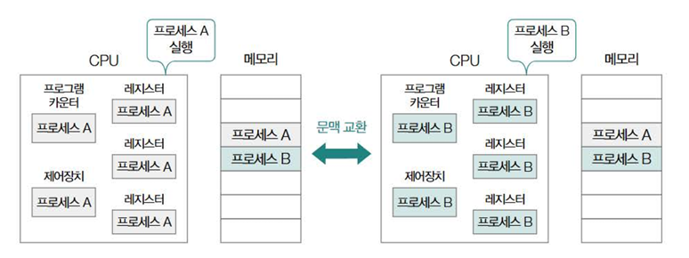

*   **문맥 교환 (Context Switching)**
    *   현재 실행 중인 프로세스의 문맥을 해당 프로세스의 PCB(프로세스 제어 블록)에 저장하는 과정이다.
    *   다음에 실행할 프로세스의 문맥을 해당 프로세스의 PCB에서 읽어와 CPU 레지스터 등에 복원하는 과정이다.
    *   운영체제가 여러 프로세스를 번갈아 실행하며 멀티태스킹을 가능하게 하는 핵심 메커니즘이다.

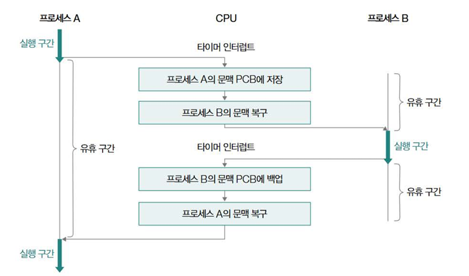

문맥 교환 과정을 더 자세히 보면 다음과 같다:

1.  **현재 프로세스의 문맥 저장:** 현재 실행 중인 프로세스 P1의 문맥(프로그램 카운터, 레지스터 값 등)을 P1의 PCB에 저장한다.
2.  **다음 프로세스의 문맥 복원:** 다음에 실행할 프로세스 P2의 PCB에서 저장된 문맥을 읽어와 CPU 레지스터 등에 복원한다.
3.  프로세스 P2 실행 재개

#### 주의점
- 이 과정을 통해 여러 프로세스가 CPU를 나누어 사용하는 것처럼 보이지만, **문맥 교환은 그 자체로 CPU 시간을 소모하는 오버헤드 작업이다.** 
- 문맥을 저장하고 복원하는 데 시간이 필요하기 때문이다.
- 따라서 **문맥 교환이 너무 자주 발생하면** 실제 유용한 작업 처리 시간보다 문맥 교환에 소요되는 시간이 많아져 **시스템 전체 성능이 저하**될 수 있다.

---

### 프로세스의 상태

하나의 프로세스는 여러 상태를 거치며 실행된다.

프로세스의 상태는 대표적으로 5가지로 나누어진다.

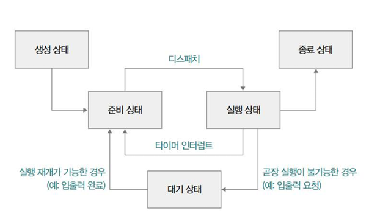

*   **생성 상태 (New)**
    *   프로세스를 막 생성한 상태이다.
    *   메모리에 적재되어 PCB(프로세스 제어 블록)를 할당받는다.
    *   생성 상태를 거쳐 실행 준비가 완료되면 준비 상태가 되어 CPU 할당을 기다린다.

*   **준비 상태 (Ready)**
    *   CPU만 할당받으면 즉시 실행할 수 있는 상태이다.
    *   아직 자신의 차례가 아니기 때문에 CPU 할당을 기다리고 있다.
    *   준비 상태의 프로세스가 CPU를 할당받아 실행 상태로 전환되는 것을 **디스패치(Dispatch)**라고 한다.

*   **실행 상태 (Running)**
    *   CPU를 할당받아 실행 중인 상태이다.
    *   할당된 시간(타임 슬라이스) 동안 CPU를 사용한다.
    *   만약 할당된 시간을 모두 사용하면 타이머 인터럽트에 의해 다시 준비 상태로 전환된다.
    *   실행 도중 입출력 장치를 사용해야 하면 입출력 작업이 끝날 때까지 기다리는 대기 상태로 전환된다.

*   **대기 상태 (Blocked / Wait)**
    *   프로세스가 입출력 작업을 요청하거나, 즉시 확보할 수 없는 자원을 요청하는 등 특정 이벤트가 발생하기를 기다리는 상태이다.
    *   예를 들어, 입출력 작업을 요청한 경우 해당 작업이 완료될 때까지 대기한다.
    *   대기 상태에 있던 프로세스는 기다리던 이벤트가 완료되면(예: 입출력 작업 완료) 다시 준비 상태가 되어 CPU 할당을 기다린다.

*   **종료 상태 (Terminated)**
    *   프로세스가 종료된 상태이다.
    *   프로세스가 종료되면 운영체제는 해당 프로세스의 PCB와 사용했던 메모리를 정리한다.

## 멀티프로세스와 멀티스레드

하나의 프로그램을 실행할 때, 그 안의 여러 코드를 동시에 실행하고 싶다면 어떻게 해야 할까? 

크게 두 가지 방법이 있다.

---

### 멀티프로세싱 (Multi-processing)

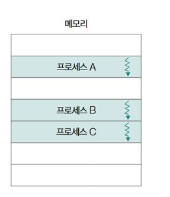

*   각각의 코드를 별도의 **프로세스**로 생성하여 동시에 실행하는 방식이다.
*   **예시:** 웹 브라우저에서 여러 탭을 열 때, 각 탭이 독립적인 프로세스로 동작하는 경우가 많다.
*   **특징:**
    *   각 프로세스는 자신만의 독립적인 메모리 공간과 자원을 가진다 (자원 공유 X).
    *   프로세스들은 서로에게 영향을 주지 않고 독립적으로 실행된다.
    *   각각 고유한 PID(프로세스 ID)를 가진다.

---

### 멀티스레딩 (Multi-threading)

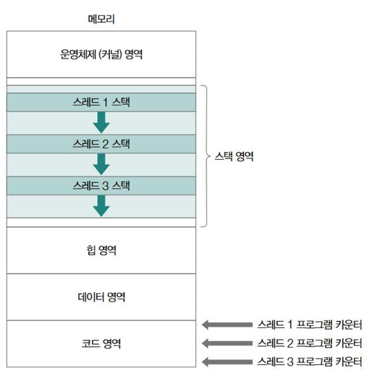

*   하나의 프로세스 내에서 여러 개의 **스레드(Thread)** 를 만들어 코드들을 동시에 실행하는 방식이다.
*   **스레드의 구성**
    *   각 스레드는 독립적인 실행 흐름을 위해 고유한 스레드 ID, 프로그램 카운터(PC), 레지스터 값, 스택 영역 등을 가진다.
    *   이를 통해 각 스레드는 다음에 실행할 명령어의 주소와 연산 중 필요한 임시 데이터를 개별적으로 관리할 수 있다.

---

### 멀티프로세스와 멀티스레드의 차이점

가장 핵심적인 차이점은 **자원 공유 여부**이다.

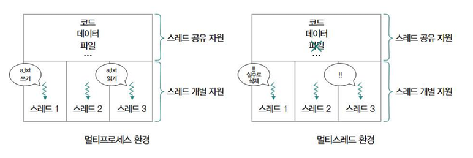

*   **멀티프로세싱 (서로 다른 프로세스들):**
    *   **자원 공유:** 기본적으로 자원을 공유하지 않는다. 각 프로세스는 완전히 독립적인 메모리 공간을 가진다.
    *   **독립성:** 매우 높다. 한 프로세스의 오류가 다른 프로세스에 영향을 미치지 않는다.
    *   **통신:** 프로세스 간 통신(IPC) 메커니즘이 필요하며, 상대적으로 복잡하다.
    *   **오버헤드:** 프로세스 생성 및 문맥 교환 시 오버헤드가 크다.

*   **멀티스레딩 (같은 프로세스 내 여러 스레드들):**
    *   **자원 공유:** 프로세스의 자원(코드 영역, 데이터 영역, 힙 영역, 열린 파일 등)을 공유한다. (단, 스택 영역은 스레드마다 별도로 가짐)
    *   **독립성:** 낮다. 한 스레드의 오류가 전체 프로세스에 영향을 줄 수 있다.
    *   **통신:** 공유 메모리를 통해 쉽게 데이터를 주고받을 수 있어 통신이 용이하다.
    *   **오버헤드:** 스레드 생성 및 문맥 교환 시 오버헤드가 프로세스보다 작다.

## 프로세스 간 통신

프로세스끼리는 기본적으로 자원을 공유하지 않지만, 프로세스끼리 자원을 공유하고 데이터를 주고 받을 수 있는 방법이 있다.

이를 **프로세스 간 통신(IPC, Inter-Process Communication)** 이라고 한다.

프로세스 간 통신에는 크게 두 가지 방식, **공유 메모리**와 **메시지 전달**이 있다.

---

### 공유 메모리
공유 메모리는 프로세스 간에 공유하는 메모리 영역을 토대로 데이터를 주고 받는 통신 방식이다.

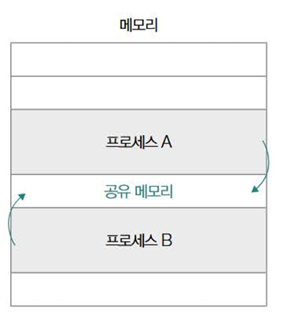

공유 메모리 기반 IPC는 

- 프로세스가 공유하는 메모리 영역을 확보하는 시스템 콜을 기반으로 수행될 수도 있고,
- 프로세스가 공유하는 변수나 파일을 활용할 수도 있다.

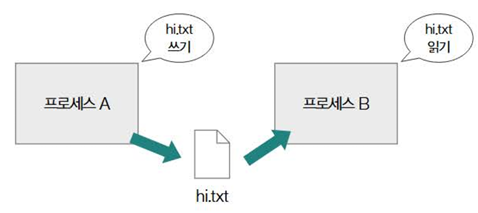

#### 특징

- 마치 자신의 메모리 영역을 읽고 쓰는 통신한다.
- 프로세스끼리 데이터를 주고받는 과정에 커널의 개입이 없다(데이터가 커널 영역을 거치지 않는 경우가 많음).
- 메시지 전달 방식보다 통신 속도가 빠르다.
- 데이터 일관성을 해칠 수 있다(경쟁 상태).

---

### 메시지 전달 

메시지 전달은 프로세스 간 주고받을 데이터가 커널을 거쳐 송수신되는 IPC이다.

공유 메모리 방식과는 다르게 메시지를 보내는 수단과 받는 수단이 명확하게 구분되어 있다(send() 시스템콜, receive() 시스템콜).

또한 커널의 도움을 받을 수 있어 경쟁 상태, 동기화 등 문제를 고려할 일이 적다.

메시지 전달 IPC를 위한 대표적인 수단으로 파이프, 시그널, 소켓, 원격 프로시저 호출(RPC) 등이 있다.

#### 파이프

파이프란 단방향 프로세스 간의 통신 도구를 뜻한다.

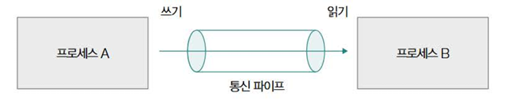

양방향 통신이 필요한 경우 읽기용 파이프와 쓰기용 파이프 2개를 이용해 통신한다.

#### 시그널

시그널은 프로세스에게 특정 **이벤트**가 발생했음을 알리는 비동기적인 신호이다.

시그널은 IPC만의 개념이 아니기에, '시그널을 적절히 활용해 IPC를 수행할 수 있다' 정도로 이해해야 한다.

다음은 리눅스 운영체제의 대표적인 시그널 예시이다.

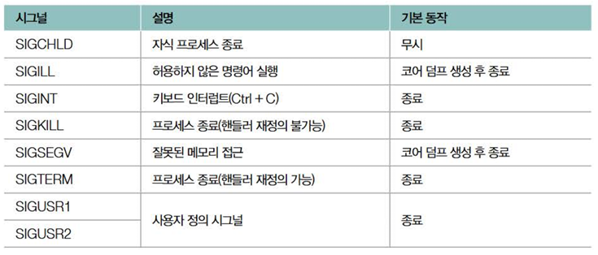

시그널이 발생하면 프로세스는 인터럽트 처리 과정과 유사하게 작동한다.

1. 하던 일을 중단한다.
2. 시그널 처리를 위한 **시그널 핸들러**를 실행한다.
3. 원래 작업을 재개한다.

파이프 방식과 똑같이 뭔가를 전달해주는 방식은 똑같아 보이지만, 파이프는 **데이터 전달 중심**이고 동기적이라면 시그널은 **이벤트 알림 중심**이고 비동기적인 것에서 차이가 있다고 볼 수 있다.

<br/><br/>


# 3. 동기화와 교착 상태

공유 자원에 접근하는 코드 중 동시에 실행했을 때 문제가 발생할 수 있는 코드를 **임계 구역**이라고 한다.

다음은 프로세스끼리 공유하는 자원을 이용했을 때 임계 구역의 예시이다.

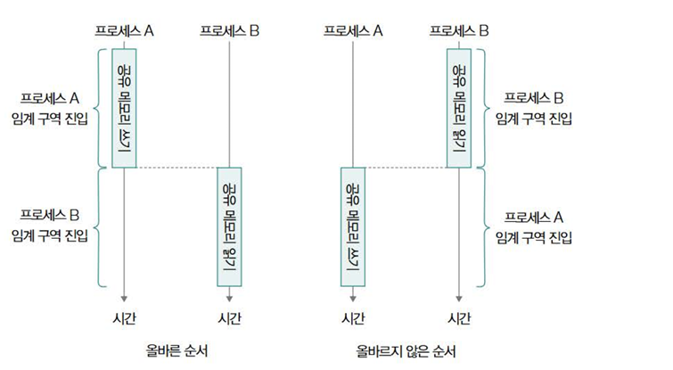

- 프로세스 B가 실행된 뒤에 프로세스 A가 실행되는 것은 문제가 될 수 있다.

- 이는 프로세스 B가 아직 쓰이지 않은 메모리를 읽으려 했기 때문이다.

다음은 스레드끼리 공유하는 자원을 이용했을 때의 예시이다.

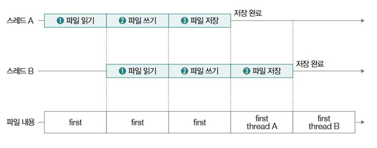

- 공유하는 자원을 서로 수정하려고 하는 상황.
- 먼저 쓰기를 진행했던 스레드 A의 작업 내역은 반영되지 않을 수 있다.

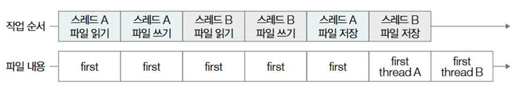

- 혹은 위처럼 문맥 교환이 발생하는 경우에도 각 스레드가 파일을 수정하는 코드는 임계 구역이 된다.

위 예시들을 통해 도출해낼 수 있는 정보들은 다음과 같다.

- **경쟁 상태 (Race Condition)**
  - 여러 프로세스나 스레드가 동시에 공유 자원(예: 변수, 파일 등)에 접근하여 값을 변경하려고 할 때, 접근 순서에 따라 결과가 달라지는 예측 불가능한 상태를 말한다.
  - 이는 데이터의 일관성을 깨뜨릴 수 있다.
- **임계 구역 (Critical Section)**
  - 코드 내에서 공유 자원에 접근하는 부분을 의미한다.
  - 경쟁 상태는 바로 이 임계 구역에서 발생할 수 있다.
- **상호 배제 (Mutual Exclusion)**
  - 임계 구역 문제를 해결하기 위한 핵심 원칙이다.
  - 즉, 한 번에 오직 하나의 프로세스 또는 스레드만이 임계 구역에 진입하도록 허용하고, 이미 임계 구역 안에 있는 작업이 끝나기 전까지 다른 작업들은 반드시 기다리도록 강제하는 것이다.


## 동기화 기법

**동기화**란 경쟁 상태를 해결하기 위해 상호 배제를 보장하는 것을 의미한다.

동기화 기법은 **뮤텍스 락**, **세마포**, **모니터** 등이 있다.

---

### 뮤텍스 락

**뮤텍스 락**은 공유 자원에 동시 접근이 불가능하도록 상호 배제를 보장하는 동기화 도구이다.

뮤텍스 락의 원리는 다음과 같이 단순하다.

> 임계 구역에 접근하고자 한다면 반드시 락(lock)을 획득(acquire)해야 한다.
>
> 임계 구역에서의 작업이 끝나면 락을 해제(release)해야 한다.

특이점은, acquire()은 특정 락에 대해 한 번만 호출 가능한 함수이고, 이후 다른 프로세스 및 스레드가 acquire()을 호출하더라도 락을 획득할 수 없다.

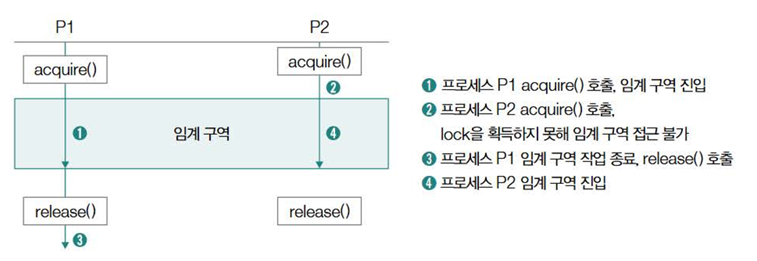

간단한 코드로 표현하면 다음과 같다.

```c++
lock.acquire();
// 임계 구역
lock.release();
```

다음은 경쟁 상태를 해결하는 예시 코드이다. 공유 자원은 최종적으로 0이 되어야 한다.

```java
import java.util.concurrent.locks.Lock;
import java.util.concurrent.locks.ReentrantLock;

public class MutexExample {

    private static int sharedData = 0;
    private static final Lock lock = new ReentrantLock();

    public static void main(String[] args) {
        System.out.println("초기 값: " + sharedData);

        Thread thread1 = new Thread(new Increment());
        Thread thread2 = new Thread(new Decrement());

        // 스레드 시작
        thread1.start();
        thread2.start();

        try {
            thread1.join();
            thread2.join();
        } catch (InterruptedException e) {
            Thread.currentThread().interrupt();
            System.err.println("메인 스레드 대기 중 인터럽트 발생");
            e.printStackTrace();
        }

        System.out.println("최종 값: " + sharedData);
    }

    static class Increment implements Runnable {
        @Override
        public void run() {
            for (int i = 0; i < 100000; i++) {
                lock.lock(); // --- 임계 구역 시작 (락 획득) ---
                try {
                    sharedData++; // 공유 데이터 증가
                } finally {
                    lock.unlock(); // --- 임계 구역 끝 (락 해제) ---
                }
            }
            System.out.println(Thread.currentThread().getName() + " 완료.");
        }
    }

    static class Decrement implements Runnable {
        @Override
        public void run() {
            for (int i = 0; i < 100000; i++) {
                lock.lock(); // --- 임계 구역 시작 (락 획득) ---
                try {
                    sharedData--; // 공유 데이터 감소
                } finally {
                    lock.unlock(); // --- 임계 구역 끝 (락 해제) ---
                }
            }
            System.out.println(Thread.currentThread().getName() + " 완료.");
        }
    }
}
```

---

### 세마포

- 뮤텍스 락: 한 번에 하나의 프로세스나 스레드만 공유 자원을 이용해야 하는 상황.
- 세마포: 한 번에 여러 프로세스나 스레드가 특정 자원을 이용하는 상황에서 사용.

세마포는 하나의 변수와 2개의 함수로 구성된다.

- 변수 S: 사용 가능한 공유 자원의 개수를 나타낸다.
- wait(): 임계 구역 진입 전 
- signal(): 임계 구역 진입 후

세마포도 뮤텍스 락과 똑같이 임계 구역 진입 전/후로 wait()과 signal()을 호출하면 된다.

```c++
wait()
// 임계 구역
signal()
```

#### wait() 함수의 작동 방식

1. wait() 함수 호출시 '사용 가능한 공유 자원의 개수'를 나타내는 변수 S를 1 감소시킨다.
2. 변수 S의 값이 0보다 작은지 여부를 확인한다. 
   - S를 1 감소시켰을 때 S>=0 이라면 사용 가능한 공유 자원의 개수가 남아 있었음을 의미한다. 이 경우, wait()를 호출한 프로세스 및 스레드는 임계 구역에 진입한다. 
   - 반대로, S를 1 감소시켰을 때 S<0 이라면 사용 가능한 공유 자원의 개수가 남아 있지 않았음을 의미한다.
3. S<0 이라면 wait()를 호출한 프로세스 및 스레드는 대기 상태로 전환되어 임계 구역에 진입할 수 없게 된다.

```c++
wait() {
    S--;          /* ① */
    if ( S < 0 ) {  /* ② */
        sleep();    /* ③ */
    }
}
```

#### signal() 함수의 작동 방식

1. signal()은 함수 호출 시 가장 먼저 ① '사용 가능한 공유 자원의 개수'를 나타내는 변수 S를 1 증가시킨다.
2. 변수 S의 값이 0 이하인지 확인한다. 
   - S를 1 증가시켰을 때 S가 0보다 크다는 것은 사용 가능한 공유 자원의 개수가 1개 이상 남아 있음을 의미하며, 이 경우는 대기 중인 프로세스/스레드가 없다고 간주할 수 있다. 
   - 반대로 S를 1 증가시켰을 때 0 이하라는 것은 (값을 증가시키기 전에는 음수였을 수 있으므로) 임계 구역에 진입하기 위해 대기하는 프로세스/스레드가 존재함을 의미한다.
3. S <= 0의 경우, 대기 상태로 접어든 프로세스 중 하나를 깨워 준비 상태로 전환한다. (wakeup(p)는 대기 중인 프로세스 p를 깨우는 동작을 나타낸다.)

```c++
signal() {
    S++;           /* ① */
    if ( S <= 0 ) {  /* ② */
        wakeup(p);   /* ③ */
    }
}
```

#### wait()과 signal()이 어떻게 동기화를 가능하게 하는가?

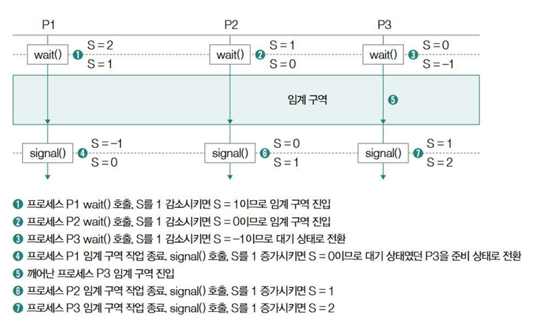

#### 세마포 코드 예시

```java
import java.util.concurrent.Semaphore;

public class Sem {

    static int sharedData = 0; // 공유 데이터 
    static Semaphore semaphore = new Semaphore(1); // 세마포 생성, 공유 자원 1개

    public static void main(String[] args) {
        Thread thread1 = new Thread(new Increment());
        Thread thread2 = new Thread(new Decrement());

        thread1.start(); // 첫 번째 스레드 시작
        thread2.start(); // 두 번째 스레드 시작

        try {
            thread1.join(); // 첫 번째 스레드 종료 대기
            thread2.join(); // 두 번째 스레드 종료 대기
        } catch (InterruptedException e) {
            e.printStackTrace();
        }

        System.out.println("Final value of sharedData: " + sharedData);
    }

    static class Increment implements Runnable {
        @Override
        public void run() {
            for (int i = 0; i < 100000; i++) {
                try {
                    semaphore.acquire(); // 세마포 획득
                    sharedData++;        // 공유 데이터 증가
                } catch (InterruptedException e) {
                     e.printStackTrace();
                } finally {
                    semaphore.release(); // 세마포 해제
                }
            }
             System.out.println("Increment 스레드 완료.");
        }
    }

    static class Decrement implements Runnable {
        @Override
        public void run() {
            for (int i = 0; i < 100000; i++) {
                try {
                    semaphore.acquire(); // 세마포 획득
                    sharedData--;        // 공유 데이터 감소
                } catch (InterruptedException e) {
                    e.printStackTrace();
                } finally {
                    semaphore.release(); // 세마포 해제
                }
            }
             System.out.println("Decrement 스레드 완료.");
        }
    }
}
```

---

### 조건 변수와 모니터

다음으로 알아볼 동기화 기법은 모니터이다. 

모니터를 이해하려면 우선 **조건 변수(Condition Variable)** 를 이해해야 한다.

#### 조건 변수 (Condition Variable)

- 목적
  - 스레드나 프로세스의 실행 순서를 제어하기 위한 동기화 도구이다. 세마포어가 자원의 개수를 세거나 신호를 보내는 데 중점을 둔다면, 조건 변수는 특정 조건이 만족될 때까지 기다리게 하는 데 특화되어 있다.
- 핵심 동작
  - `wait()`: 이 함수를 호출한 스레드는 특정 조건이 만족되기를 기다리며 대기 상태로 들어간다. (스스로 잠드는 것과 비슷)
  - `signal()`: 다른 스레드가 `wait()`를 호출하여 잠들어 있는 스레드에게 "이제 네가 기다리던 조건이 만족되었으니 깨어나도 돼!" 라고 알려주어 실행을 재개시키는 함수이다.
- 간단 요약:
  - 아직 원하는 조건이 안 됐으면? -> `wait()` 호출해서 기다린다.
  - 기다리던 조건이 충족됐으면? -> `signal()` 호출해서 기다리던 애를 깨운다.

다음은 조건 변수의 예시 코드이다.

```java
import java.util.concurrent.locks.Condition;
import java.util.concurrent.locks.Lock;
import java.util.concurrent.locks.ReentrantLock;

public class CV {

    private static final Lock lock = new ReentrantLock();
    private static final Condition cond = lock.newCondition();
    private static boolean ready = false;

    public static void main(String[] args) throws InterruptedException {
        Thread t1 = new Thread(new ThreadJob1());
        Thread t2 = new Thread(new ThreadJob2());

        t1.start();
        t2.start();

        t1.join();
        t2.join();
    }

    static class ThreadJob1 implements Runnable {
        @Override
        public void run() {
            System.out.println("P1: 먼저 시작");
            lock.lock(); // 락 획득 (임계 구역 진입)
            try {
                System.out.println("P1: 2초 대기");
                // ready 변수가 true가 될 때까지 (조건이 만족될 때까지) 대기
                while (!ready) {
                    cond.await(); // 조건 변수 wait
                }
                // 이 아래 코드는 P2가 signal을 보낸 후에 실행됨
            } catch (InterruptedException e) {
                e.printStackTrace();
            } finally {
                lock.unlock(); // 락 해제
            }

            System.out.println("P1: 다시 시작");
            System.out.println("P1: 종료");
        }
    }

    static class ThreadJob2 implements Runnable {
        @Override
        public void run() {
            System.out.println("P2: 2초 실행 시작");
            try {
                Thread.sleep(2000); // 2초 대기
            } catch (InterruptedException e) {
                e.printStackTrace();
            }

            System.out.println("P2: 실행 완료");
            lock.lock(); // 락 획득 (임계 구역 진입)
            try {
                ready = true;   
                cond.signal();    // 조건 변수 signal (대기 중인 스레드 하나를 깨움)
            } finally {
                lock.unlock(); // 락 해제
            }
        }
    }
}
```

위 코드의 실행 결과는 다음과 같다.

```
P1: 먼저 시작
P1: 2초 대기
P2: 2초 실행 시작
P2: 실행 완료
P1: 다시 시작
P1: 종료
```

#### 모니터

모니터는 공유 자원과 그 공유 자원을 다루는 함수(인터페이스)들로 구성된 동기화 도구이다. 

모니터는 상호 배제(Mutual Exclusion) 를 위한 동기화뿐만 아니라, 

실행 순서 제어를 위한 동기화까지 가능하다는 특징을 가진다.

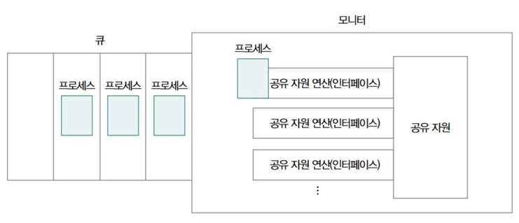

#### 모니터의 상호 배제 원리:
모니터의 기본적인 작동 원리는 단순하다.
1. 프로세스 및 스레드는 공유 자원에 접근하기 위해 반드시 모니터가 제공하는 정해진 함수(인터페이스)를 통해서만 모니터 내부로 진입해야 한다.
2. 어떤 시점이든 모니터 안에 진입하여 코드를 실행하는 프로세스 및 스레드는 항상 하나여야 한다. (자동 상호 배제 보장)
3. 만약 이미 모니터 내부에 진입하여 실행 중인 프로세스/스레드가 있다면, 다른 프로세스/스레드가 모니터 내부로 진입하려고 할 때 자동으로 큐(Queue)에서 대기해야 한다.

#### 모니터의 실행 순서 제어
모니터는 앞서 설명된 조건 변수(Condition Variable) 를 함께 활용하여 실행 순서 제어를 위한 동기화도 구현할 수 있다.

예를 들어, 동시에 실행되는 프로세스 A와 B 중, 반드시 A가 먼저 실행되고 그 다음에 B가 실행되어야 한다는 조건을 가정해 보자.

1. **프로세스 B의 조건 확인 및 대기**
   - 프로세스 B가 먼저 모니터 내부에 진입했다고 가정하자. 
   - B는 실행하기 전에 "프로세스 A의 실행이 완료되었는지" 조건을 먼저 검사해야 한다. 
   - 만약 A가 아직 완료되지 않았다면, 이는 'B가 실행되어야 한다'는 조건이 아직 충족되지 않은 것이다. 
   - 이 경우, 프로세스 B는 모니터 내의 특정 조건 변수(cv)에 대해 cv.wait()를 호출하여 대기 상태로 들어간다. 
   - wait()를 호출하면 B는 모니터의 락(lock)을 임시로 해제하고 잠들게 되어, 다른 프로세스(여기서는 A)가 모니터에 진입할 수 있게 된다.

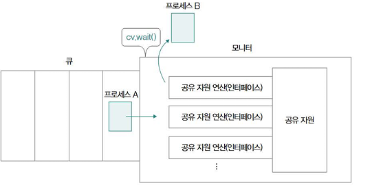

2. **프로세스 A의 작업 완료 및 신호**
   - 프로세스 A가 모니터 내로 진입하여 자신의 작업을 완료한다. 
   - 작업 완료 후, A는 프로세스 B가 기다리고 있던 조건 변수(cv)에 대해 cv.signal()을 호출한다. 
   - 이 signal() 호출은 cv.wait()로 인해 잠들어 있던 프로세스 B를 깨우는 역할을 한다.
   
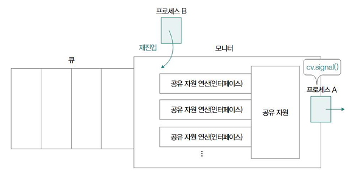

3. **프로세스 B의 실행 재개**
   - signal() 호출로 깨어난 프로세스 B는 다시 모니터의 락을 얻으려고 시도한다. 
   - 락을 성공적으로 획득하면, 이전에 cv.wait()를 호출했던 지점 다음부터 실행을 재개한다.


결과적으로, 이 과정을 통해 반드시 프로세스 A가 먼저 실행되고, 그 다음 프로세스 B가 실행되는 순서 제어가 이루어진다.

모니터를 이용한 코드 예시는 다음과 같다.

```java
public synchronized void example(int value){
    // 이 메서드 전체가 임계 구역이 되며, 한 번에 하나의 스레드만 실행 가능
    this.count += value;
}
```

---

### 스레드 안전 (Thread Safety)

#### 스레드 안전이란
- 어떤 코드(함수, 클래스, 객체 등)가 여러 스레드로부터 동시에 접근되어 실행되더라도, 예상한 대로 올바르게 동작하고 데이터의 일관성이 깨지지 않는 상태 또는 성질을 의미한다.
- 즉, 멀티스레드 환경에서도 해당 코드를 안전하게 사용할 수 있음을 뜻한다.

#### 경쟁 상태
- 스레드 안전성은 경쟁 상태(Race Condition) 와 밀접한 관련이 있다. 
- 경쟁 상태는 여러 스레드가 동기화 없이 공유 자원에 접근하여 발생할 수 있는 문제 상황 그 자체를 의미한다.
- 스레드 안전성은 이러한 경쟁 상태를 방지하거나 적절히 제어하여 코드의 안정성을 확보한 상태이다. 
- 스레드 안전한 코드는 내부적으로 뮤텍스, 세마포어 등의 동기화 기법을 사용하여 공유 자원에 대한 접근을 조율함으로써 경쟁 상태를 막는다.

#### Java Vector vs ArrayList
스레드 안전성을 이해하는 좋은 예시가 Java의 Vector와 ArrayList이다. 

두 클래스 모두 리스트 형태의 데이터를 저장하지만, 스레드 안전성 측면에서 큰 차이가 있다.

- **Vector**
  - Vector 클래스의 대부분의 메서드(예: add, get, remove)는 synchronized 키워드로 선언되어 있다.
  - synchronized는 메서드 전체 또는 특정 코드 블록에 대해 자동으로 락(모니터 락)을 걸어주는 역할을 한다. 
  - 따라서 Vector 객체에 대해서는 한 번에 하나의 스레드만 add와 같은 메서드를 실행할 수 있다 (상호 배제 보장).
  - 이로 인해 Vector는 별도의 동기화 처리 없이도 기본적으로 스레드 안전(Thread-Safe) 하다. 
  - 여러 스레드가 동시에 add를 호출해도 경쟁 상태가 발생하지 않는다.
  - 단점: 모든 메서드 호출에 동기화 비용(락 획득/해제 오버헤드)이 발생하므로, 단일 스레드 환경이나 이미 외부에서 동기화를 처리하는 경우에는 성능 저하가 발생할 수 있다.

- **ArrayList**
  - ArrayList 클래스의 메서드(예: add, get, remove)는 synchronized로 선언되어 있지 않다.
  - 따라서 여러 스레드가 동시에 같은 ArrayList 객체의 add 메서드를 호출하면, 내부 데이터(배열, 크기 변수 등)에 대한 접근이 겹쳐 경쟁 상태가 발생할 수 있다. 이로 인해 리스트의 크기가 잘못 계산되거나, 데이터가 유실되거나, 예외가 발생하는 등의 문제가 생길 수 있다.
  - ArrayList는 기본적으로 스레드 안전하지 않다 (Not Thread-Safe). 멀티스레드 환경에서 안전하게 사용하려면, 개발자가 직접 외부에서 동기화 처리(예: Collections.synchronizedList() 래퍼 사용, CopyOnWriteArrayList 사용, 또는 직접 락 사용)를 해주어야 한다.
  - 장점: 동기화 오버헤드가 없으므로 단일 스레드 환경에서는 Vector보다 일반적으로 성능이 좋다.

---

## 교착 상태

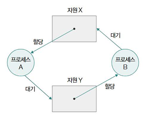

**교착 상태**란 두 개 이상의 프로세스가 서로 상대방이 가진 자원을 기다리며, 무한정 대기하여 더 이상 진행할 수 없는 상태이다.

### 교착 상태 조건

1. 상호 배제
2. 점유와 대기
3. 비선점
4. 원형 대기

### 해결 방법

#### 교착 상태 예방

- 교착 상태를 발생시키는 4가지 필요 조건 중 하나를 충족하지 못하게 하기

#### 교착 상태 회피

- 교착 상태를 한정된 자원의 무분별한 할당으로 인해 발생하는 문제로 간주함.
- 따라서 자원 할당 시 보수적으로 자원 할당하기

#### 교착 상태 검출 후 회복

- 프로세스를 자원 선점을 통해 회복
- 교착 상태에 놓인 프로세스를 강제 종료

<br/><br/>


# 4. CPU 스케줄링
다음 세 가지 개념을 다룬다.

- **CPU 스케줄링**: 운영체제가 다양한 프로세스와 스레드에 CPU 사용을 배분함으로써 CPU 자원을 관리하는 것
- **CPU 스케줄링 알고리즘**: 운영체제가 프로세스와 스레드에 CPU 사용을 배분하는 방법
- **CPU 스케줄러**: 운영체제가 프로세스와 스레드에 CPU 사용을 배분하는 일을 하는 커널 컴포넌트

### 우선순위
#### 우선순위 규칙
- CPU의 자원은 단순히 돌아가면서 프로세스에 할당되지 않음
- 운영체제는 우선순위에 따라 공정하게 CPU의 자원을 프로세스에 할당해야 함함
- 운영체제는 프로세스별 **우선순위**를 판단해 이를 PCB에 명시함
- 일반적으로 **우선순위가 높은 프로세스에게 CPU 자원을 더 빨리, 더 많이** 할당함

#### 우선순위 결정 기준
운영체제가 우선순위를 할당하는 중요한 기준 중 하나는 **CPU를 사용하는 방식**이다. 
- **CPU 버스트 (CPU Burst)**: 프로세스가 CPU를 집중적으로 사용하여 실행되는 구간
- **입출력 버스트 (I/O Burst)**: 프로세스가 입출력 작업을 요청하고 완료될 때까지 기다리는 구간

프로세스는 어떤 종류의 버스트가 더 빈번하고 긴지에 따라 프로세스 유형을 나누기도 한다.
- **입출력 집약적 프로세스 (I/O-bound Process)**
  - CPU 버스트가 짧고, 입출력 버스트가 긴 프로세스이다.
  - 즉, 잠깐 CPU를 사용하고 바로 입출력 작업을 요청한 뒤 오랫동안 대기하는 패턴을 보인다. (예: 파일 복사 프로그램, 네트워크 통신 프로그램)
  - 실행 시간보다 대기 시간이 더 긴 경향이 있다.
- **CPU 집약적 프로세스 (CPU-bound Process)**
  - CPU 버스트가 길고, 입출력 버스트가 짧거나 거의 없는 프로세스이다.
  - 즉, 입출력 작업 없이 오랫동안 CPU를 사용하여 복잡한 계산을 수행하는 패턴을 보인다. (예: 복잡한 그래픽 렌더링, 과학 계산 프로그램)
  - 대기 시간보다 실행 시간이 더 긴 경향이 있다.

#### 우선순위 기반 스케줄링의 효율성

입출력 집약적 프로세스와 CPU 집약적 프로세스는 CPU 사용 패턴이 매우 다르다. 

따라서 모든 프로세스에게 동일한 빈도로 CPU를 할당하는 것은 비효율적일 수 있다.
- **합리적 전략**
  - 입출력 집약적 프로세스가 CPU를 요청하면 **가능한 한 빨리** CPU를 할당하여 짧은 CPU 버스트를 신속하게 처리하고 입출력 작업을 시작하도록 한다. 
  - 이렇게 하면 해당 프로세스가 입출력 대기 상태에 들어간 동안, CPU는 **CPU 집약적 프로세스에게 할당**되어 쉬지 않고 계속 일할 수 있다.
- **우선순위 할당**
  - 이 전략을 구현하기 위해 운영체제는 기본적으로 **입출력 집약적 프로세스에게** CPU 집약적 프로세스보다 **높은 우선순위**를 부여한다.
- **효과**
  - CPU와 입출력 장치를 동시에 최대한 활용하여 시스템 전체의 처리량(Throughput)을 높이고 효율성을 극대화할 수 있다.

### 스케줄링 큐

운영체제는 한정된 시스템 자원(CPU, 메모리, 입출력 장치 등)을 여러 프로세스에게 효율적으로 배분하기 위해, 자원을 사용하려는 프로세스들이 줄을 서서 기다리도록 요구한다. 

이 줄 서기 메커니즘을 구현하는 것이 바로 **스케줄링 큐**이다.

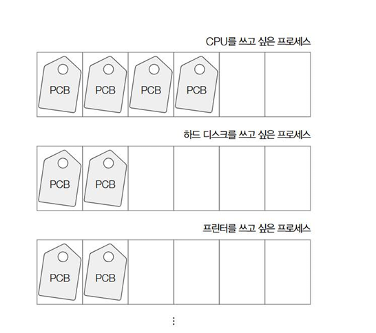

- **큐의 역할**
  - 특정 자원을 기다리는 프로세스들의 프로세스 제어 블록(PCB) 을 줄 세워 관리하는 역할을 한다.
  - 예를 들어 CPU를 사용하려는 프로세스들의 PCB는 CPU 큐에, 특정 입출력 장치를 사용하려는 프로세스들의 PCB는 해당 장치의 큐에 삽입된다.
- **FIFO 아님**
  - 자료구조로서의 큐는 선입선출(FIFO) 구조를 따르지만, 운영체제의 스케줄링 큐는 반드시 FIFO일 필요는 없다.
  - 우선순위 등 다양한 요인에 따라 큐에서 프로세스를 선택할 수 있다.

#### 주요 스케줄링 큐

1. **준비 큐 (Ready Queue)**
   - CPU를 사용하기 위해 대기하는 프로세스들의 PCB가 모여 있는 큐이다.
   - 프로세스가 생성되거나, 실행 중 타임 슬라이스를 다 사용하거나(타이머 인터럽트), 입출력 작업 완료 후 대기 상태에서 벗어나면 이 큐로 들어온다.
   - 운영체제(CPU 스케줄러)는 준비 큐에서 다음에 실행할 프로세스를 선택(디스패치)하여 CPU를 할당한다. (보통 우선순위가 높은 프로세스부터 선택)

2. **대기 큐 (Waiting Queue / Device Queue)**
   - CPU 이외의 특정 이벤트 발생을 기다리는 프로세스들의 PCB가 모여 있는 큐이다.
   - 주로 입출력 작업 완료를 기다리는 경우가 많다. 프로세스가 실행 중 입출력 장치 사용을 요청하면, 해당 장치의 대기 큐로 이동하여 입출력 완료 인터럽트가 발생할 때까지 기다린다.
   - **장치별 큐**: 대기 큐는 특정 이벤트를 기다리는 프로세스들을 모아두는데, 특히 입출력 장치의 경우 각 장치마다 별도의 대기 큐를 가지는 경우가 많다. (예: 하드 디스크 대기 큐, 프린터 대기 큐, CD-ROM 대기 큐 등)

#### 프로세스 상태와 큐 이동

프로세스는 실행되는 동안 상태가 변하며, 이에 따라 스케줄링 큐 사이를 이동한다.
- **준비 상태**: 프로세스는 준비 큐에서 자신의 차례를 기다린다.
- **준비 큐 -> 실행 상태**: CPU 스케줄러가 준비 큐에서 프로세스를 선택(디스패치)하면 실행 상태가 된다.
- **실행 상태 -> 준비 큐**: 할당된 CPU 시간(타임 슬라이스)을 모두 사용하면 타이머 인터럽트가 발생하여 다시 준비 큐로 돌아간다.
- **실행 상태 -> 대기 큐**: 실행 중 입출력 작업을 요청하면 해당 장치의 대기 큐로 이동하여 대기 상태가 된다.
- **대기 큐 -> 준비 큐**: 기다리던 입출력 작업이 완료되면 (입출력 완료 인터럽트 발생), 운영체제는 해당 프로세스의 PCB를 대기 큐에서 제거하고 다시 준비 큐로 이동시킨다.

### 선점형 스케줄링과 비선점형 스케줄링
CPU 스케줄링은 기본적으로 한 프로세스의 실행이 끝나면 (또는 스스로 CPU를 반납하면) 다음 프로세스를 선택하여 실행하는 방식으로 이루어진다.

하지만 프로세스가 아직 끝나지 않았음에도 불구하고 실행 도중에 스케줄링이 발생하는 대표적인 두 가지 시점이 있다:
- 실행 상태 -> 대기 상태: 실행 중인 프로세스가 입출력 작업을 요청하여 대기 상태로 전환될 때
- 실행 상태 -> 준비 상태: 실행 중인 프로세스에게 할당된 시간(타임 슬라이스)이 만료되어 타이머 인터럽트가 발생하고 준비 상태로 변경될 때

이 두 시점에서 운영체제가 어떻게 동작하느냐에 따라 스케줄링 방식을 크게 두 가지로 나눌 수 있다.
1. **비선점형 스케줄링 (Non-preemptive Scheduling)**
   - 오직 (실행 -> 대기) 에서만 스케줄링이 발생하는 방식이다. 
   - 즉, 어떤 프로세스가 CPU를 사용하고 있다면, 그 프로세스가 스스로 종료하거나 대기 상태에 들어가기 전까지는 **다른 프로세스가 CPU를 빼앗을 수 없다**.
    - 한 프로세스가 CPU를 사용하기 시작하면 끝날 때까지 (또는 입출력 대기 전까지) 계속 사용한다. 다른 프로세스는 무조건 기다려야 한다.
    - 문맥 교환의 빈도가 상대적으로 적어 오버헤드가 적을 수 있다.
    - 하지만 CPU를 오래 사용하는 프로세스가 있으면 다른 프로세스들(특히 짧은 작업이나 우선순위 높은 작업)이 무작정 기다려야 하는 단점이 있다. 
    - 응답성이 떨어질 수 있다.
2. **선점형 스케줄링 (Preemptive Scheduling)**
   - (실행 -> 대기)와 (실행 -> 준비, 타이머 인터럽트 등) 모두에서 스케줄링이 발생할 수 있는 방식이다. 
   - '선점'이란 '남보다 앞서서 차지함'을 의미하며, 운영체제가 현재 CPU를 사용 중인 프로세스로부터 **CPU 자원을 강제로 빼앗아 다른 프로세스에게 할당**할 수 있는 스케줄링을 말한다.- 지금까지 설명된 타이머 인터럽트 기반 스케줄링 (라운드 로빈 등)은 대표적인 선점형 스케줄링의 일종이다. 
   - 프로세스마다 정해진 시간만큼만 CPU를 사용하고 시간이 다 되면 운영체제가 강제로 CPU를 회수하여 다음 프로세스에게 넘겨준다.
   - 또한, 실행 중인 프로세스보다 더 높은 우선순위의 프로세스가 준비 상태가 되면, 현재 프로세스를 멈추고 더 높은 우선순위 프로세스에게 CPU를 할당할 수도 있다.
   - 장점: 어느 한 프로세스가 CPU를 독점하는 것을 막고 여러 프로세스에게 CPU 자원을 비교적 골고루 배분할 수 있다. 더 긴급한 프로세스가 빠르게 CPU를 얻을 수 있어 응답성이 좋다.
   - 단점: 문맥 교환이 비선점형 방식보다 자주 발생하므로, 문맥 교환 과정에서 발생하는 오버헤드가 더 클 수 있다.

## CPU 스케줄링 알고리즘

### 선입 선처리 스케줄링 (FCFS)

- 방식: 가장 단순한 방식으로, 준비 큐에 도착한 순서대로 프로세스에게 CPU를 할당한다.
- 특징: 이해하고 구현하기 쉽다.
- 단점: 실행 시간이 매우 긴 프로세스가 먼저 도착하면, 그 뒤의 짧은 프로세스들이 하염없이 기다려야 하는 **호위 효과(Convoy Effect)** 가 발생하여 평균 대기 시간이 길어질 수 있다. 
- 비선점형 방식이다.

### 최단 작업 우선 스케줄링 (SJF)

- 방식: 준비 큐에 있는 프로세스들 중에서 CPU 사용 시간(CPU 버스트)이 가장 짧을 것으로 예상되는 프로세스에게 먼저 CPU를 할당한다.
- 특징: 평균 대기 시간을 최소화할 수 있는 최적의 알고리즘 중 하나로 알려져 있다.
- 단점: 각 프로세스의 정확한 CPU 사용 시간을 미리 알기 어렵다는 문제가 있다. 
- 기본적으로 비선점형이지만, 선점형으로 구현될 수도 있다 (SRT).

### 라운드 로빈 스케줄링 (Round Robin)

- 방식: 선입 선처리(FCFS) 방식에 타임 슬라이스(Time Slice) 또는 퀀텀(Quantum) 이라는 개념을 더한 선점형 방식이다. 각 프로세스는 정해진 타임 슬라이스만큼만 CPU를 사용한다.
- 동작: 시간이 다 되기 전에 프로세스가 끝나면 다음 프로세스에게 CPU를 넘긴다. 시간이 다 되었는데도 프로세스가 끝나지 않으면, 운영체제는 해당 프로세스를 강제로 멈추고 준비 큐의 맨 뒤로 보낸 후, 다음 프로세스에게 CPU를 할당한다.
- 모든 프로세스가 공평하게 CPU 시간을 나눠 가질 기회를 얻는다. 
- 응답 시간이 빠르다.
- 타임 슬라이스 크기 설정이 중요하다.

### 최소 잔여 시간 우선 스케줄링 (SRT)

- 최단 작업 우선(SJF) 알고리즘의 선점형 버전이다.
- 현재 실행 중인 프로세스의 남은 CPU 시간보다 더 짧은 CPU 시간을 가진 새로운 프로세스가 준비 큐에 도착하면, 현재 프로세스를 멈추고 새로운 프로세스에게 CPU를 할당한다.
- SJF의 장점(평균 대기 시간 최소화)을 가지면서, 선점 방식을 통해 짧은 작업이 긴 작업 때문에 오래 기다리는 것을 줄여준다.

### 우선순위 스케줄링 (Priority Scheduling)

- 각 프로세스에 우선순위를 부여하고, 가장 높은 우선순위를 가진 프로세스에게 CPU를 할당한다. 선점형 또는 비선점형으로 구현될 수 있다.
- 중요한 프로세스를 먼저 처리할 수 있다.
- 우선순위가 낮은 프로세스는 계속 실행되지 못하고 무한정 기다리는 **기아 현상(Starvation)** 이 발생할 수 있다.
- **기아 현상 해결책**: **에이징(Aging)** 기법을 사용하여, 오랫동안 기다린 프로세스의 우선순위를 점차 높여 언젠가는 실행될 기회를 얻도록 한다.

### 다단계 큐 스케줄링

- 준비 큐를 여러 개의 독립적인 큐로 분할하여 사용하는 방식이다.
- 각 큐는 자신만의 우선순위를 가지며, 해당 큐 내부에서는 별도의 스케줄링 알고리즘(예: 상위 큐는 RR, 하위 큐는 FCFS)을 사용할 수 있다.
- 일반적으로 우선순위가 가장 높은 큐에 있는 프로세스들을 먼저 처리하고, 해당 큐가 비어야 다음 우선순위 큐의 프로세스를 처리한다.
- 프로세스 유형(예: 대화형, 백그라운드)에 따라 다른 스케줄링 정책을 적용하기 용이하다.
- 단점: 프로세스가 한번 특정 큐에 할당되면 다른 큐로 이동할 수 없어, 하위 큐의 프로세스는 기아 현상을 겪을 수 있다.

### 다단계 피드백 큐 스케줄링

- 다단계 큐 스케줄링과 유사하지만, 프로세스가 큐 사이를 이동할 수 있다는 점이 가장 큰 차이점이다.
- 새로운 프로세스는 일반적으로 가장 높은 우선순위 큐에 들어간다.
- 할당된 타임 슬라이스 동안 실행이 끝나지 않으면, 더 낮은 우선순위 큐로 강등된다. (CPU를 오래 사용하는 프로세스는 우선순위가 낮아짐)
- 낮은 우선순위 큐에서 너무 오래 대기하면, 더 높은 우선순위 큐로 승격될 수 있다 (에이징).

---

## 리눅스 CPU 스케줄링
리눅스 운영체제는 다양한 상황에 맞춰 여러 CPU 스케줄링 알고리즘을 사용한다. 

이는 리눅스의 스케줄링 정책(Scheduling Policy) 을 통해 관리된다. 

스케줄링 정책은 새로운 프로세스를 언제, 어떻게 선택하여 실행할지 결정하는 규칙의 집합이며, 리눅스에서는 크게 다음과 같은 5가지 스케줄링 정책을 사용한다.

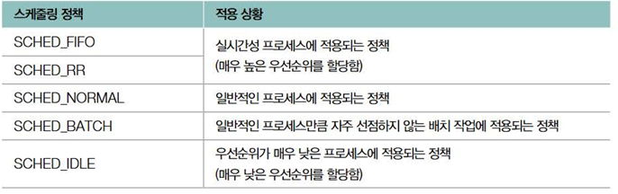

#### 실시간 스케줄링 정책 (`SCHED_FIFO`, `SCHED_RR`):
- `SCHED_FIFO` (First-In, First-Out): 실시간 프로세스를 위한 **선입선출 비선점형** 방식이다. 일단 CPU를 잡으면 스스로 반납하거나 더 높은 우선순위의 실시간 프로세스가 나타나기 전까지 계속 실행한다.
- `SCHED_RR` (Round Robin): 실시간 프로세스를 위한 라운드 로빈 선점형 방식이다. `SCHED_FIFO`와 유사하지만, 각 프로세스에게 정해진 타임 슬라이스만큼만 CPU를 할당한다. 시간이 만료되면 같은 우선순위 큐의 다음 프로세스에게 CPU를 넘긴다.
- 이 두 정책은 매우 높은 우선순위를 가지며, 일반 프로세스보다 먼저 실행될 기회를 보장받는다.

#### 일반 프로세스 스케줄링 정책 (`SCHED_NORMAL`):
- 리눅스에서 가장 일반적으로 사용되는 정책이며, **CFS(Completely Fair Scheduler)** 라는 스케줄러에 의해 관리된다.
- **CFS의 목표**: 모든 프로세스에게 CPU 시간을 **'완전히 공평하게'** 배분하는 것을 지향한다.
- **vruntime (Virtual Runtime)**: CFS는 각 프로세스마다 **가상 실행 시간(vruntime)** 이라는 정보를 유지한다. 이는 실제 실행 시간(runtime)이 아니라, 프로세스의 **'가중치(weight)'** 를 고려한 가상의 실행 시간이다.
  - **가중치**: 프로세스의 우선순위(nice 값)에 따라 결정된다. 우선순위가 높을수록(nice 값이 낮을수록) 가중치가 크다.
  - **vruntime 계산** (개략적): vruntime ≈ (실제 실행 시간) / (프로세스 가중치) \* (전체 가중치 평균)
  - **의미**: 가중치가 높은 프로세스는 실제 실행 시간이 길어도 vruntime은 천천히 증가하고, 가중치가 낮은 프로세스는 실제 실행 시간이 짧아도 vruntime이 빠르게 증가한다.
 
- **CFS의 선택 기준**: CFS는 현재 실행 가능한 프로세스들 중에서 vruntime 값이 가장 작은 프로세스를 다음에 실행할 대상으로 선택한다. 즉, vruntime이 일종의 '공평성 척도'이자 우선순위 역할을 한다. vruntime이 작다는 것은 그동안 CPU를 '덜' 사용했다고 간주하여 먼저 실행 기회를 주는 것이다.
- **타임 슬라이스 결정**: CFS에서 각 프로세스에게 할당되는 타임 슬라이스 역시 고정된 값이 아니라, 프로세스의 가중치(우선순위)에 따라 동적으로 결정된다.
  - **계산 (개략적)**: 타임 슬라이스 ≈ (전체 스케줄링 주기) \* (프로세스 가중치 / 큐 내 모든 프로세스 가중치 합)
  - **의미**: 가중치가 높을수록(우선순위가 높을수록) 더 긴 타임 슬라이스를 할당받는다.

<br/><br/>


# 5. 가상 메모리

CPU는 동적으로 변하는 모든 프로세스의 정확한 메모리 위치를 직접 파악하기 어렵기 때문에, 이를 관리하기 위해 **논리 주소**와 **가상 메모리**, **페이징** 같은 기법이 필요하다.

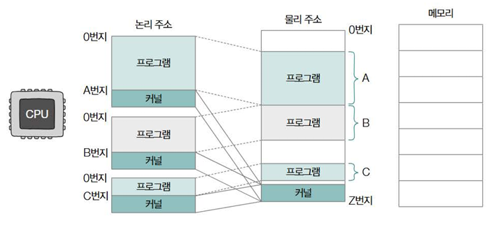

## 물리 주소와 논리 주소

- **물리 주소 (Physical Address)**
  - 메모리 하드웨어 상의 실제 주소이다. 
  - 메모리 칩에서 사용하는 고유한 번지
- **논리 주소 (Logical Address)**
  - CPU와 프로세스가 사용하는 주소이다. 
  - 각 프로세스마다 독립적으로 부여되며, 일반적으로 0번지부터 시작하는 주소 체계이다.
- **논리 주소 사용 이유**
  - 실제 물리 주소를 직접 사용하면 여러 프로세스가 동시에 메모리에 적재될 때 주소가 겹칠 수 있다. 
  - 각 프로세스가 자신만의 0번지부터 시작하는 논리 주소 공간을 가짐으로써 이러한 주소 충돌 문제를 해결하고 프로세스별로 독립적인 주소 공간을 제공한다.
- **주소 변환 필요성**
  - CPU가 사용하는 논리 주소는 실제 메모리(RAM)의 물리 주소와 다르다. 
  - 따라서 CPU가 논리 주소를 통해 메모리에 접근하려면, 반드시 논리 주소를 물리 주소로 변환하는 과정이 필요하다.
- **MMU (Memory Management Unit)**
  - 이 논리 주소-물리 주소 변환을 담당하는 하드웨어 장치이다. 
  - MMU는 CPU와 메모리 사이에 위치하여 CPU가 이해하는 논리 주소를 메모리가 이해하는 물리 주소로 빠르게 변환해주는 역할을 한다.

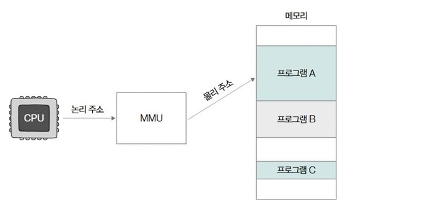

## 스와핑과 연속 메모리 할당

### 스와핑

- **정의**
  - 메모리(RAM)에 적재된 프로세스들 중에는 현재 실행되지 않거나 오랫동안 사용되지 않아 사실상 유휴 상태인 프로세스가 있을 수 있다. 
  - 스와핑은 이러한 프로세스를 **메모리에서 통째로 내보내 스왑 영역(Swap Space)** 이라는 보조기억장치(디스크)의 특별한 공간으로 옮기고, 그 자리에 다른 프로세스를 적재하여 실행하는 메모리 관리 기법이다.
- **목적**
  - 물리 메모리(RAM)의 크기는 한정되어 있는데, 그보다 더 많은 프로세스를 동시에 실행 준비 상태로 유지하거나, 메모리 공간이 부족할 때 우선순위가 낮은 프로세스를 잠시 보조기억장치로 옮겨 공간을 확보하기 위해 사용된다.
- **스왑 영역 (Swap Space/Area)**
  - 프로세스를 임시로 내보내 저장하는 보조기억장치(하드 디스크, SSD 등) 내의 특별한 공간이다.
  - macOS, 리눅스 등 여러 운영체제에서 스왑 영역의 크기 등을 확인할 수 있다.
- **스왑 아웃 (Swap Out)**
  - 현재 실행되지 않는 프로세스를 메모리에서 스왑 영역으로 내보내는 과정이다.
- **스왑 인 (Swap In)**
  - 스왑 아웃되었던 프로세스가 다시 실행되어야 할 때, 스왑 영역에서 메모리로 다시 불러들이는 과정이다.
- **주소 재배치**
  - 스왑 인될 때, 해당 프로세스는 이전에 메모리에 있었던 주소와 다른 물리 주소에 적재될 수 있다.
- **기본 메모리 관리 기법**
  - 스와핑은 운영체제가 메모리 내의 빈 공간에 프로세스들을 적재하고 관리하는 기본적인 방법 중 하나이다. (이후 메모리 공간 할당 방법에 대한 논의로 이어진다.)

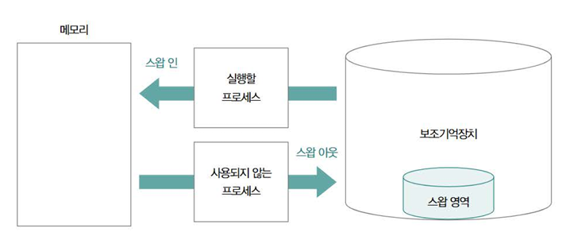

### 연속 메모리 할당과 외부 단편화

- **연속 메모리 할당 (Contiguous Memory Allocation)**
  - 프로세스를 메모리에 적재할 때, 해당 프로세스가 필요로 하는 메모리 공간 전체를 물리적으로 연속된 하나의 덩어리(block) 로 할당하는 방식이다.
  - 예를 들어, 프로세스 A가 50MB 필요하면 메모리에서 비어있는 50MB 크기의 연속 공간을 찾아 할당하고, 그 바로 다음에 프로세스 B가 100MB 필요하면 A 다음부터 100MB의 연속 공간을 찾아 할당하는 식이다.
- **문제점**
  - 얼핏 보면 당연하고 보편적인 방식 같지만, 메모리를 효율적으로 사용하는 방법은 아니다.
  - 외부 단편화(External Fragmentation) 라는 문제를 내포하고 있다.
- **외부 단편화 (External Fragmentation)**
  - **정의**: 프로세스들이 메모리에 연속적으로 할당되고 해제되는 과정이 반복되면서, 할당된 메모리 블록들 사이에 **작은 크기의 사용 가능한 빈 공간(hole)들이 여러 개 흩어져 발생하는 현상**이다.
  - **원인**: 프로그램의 실행과 종료가 반복되면서 메모리 공간이 조각나는 것이다.
  - **결과**: 메모리에는 분명히 사용 가능한 빈 공간들이 존재하고, 그 빈 공간들의 총합은 새로운 프로세스를 적재하기에 충분히 클지라도, 연속된 단일 빈 공간 중에는 새로운 프로세스를 수용할 만큼 큰 공간이 없는 상황이 발생한다.
  - **예시**: 메모리에 총 50MB의 빈 공간(30MB짜리 하나, 20MB짜리 하나)이 남아있지만, 50MB 크기의 새로운 프로세스는 이 두 조각난 공간 어디에도 연속적으로 들어갈 수 없어 적재하지 못한다.
  - **낭비**: 결국 사용 가능한 메모리 공간이 있음에도 불구하고 활용하지 못하게 되어 메모리 낭비로 이어진다.

## 페이징을 통한 가상 메모리 관리

스와핑과 연속 메모리 할당은 2개의 문제점을 내포한다.

1. 외부 단편화: 연속 메모리 할당 방식은 프로세스 적재와 삭제를 반복하면서 메모리 사이에 사용하기 어려운 작은 빈 공간(단편화)을 발생시켜 메모리 낭비를 초래한다.
2. 물리 메모리 크기 제약: 프로세스를 반드시 물리 메모리에 연속적으로 할당해야 한다면, 실제 사용 가능한 물리 메모리(RAM) 크기보다 더 큰 프로세스는 실행할 수 없다는 근본적인 한계가 있다. (예: 4GB RAM 컴퓨터에서 4GB 이상의 프로그램 실행 불가)
   
- **해결책**: **가상 메모리 (Virtual Memory)**
    - 이러한 문제들을 해결하기 위해 등장한 운영체제의 메모리 관리 기술이 바로 **가상 메모리**이다.
    - **핵심 아이디어**: 실행하고자 하는 프로그램의 **일부만 물리 메모리(RAM)에 적재**하고, 나머지는 **보조기억장치(디스크)의 일부를 메모리처럼** 사용하여 실제 메모리보다 더 큰 프로그램도 실행할 수 있도록 만든다. 또한, 프로세스의 일부만 메모리에 적재함으로써 실제 물리 메모리 크기보다 **메모리가 더 커 보이게 하는 효과**를 준다.
    - **가상 주소 공간 (Virtual Address Space)**: 가상 메모리 기법을 통해 생성된, 프로세스가 인식하는 논리적인 주소 공간을 가상 주소 공간이라고도 부른다.
- **대표적인 가상 메모리 관리 기법**
  - **페이징 (Paging)**: 프로세스의 가상 주소 공간과 물리 메모리를 일정한 크기의 블록(페이지, 프레임)으로 나누어 관리하는 기법이다. 외부 단편화 문제를 해결하는 데 효과적이다.
  - **세그먼테이션 (Segmentation)**: 프로세스의 가상 주소 공간을 코드, 데이터, 스택 등 논리적인 의미 단위(세그먼트)로 나누어 관리하는 기법이다.

### 페이징
- **정의**
  - 페이징은 프로세스의 논리 주소 공간을 페이지(Page) 라는 일정한 크기의 단위로 나누고, 물리 메모리(RAM) 역시 페이지와 동일한 크기의 프레임(Frame) 이라는 일정한 단위로 나눈 뒤, 각 페이지를 개별적으로 프레임에 할당하는 가상 메모리 관리 기법이다.
- **핵심 특징**
  - 비연속적 배치: 프로세스를 구성하는 각 페이지는 물리 메모리 내의 서로 떨어져 있는(비연속적인) 프레임에 배치될 수 있다. 
  - 즉, 논리적으로는 연속된 주소 공간이라도 물리적으로는 흩어져 저장될 수 있다.
- **외부 단편화 해결**
  - 이처럼 메모리를 고정된 크기(페이지/프레임) 단위로 관리하고 비연속적으로 할당하기 때문에, 연속 메모리 할당 방식에서 발생했던 외부 단편화 문제가 발생하지 않는다. 
  - 작은 빈 공간들이 흩어져 있어도, 각 프레임 단위로 할당할 수 있기 때문이다.
- **페이징과 스와핑 (페이지 아웃/인)**
  - 페이징 기법에서도 스와핑 개념이 사용될 수 있다. 다만, 프로세스 전체가 스왑 아웃/인 되는 것이 아니라, 페이지 단위로 스왑 아웃/인이 이루어진다.
- **페이지 아웃 (Page Out)**
  - 메모리(RAM)에 있는 페이지 중 당장 사용되지 않는 페이지를 보조기억장치(디스크의 스왑 영역)로 내보내는 것이다.
- **페이지 인 (Page In)**
  - 보조기억장치에 있던 페이지가 필요해져서 다시 메모리(RAM)로 불러들이는 것이다.
- **결과 (가상 메모리 구현)**
  - 이를 통해 프로그램의 일부 페이지만 메모리에 적재하고 나머지는 보조기억장치에 두는 것이 가능하다. 
  - 즉, 프로그램을 실행하기 위해 전체 프로그램이 메모리에 있을 필요가 없다. 
  - CPU 관점에서는 논리 메모리의 크기가 실제 물리 메모리 크기보다 클 수 있게 되며, 페이징을 통해 물리 메모리보다 큰 프로그램의 실행도 가능해진다.
- **새로운 문제점: 주소 변환**
  - 프로세스의 페이지들이 물리 메모리 내에 비연속적으로 흩어져 배치되기 때문에, CPU 입장에서는 다음에 실행할 (논리 주소 상의) 페이지가 물리 메모리의 어느 프레임에 저장되어 있는지 찾는 것이 어렵다. 
  - CPU는 어떤 페이지가 어떤 프레임에 적재되어 있는지 모든 정보를 직접 알기 어렵다. 
  - (이 문제를 해결하기 위해 페이지 테이블과 MMU가 필요하게 된다.)

### 페이지 테이블
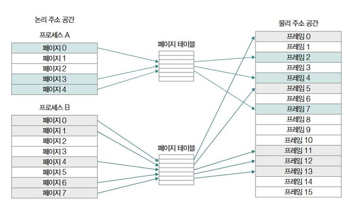

- **목적**
  - 페이징 시스템에서 프로세스의 논리 페이지들이 물리 메모리의 어느 프레임에 비연속적으로 배치되어 있는지 매핑(mapping) 정보를 관리하기 위해 사용된다. 
  - 즉, 논리 주소를 물리 주소로 변환하는 데 필요한 핵심 정보를 제공한다.
- **구조**
  - 기본적으로 페이지 번호(Page Number) 와 그 페이지가 실제 적재된 프레임 번호(Frame Number) 가 짝을 이루어 저장된다.
- **프로세스별 관리**
  - 각 프로세스는 자신만의 고유한 페이지 테이블을 가진다. 
  - CPU가 특정 프로세스를 실행할 때는 해당 프로세스의 페이지 테이블을 참조하여 메모리에 접근한다.

### 페이지 테이블 엔트리
페이지 테이블을 구성하는 각 행(항목)을 PTE라고 하며, 여기에는 프레임 번호 외에도 중요한 정보들이 포함된다.

- **유효 비트 (Valid Bit / Present Bit)**
  - 해당 페이지가 현재 물리 메모리(RAM)에 적재되어 있는지(1) 아니면 디스크에 있는지(0)를 나타낸다. 
  - 이 비트가 0일 때 해당 페이지에 접근하면 **페이지 폴트(Page Fault)** 가 발생한다.
- **보호 비트 (Protection Bit)**
  - 페이지에 대한 접근 권한(읽기 'r', 쓰기 'w', 실행 'x')을 제어한다.
  -  예를 들어, 읽기 전용 페이지에 쓰기를 시도하면 보호 오류가 발생한다.
- **참조 비트 (Reference Bit)**
  - 페이지가 최근에 접근(참조)되었는지 여부를 나타낸다. 
  - 페이지 교체 알고리즘에서 활용된다. (최근 사용 안 된 페이지를 교체 대상으로 삼기 위해)
- **수정 비트 (Modified Bit / Dirty Bit)**
  - 페이지가 메모리에 로드된 후 내용이 변경(수정)되었는지 여부를 나타낸다. 
  - 이 비트가 1이면 해당 페이지를 메모리에서 내보낼 때 변경된 내용을 디스크(스왑 영역)에 다시 저장해야 한다. 
  - 0이면 디스크에 쓸 필요 없이 그냥 덮어써도 된다.

### 페이징의 단점: 내부 단편화 (Internal Fragmentation)
- 페이징은 외부 단편화는 해결하지만, 내부 단편화 문제를 일으킬 수 있다.
- 프로세스의 크기가 페이지 크기의 배수가 아닐 경우, 마지막 페이지에는 사용되지 않는 빈 공간이 남게 된다. 
- 이 공간은 페이지 단위로만 메모리가 할당되므로 다른 프로세스가 사용할 수 없어 낭비된다. 
- (예: 페이지 크기 10KB, 프로세스 107KB -> 11개 페이지(110KB) 할당, 마지막 페이지에 3KB 낭비 발생)

### 페이지 테이블 관리 및 문제점
- **저장 위치 및 접근**
  - 각 프로세스의 페이지 테이블은 메모리(RAM)의 커널 영역에 저장된다. 
  - CPU 내의 페이지 테이블 기준 레지스터(PTBR, Page Table Base Register) 는 현재 실행 중인 프로세스의 페이지 테이블 시작 주소를 가리킨다. 
  - 컨텍스트 스위칭 시 PTBR 값도 변경된다.
- **문제점 1: 메모리 접근 속도 저하**
  - CPU가 특정 데이터에 접근하려면, (1) 메모리에서 페이지 테이블을 찾아 프레임 번호를 얻고, (2) 그 프레임 번호로 다시 메모리에 접근하여 실제 데이터를 가져와야 한다. 즉, 메모리 접근이 두 번 필요하여 속도가 느려진다.
  - **해결책: TLB (Translation Lookaside Buffer)**
  - MMU 내부에 있는 고속 주소 변환 캐시이다. 최근 사용된 페이지-프레임 매핑 정보를 저장해둔다.
  - **TLB 히트(Hit)**: TLB에 정보가 있으면 페이지 테이블 접근 없이 바로 물리 주소를 얻어 성능 저하가 없다.
  - **TLB 미스(Miss)**: TLB에 정보가 없으면 메모리의 페이지 테이블을 접근해야 한다. (속도 저하 발생)
- **문제점 2: 메모리 공간 낭비**
  - 가상 주소 공간이 매우 큰 프로세스의 경우, 페이지 테이블 자체의 크기도 매우 커져서 메모리를 많이 차지하게 된다.
  - **해결책: 계층적 페이징 (Hierarchical Paging / Multilevel Page Table)**
  - 페이지 테이블을 여러 단계(Level)로 나누어 구성한다. 
  - 예를 들어 2단계 페이징에서는 바깥쪽 페이지 테이블(Outer Page Table)이 안쪽 페이지 테이블들의 위치를 가리킨다. 
  - 이렇게 하면 당장 사용하지 않는 영역의 안쪽 페이지 테이블은 메모리에 로드하지 않아도 되어 메모리 공간을 절약할 수 있다.

### 페이징 주소 체계
- 페이징 시스템에서 사용하는 **논리 주소(가상 주소)** 는 기본적으로 두 부분으로 구성된다:
  - **<페이지 번호 (Page Number), 변위 (Offset)>**

- **페이지 번호 (Page Number)**
  - 접근하려는 주소가 몇 번째 페이지에 속하는지를 나타낸다.
  - 이 페이지 번호는 페이지 테이블을 참조(인덱싱) 하여 해당 페이지가 실제 물리 메모리의 어느 프레임에 저장되어 있는지(프레임 번호) 를 찾는 데 사용된다.
- **변위 (Offset)**
  - 접근하려는 주소가 해당 페이지(또는 프레임)의 시작 지점으로부터 얼만큼 떨어져 있는지를 나타내는 상대적인 위치 정보이다.
  - 페이지 크기가 2<sup>n</sup> 바이트라면, 변위는 n비트로 표현된다.
- **논리 주소 -> 물리 주소 변환 과정**
  - CPU가 생성한 논리 주소 <페이지 번호, 변위> 를 MMU가 받는다.
  - MMU는 페이지 번호를 사용하여 페이지 테이블에서 해당 항목을 찾는다.
  - 페이지 테이블 항목에서 해당 페이지가 적재된 프레임 번호를 얻는다.
  - MMU는 얻어낸 프레임 번호와 원래 논리 주소에 있던 변위를 결합하여 최종 물리 주소를 생성한다.
    - **물리 주소 = <프레임 번호, 변위>**
- **예시**
  - 페이지 크기가 4바이트(주소 4개)라고 가정한다.
  - CPU가 논리 주소 5번 페이지, 변위 2 ( <5, 2> )에 접근하려고 한다.
  - 페이지 테이블을 보니 5번 페이지는 1번 프레임에 저장되어 있다.
  - 물리 메모리의 1번 프레임은 8번지부터 시작한다고 가정한다.
  - 따라서 CPU가 접근할 실제 물리 주소는 1번 프레임의 시작 주소(8번지) + 변위(2) = 10번지가 된다.

## 페이지 교체 알고리즘

### 요구 페이징
- **개념**
  - 프로세스를 메모리에 적재할 때, 처음부터 모든 페이지를 다 로드하지 않고, 현재 실행에 필요한 페이지만 메모리에 올리는 가상 메모리 관리 기법이다. 
  - 아직 필요하지 않은 페이지는 디스크(실행 파일이나 스왑 영역)에 그대로 둔다.
- **기본 동작**
  1. CPU가 특정 페이지에 접근하는 명령어를 실행한다.
  2. 만약 페이지가 이미 메모리(프레임)에 있다면 (유효 비트 1): CPU는 해당 프레임에 접근하여 작업을 계속한다.
  3. 만약 페이지가 현재 메모리에 없다면 (유효 비트 0): 페이지 폴트(Page Fault) 가 발생한다.
  4. 페이지 폴트 처리 루틴이 동작하여 디스크에서 해당 페이지를 메모리로 적재하고, 유효 비트를 1로 변경한다.
  5. CPU는 중단되었던 명령어를 다시 수행한다.
- **순수 요구 페이징 (Pure Demand Paging)**
  - 아무 페이지도 메모리에 적재하지 않은 채 무작정 프로세스를 실행하는 극단적인 방식이다. 
  - 첫 명령어부터 페이지 폴트가 발생하고, 실행에 필요한 페이지들이 점차 로드된다.
- **장점**: 실제로 사용되지 않는 페이지를 로드하지 않으므로 메모리를 절약하고 프로그램 시작 시간을 단축할 수 있다.
- **단점**: 초기에는 페이지 폴트가 빈번하게 발생할 수 있다.

### 페이지 교체 알고리즘 (Page Replacement Algorithm)
- **필요성**
  - 요구 페이징을 통해 페이지를 메모리에 계속 적재하다 보면 언젠가는 메모리가 가득 차게 된다. 
  - 이때 새로운 페이지를 적재할 빈 프레임이 없다면, 메모리에 이미 있는 페이지 중 어떤 것을 디스크로 내보낼지(스왑 아웃할지) 결정해야 한다. 
  - 이 결정 규칙이 페이지 교체 알고리즘이다.
- **목표**
  - 페이지 폴트 발생 빈도를 최소화하여 성능 저하를 줄이는 것이다. 
  - 좋은 알고리즘은 앞으로 사용될 가능성이 낮은 페이지를 교체 대상으로 선택한다.
- **성능 영향**
  - 어떤 알고리즘을 사용하느냐에 따라 페이지 폴트 발생률과 시스템 성능이 크게 달라질 수 있다. 
  - 잘못된 페이지를 계속 내보내면 페이지 폴트가 자주 발생하여 성능이 저하된다.
- **스래싱 (Thrashing)**
  - 지나친 페이지 교체로 인해 실제 작업 시간보다 페이지 교체에 더 많은 시간을 소모하여 성능이 심각하게 저하되는 현상을 스래싱이라고 한다.

#### FIFO (First-In, First-Out) 페이지 교체 알고리즘
- **방식**: 메모리에 가장 먼저 들어온 페이지를 가장 먼저 내보낸다. (큐처럼 동작)
- **특징**: 구현이 매우 간단하다.
- **단점**: 초기에 적재되어 계속 참조되고 있는 중요한 페이지를 내보낼 위험이 있어, 페이지 폴트가 불필요하게 발생할 수 있다.
#### 최적 (Optimal) 페이지 교체 알고리즘
- **방식**: 메모리에 있는 페이지들 중에서 앞으로 가장 오랫동안 사용되지 않을 페이지를 교체 대상으로 선택한다.
- **특징**: 이론적으로 가장 낮은 페이지 폴트율을 보장하는 최적의 알고리즘이다.
- **단점**: 어떤 페이지가 '앞으로' 가장 오랫동안 사용되지 않을지 미리 예측하는 것은 불가능하므로 실제 시스템에서 구현하기는 어렵다. 주로 다른 알고리즘의 성능 비교 기준으로 사용된다.
#### LRU (Least Recently Used) 페이지 교체 알고리즘
- **방식**: 메모리에 있는 페이지들 중에서 가장 오랫동안 사용(참조)되지 않은 페이지를 교체 대상으로 선택한다. ("최근에 가장 적게 사용된" 페이지)
- **특징**: 최적 알고리즘의 아이디어("앞으로 오랫동안 안 쓸 것")를 과거 기록("과거에 오랫동안 안 썼음")으로 근사하여 구현한 방식이다. 일반적으로 좋은 성능을 보인다.
- **구현**: 실제로 가장 오랫동안 사용되지 않은 페이지를 추적하기 위해 참조 비트(Reference Bit)나 카운터, 스택 등을 활용하는 다양한 구현 방법이 있다.
- **표준**: 현재 가장 널리 사용되는 페이지 교체 알고리즘의 원형이며, 이를 기반으로 한 다양한 변형 알고리즘들이 존재한다.
<br/><br/>


# 6. 파일 시스템

## 파일과 디렉토리

## 파일 시스템

<br/><br/>
