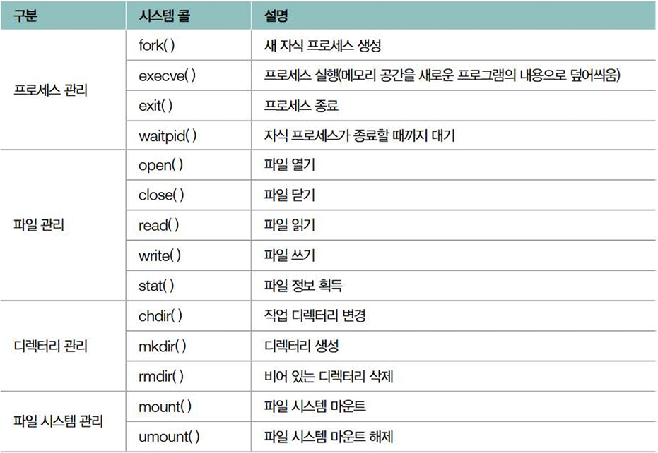
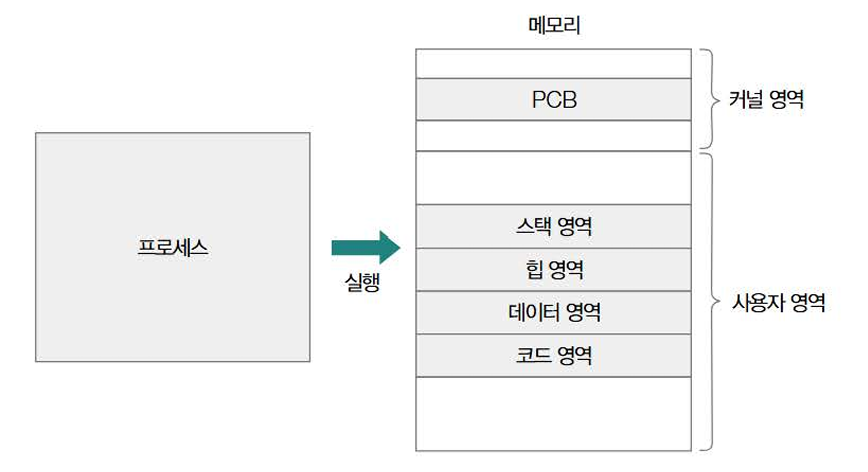
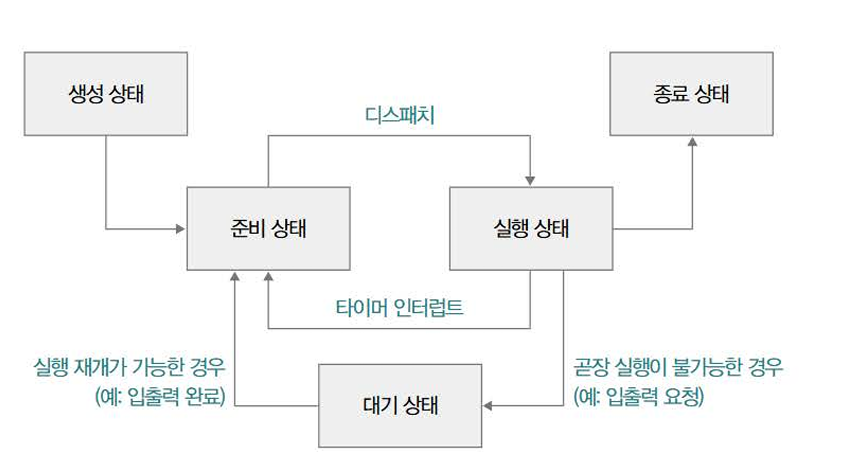

## 1. 운영체제의 큰 그림

운영체제의 핵심 기능을 담당하는 부분을 `커널`이라고 한다. (이번 장에서 말하는 '운영체제'란 '커널'을 지칭한다.)

- `커널` : 운영체제의 핵심 부분으로 자동차의 엔진이나 사람의 심장과 같은 역할

### 운영체제의 역할

`자원 할당 및 관리`, `프로세스 및 스레드 관리` 는 운영체제의 핵심 기능

- `자원 할당 및 관리`

  - 자원(시스템 자원) : 프로그램 실행에 마땅히 필요한 요소 (데이터(소프트웨어), 부품(하드웨어))

  - CPU 관리: CPU 스케줄링

    - CPU라는 한정된 자원의 할당 순서와 사용 시간을 결정

  - 메모리 관리: 가상 메모리

    - 메모리 용량을 효울적으로 관리하기 위해 물리적인 메모리 크기보다 더 큰 메모리를 이용할 수 있게 하는 방식

  - 파일/디렉터리 관리: 파일 시스템

    - 보조기억장치를 효육적으로 관리하기 위해 활용. 보조기억장치 내의 정보를 파일 및 폴더(디렉터리) 단위로 접근, 관리.

- `프로세스 및 스레드 관리`

  - 프로세스 : 실행 중인 프로그램. 운영체제로부터 필요한 자원을 할당받는다.

  - 스레드 : 프로세스를 이루는 실행의 단위. 프로세스가 할당받은 자원을 이용해 프로세스의 작업을 수행

  - 동기화와 교착 상태 : 동시다발적으로 실행되는 프로세스와 스레드의 실행 순서 제어와 자원 배분을 하는 환경과 발생하는 자원 관리 상 문제.

### 시스템 콜과 이중 모드

운영체제 또한 프로그램이기에 메모리에 적재되는 과정이 필요. 하지만 타 프로그램과 달리 메모리 내의 `커널 영역`에 따로 적재되어 실행된다. 운영체제와 달리 다른 프로그램들은 `사용자 영역`에 적재된다.

- `커널 영역` : 운영체제 적재를 위한 메모리 영역

- `사용자 영역` : 사용자 응용 프로그램 적재를 위한 메모리 영역

`커널 영역`에 적재된 운영체제의 코드를 실행할 수 있는 수단으로 `시스템 콜`을 사용한다.

- `시스템 콜` : 운영체제 서비스를 제공받기 위한 수단(인터페이스). 아래와 같은 형태의 시스템 콜을 호출하여 운영체제의 기능을 제공받는다.



프로세스는 시스템 콜을 통해 또 다른 프로세스를 생성하는 것이 가능하다. 이때 새 프로세스를 생성한 프로세스를 `부모 프로세스`, 생성된 프로세스를 `자식 프로세스`라고 한다.

- `부모 프로세스` : 새 프로세스를 생성한 프로세스

- `자식 프로세스` : 부모 프로세스에 의해 생성된 프로세스

`이중 모드`일 경우 시스템 콜 호출 시 다음과 같은 작업이 수행된다.

1. `사용자 모드` 중 시스템 콜 호출되면 CPU는 현재 작업을 백업 (소프트웨어 인터럽트 발생)

2. `사용자 모드`에서 `커널 모드`로 전환

3. 커널 영역 내 인터럽트 처리 코드 실행

4. 작업 완료 후 `사용자 모드`로 전환하여 실행 재개

- `사용자 모드` : 사용자 영역에 적재된 코드를 실행할 때의 실행 모드. 자원 직접 접근이 불가하여 자원에 접근하는 명령어를 실행하지 않는다.

- `커널 모드` : 커널 영역에 적재된 코드를 실행할 때의 실행 모드. 모든 자원에 접근하고, 명령어를 실행하는 것이 가능하다.

- `이중 모드` : 사용자, 커널 2개의 모드로 구분하여 실행하는 것. CPU의 슈퍼바이저 플래그로 현재 모드를 구분한다.

## 2. 프로세스와 스레드

### 프로세스의 유형과 구성

- `포그라운드 프로세스`: 사용자가 보는 공간에서 사용자자와 상호작용하는 프로세스

- `백그라운드 프로세스` : 사용자가 보지 못하는 곳에서 실행되는 프로세스

- `데몬(서비스(window에서))`: 사용자와 상호작용 없이 주어진 작업만 수행하는 특별한 백그라운드 프로세스

프로세스를 구성하는 메모리 내 정보는 커널 영역에는 프로세스 제어 블록(PCB), 사용자 영역에는 `코드 영역`, `데이터 영역`, `힙 영역`, `스택 영역`으로 나뉘어 저장된다.



우선 사용자 영역부터 살펴보자.

- `코드 영역(Code segment)` : 실행 가능한 명령어가 저장되는 공간. 텍스트 영역(Text segment)이라고 부르며 읽기 전용 공간이다.

- `데이터 영역(Data segment)` : 프로그램이 실행되는 동안 유지할 데이터가 저장되는 공간. 정적 변수나 전역 변수가 저장되는 공간이다. 초깃값이 없는 데이터의 경우 `BSS 영역`에 저장된다.

  - `BSS 영역`: 데이터 영역과 유사하지만 초깃값이 없는 데이터를 저장한다. 구분을 안하는 경우도 있다.

- `힙 영역(Heap segment)`: 개발자가 직접 할당 가능한 저장 공간. 동적 할당이 가능하고, 공간 반환 작업이 이루어지지 않을 경우 메모리 누수(memory leak)가 발생한다. 이 문제의 해결을 위해 가비지 컬렉션(garbage collection)이 존재하는 언어도 있다.(Java)

- `스택 영역(Stack segment)`: 일시적으로 사용할 값들이 저장되는 공간. 함수의 매개변수, 지역 변수, 함수 복귀 주소 등 저장된다. `스택 트레이스` 형태의 함수 호출 정보가 저장될 수 있어 문제의 발생 지점 추적에 유용하게 활용된다.

  - `스택 트레이스(stack trace)` : 특정 시점에 스택 영역에 저장된 함수 호출 정보. 디버깅에 유용하게 활용된다.

  ```
  Exception in thread "main" java.lang.NullPointerException
      at com.example.....
  ```

### PCB와 문맥 교환

다수의 프로세스 관리를 위해 커널 영역에 저장되는 프로세스 관련 정보를 내포하는 `구조체`를 `PCB`라고 한다.

- `구조체` : 서로 다른 자료형으로 이루어진 데이터를 하나로 묶어 활용할 수 있도록 하는 복합 자료형.

- `PCB(Process Control Block)`: 프로세스 관련 정보를 저장하는 구조체. PID(프로세스 식별 번호), 실행 과정에서 사용한 레지스터 값, 프로세스 상태, CPU 스케줄링 정보(우선순위), 메모리 관련 정보(적재 위치치), 파일 및 입출력장치 관련 정보가 명시된다.

PCB들을 커널 내 `프로세스 테이블` 형태로 관리되는 경우가 많다.

- `프로세스 테이블` : 실행 중인 PCB의 모음. 가끔 프로세스가 비정상 종료되어 자원이 회수되었음에도 PCB가 남아있는 경우(좀비 프로세스)가 있다.

다양한 프로세스들이 한정된 시간 동안 번갈아 가며 실행되도록 조절하기 위해 `타이머 인터럽트(타임아웃 인터럽트)`를 사용한다. 이 때 프로세스 수행을 재개하기 위해 기억해야 할 정보를 문맥(context)이라 하며 인터럽트가 발생하면 운영체제는 해당 문맥을 PCB에 백업하고, 다른 프로세스의 문맥을 불러오는 `문맥 교환(Context Switch)`가 일어난다.

- `타이머 인터럽트` : 프로세스 실행 시간을 제한하는 인터럽트. 설정한 시간이 지나면 인터럽트가 발생한다.

- `문맥 교환(Context Switch)` : 실행 중인 프로세스를 중단하고 다른 프로세스로 전환하는 과정을 의미. 현재 프로세스의 문맥을 현재 프로세스의 PCB에 백업하고, 다음 프로세스의 문맥을 다음 프로세스의 PCB에서 복구한다. 잦은 문맥 교환이 발생할 경우 캐시 미스가 발생할 확률이 높아지지고 오버헤드가 커진다.

### 프로세스의 상태



- 생성 상태(new) : 프로세스를 생성 중인 상태로 메모리에 적재되어 PCB를 할당받은 상태이다.

- 준비 상태(ready) : CPU를 할당받기 위해 기다리는 상태로 CPU 할당 시 실행 상태가 된다.

  - 디스패치(dispatch): 준비 상태의 프로세스가 실행 상태로 전환되는 것

- 실행 상태(running) : CPU를 할당받아 실행 중인 상태로 타이머 인터럽트로 인해 준비 상태로 전환 될 수 있다. 만약 실행 도중 입출력장치를 사용하여 입출력 작업의 종료를 기다려야 할 경우(블로킹 입출력(blocking I/O)) 대기 상태로 전환된다.

  - 블로킹 입출력(blocking I/O) : 입출력 작업 수행 시 대기 상태로 전환된 후 완료 후 준비 상태로 돌아가는 방식

  - 논블로킹 입출력(non-blocking I/O) : 입출력 작업 수행 시 입출력장치에 입출력 작업을 맡긴 뒤 곧바로 이어질 명령어를 실행하는 방식.

- 대기 상태(blocked) : 입출력 작업을 요청하거나 바로 확보할 수 없는 자원을 요청하는 등 곧장 실행이 불가능한 조건에 놓인 상태. 입출력의 경우 작업 완료 시 준비 상태가 된다.

- 종료 상태(terminated) : 프로세스가 종료된 상태로 할당된 PCB와 자원이 정리된다.

### 멀티프로세스와 멀티스레드

- 멀티프로세스 : 동시에 여러 프로세스가 독립적으로 실행되는 것을 말한다. 프로세스들 간에 자원을 공유하지 않고, 독립적인 메모리 공간을 사용하기에 한 프로세스의 문제가 다른 프로세스에 영향을 적게 미친다.

- 멀티스레드 : 하나의 프로세스 내에서 여러 스레드가 실행되는 것을 말한다. 하나의 스레드는 스레드를 식별할 수 있는 스레드 ID, 프로그램 카운터, 레지스터 값, 스택으로 구성된다. 스레들은 동일한 주소 공간의 코드, 데이터, 힙 영역을 공유하여 쉽게 협력하고 통신이 가능하다. 이로 인해 한 스레드에서 생긴 문제가 전체 프로세스의 문제가 될 수 있다.

  - 스레드 조인(join()) : 스레드의 실행이 종료될 때까지 스레드를 생성한 스레드가 대기하는 메서드

### 프로세스 간 통신(IPC)

프로세스 간에 자원을 공유하고 데이터를 주고받는 방법을 의미하며 크게 2가지 유형, `공유 메모리`와 `메시지 전달`이 있다.

- `공유 메모리` : 프로세스 간에 공유하는 메모리 영역을 두는 방식. 커널의 개입이 거의 없고 통신 속도가 빠르다. 하지만 동기화 문제(레이스 컨디션, 일관성 훼손 문제)가 발생할 수 있다.

- `메시지 전달` : 프로세스 간에 주고받을 데이터를 커널이 제공하는 `파이프`를 통해 메시지의 형태로 주고받는 방식. 메시지를 보내는 수단과 받는 수단이 명확하게 구분되어 있으며 통신 속도는 공유 메모리보다 느리다. 하지만 동기화 문제를 고려하는 일이 상대적으로 적다.

  - `파이프` : 단방향 통신을 지원하는 통신 도구로 양방향 통신을 위해선 두 개의 파이프가 필요하다. `익명 파이프`와 이를 확장한 `지명 파이프`가 있다.

    - `익명 파이프(unnamed pipe)`: 부모-자식 프로세스 간 통신에만 사용 가능하다.

    - `지명 파이프(named pipe/FIFO)`: 관련 없는 프로세스 간에도 통신이 가능하다. 양방향 통신을 지원한다.(window는 확실, linux는 애매)

IPC에서 프로세스에게 특정 이벤트가 발생했음을 알리는 비동기적인 신호(`시그널`), `네트워크 소켓`, `원격 프로시저 호출(RPC)`를 사용한다.

- `시그널` : 프로세스에게 특정 이벤트가 발생했음을 알리는 비동기적 신호. 인터럽트와 유사하게 시그널 발생 시 시그널 처리를 위한 시그널 핸들러를 실행하며 `코어 덤프`를 생성하기도 한다.

  

  - `코어 덤프(core dump)` : 프로세스가 비정상적으로 종료하는 경우에 생성되는 파일로 프로그램이 특정 시점에 작업하던 메모리 상태 기록되어 디버깅 용도로 활용된다.

- `네트워크 소켓` : 네트워크 통신을 통한 프로세스 간 통신으로 로컬, 원격 프로세스 간 통신이 가능하도록 도와준다.

- `원격 프로시저 호출(RPC)` : 원격 코드를 실행하는 IPC 기술로 프로그래밍 언어나 플랫폼과 무관하게 성능 저하를 최소화해 대규모 트래픽 처리 환경, 특히 서버 간 통신 환경에서 주로 사용된다. 예시로 gRPC가 있다.

## 3. 동기화와 교착상태

### 공유 자원과 임계 구역

- 공유 자원(shared resource) : 여러 프로세스 또는 스레드가 공유하는 자원(메모리, 파일, 전역 변수, 입출력장치 등)

- 임계 구역(critical section): 공유 자원에 접근하는 코드 중 동시에 실행했을 때 문제가 발생할 수 있는 코드

동시다발적으로 실행되는 프로세스 혹은 스레드를 다룰 때는 언제나 임계 구역을 동시에 실행하지 않도록 유의해야 한다. 만약 임계 구역 코드를 동시에 실행하여 문제가 발생하는 상황을 `레이스 컨디션(race condition)`이라고 한다.

- `레이스 컨디션(race condition)`: 여러 프로세스 혹은 스레드가 동시에 임계 구역을 실행해 자원의 일관성이 손상되는 경우. 동기화(synchronization)를 통해 해결한다.

### 동기화(synchronization)

동기화란 `실행 순서 제어`, `상호 배제` 조건을 준수하며 실행하는 것을 의미한다.

- `실행 순서 제어` : 프로세스 및 스레드를 올바른 순서로 실행
- `상호 배제` : 동시에 접근해서는 안 되는 자원에 하나의 프로세스 및 스레드만 접근

실행 순서 제어, 상호 배제를 만족시키기 위한 동기화 기법이 존재한다.

- 상호 배제만을 위한 동기화 기법

  - 뮤텍스 락(mutex lock) : 상호 배제를 보장하는 동기화 도구로 프로세스 및 스레드가 임계 구역 진입 전 락을 획득하고, 작업 후 락을 해제한다. 락 획득 함수(acquire())는 락이 해체되었을 경우에만 동작하고, 락이 있을 경우 락 해제 함수(release())로 락을 해제해야 acquire() 호출이 성공된다.

  - 세마포(Semaphore) : 여러 개의 공유 자원이 있는 경우 이를 관리하는 동기화 도구. 사용 가능한 공유 자원의 개수(변수 S), 임계 구역 진입 전 호출하고, S를 감소시키는 함수(wait()), 임계 구역 종료 후 호출하고, S를 증가시키는 함수(signal())로 구성된다. S의 설정에 따라 `이진 세마포`와 `카운팅 세마포`로 나뉜다.

    - `이진 세마포(binary semaphore)` : S가 0과 1의 값을 가지는 세마포. 뮤텍스 락과 유사하게 동작

    - `카운팅 세마포(counting semaphore)` : S가 음이 아닌 정수 값을 가지는 세마포.

- 상호 배제와 실행 순서 제어 모두를 고려한 동기화 기법

  - 모니터 : 공유 자원과 그 공유 자원을 다루는 함수로 구성된 동기화 도구로 모니터 안에 진입하여 실행되는 프로세스 및 스레드는 항상 하나고, 나머지는 큐에서 대기해야 한다. 하나씩 실행하여 상호 배제를 만족시키고, `조견 변수`를 통해 실행 순서 제어도 가능하다. Java에서는 synchronized 키워드로 모니터 사용이 가능하다.

    - `조건 변수(condition variable)` : 실행 순서 제어를 위한 동기화 도구로 `wait()`, `signal()`로 구성된다.

      - `wait()` : 호출한 프로세스 혹은 스레드를 대기 상태로 전환한다.

      - `signal()` : wait()로 일시 중지된 프로세스 혹은 스레드의 실행을 재개한다.

여러 프로그래밍 언어를 사용하다보면 `스레드 안전`이라는 용어가 많이 나온다. 이는 동기화가 되어있다는 뜻이다.

- `스레드 안전` : 멀티스레드 환경에서 어떤 변수나 함수, 객체에 동시 접근이 이루어져도 실행에 문제가 없는 상태. 즉 레이스 컨디션이 발생하지 않는 상황을 말한다.

### 교착 상태(deadlock)

프로세스들이 서로의 자원을 무한정 기다려 진행이 멈춘 상태를 말한다. `상호 배제`, `점유와 대기`, `비선점`, `원형 대기` 총 4가지 조건이 충족될 경우 발생한다.

- `상호 배제` : 한 번에 하나의 프로세스만 해당 자원 이용이 가능해 한 프로세스가 사용하는 자원을 다른 프로세스가 사용할 수 없는 상황.

- `점유와 대기` : 한 프로세스가 어떤 자원을 보유한 상태(점유)에서 다른 자원을 기다리는(대기) 상황.

- `비선점` : 어떤 프로세스도 자원을 사용 중인 프로세스가 작업을 마칠 때까지 자원을 이용할 수 없는 상황

- `원형 대기` : 프로세스들이 원형으로 자원을 기다리는 상황.

교착 상태를 해결하는 방법은 크게 3가지로 나뉜다. 이는 미리 막는 `예방`, 위험 상황일 때 자원 할당을 막아 피하는 `회피`, 교착 상태가 발생할 경우 해결하는 `검출 후 회복`이다.

- `예방` : 교착 상태 발생을 일으키는 4가지 조건 중 하나를 방지

- `회피` : 안전한 상태를 유지하며 자원을 할당하여 무분별한 할당을 막아 방지. 은행원 알고리즘이 그 예시이다.

- `검출 후 회복`: 교착 상태 발생 시 감지하고 해결. `자원 선점`, `프로세스 강제 종료`로 해결한다.

  - 자원 선점: 교착 상태가 해결될 때까지 다른 프로세스로부터 강제로 자원을 빼앗아 할당하는 방법

  - 프로세스 강제 종료: 교착 상태에 있는 프로세스를 강제로 종료시켜 해결하는 방법

## 5. CPU 스케줄링

### CPU 스케줄링 이란?

CPU 스케줄링 알고리즘을 통해 운영체제의 CPU 배분 방법을 말한다. 스케줄링 알고리즘을 결정하고 수행하는 운영체제의 일부분을 CPU 스케줄러라 한다. 이 때 프로세스뿐만 아니라 스레드도 CPU 스케줄링의 대상이 된다.

- 우선순위 : 프로세스별 CPU 할당 순서를 결정하여 PCB에 할당하는 값. CPU 활용률을 높이기 위해 보통 `입출력 집중 프로세스`를 먼저 실행시키고 `CPU 집중 프로세스`를 실행시킨다.

  - `입출력 집중 프로세스(I/O-bound process)` : 입출력 작업이 많아 `입출력 버스트`가 빈번한 프로세스로 보통 높은 우선순위를 가진다.

  - `CPU 집중 프로세스(CPU-bound process)` : CPU 연산이 많아 `CPU 버스트`가 빈번한 프로세스로 보통 낮은 우선순위를 가진다.

    - `CPU 버스트`: 프로세스가 CPU를 이용하는 작업

    - `입출력 버스트`: 프로세스가 입출력장치를 기다리는 작업

- 스케줄링 큐 : 프로세스들이 CPU, 메모리, 입출력장치 등 자원을 사용하기 위해 기다리는 줄. 대표적으로 `준비 큐`와 `대기 큐`가 있다.

  - `준비 큐(ready queue)` : CPU를 이용하고 싶은 프로세스의 PCB가 서는 줄

  - `대기 큐(waiting queue)` : 대기 상태에 접어든 프로세스의 PCB가 서는 줄. 보통 입출력 작업 완료 인터럽트를 기다린다.

스케줄링은 보통 프로세스의 실행이 끝나면 이루어지지만, 1. 실행 상태에서 입출력 작업을 위해 대기 상태로 전환될 때, 2. 타이머 인터럽트가 발생해 준비 상태로 변경될 때 프로세스가 종료되지 않았음에도 수행된다. 1, 2 모든 상황에서 수행되는 스케줄링 유형을 `선점형 스케줄링`, 1. 상황 에서만 실행되는 스케줄링 유형을 `비선점형 스케줄링`이라고 한다.

- 선점형 스케줄링(preemptive scheduling): 운영체제가 프로세스로부터 CPU 자원을 강제로 빼앗아 다른 프레세스에 할당할 수 있는 스케줄링 방식.

- 비선점형(non-preemptive scheduling): 실행 중인 프로세스가 종료되거나 대기 상태로 진입하여 스스로 CPU를 반환하기 전엔 다른 프로세스가 끼어들 수 없는 스케줄링 방식.

### CPU 스케줄링 알고리즘

1. 선입 선처리(FCFS, First-Come First-Served)

   - 먼저 CPU를 요청한 프로세스부터 CPU를 할당하는 비선점형 스케줄링 방식.
   - 먼저 삽입된 프로세스의 오랜 실행으로 나중에 삽입된 프로세스 실행이 지연되는 호위 효과(convoy effect)가 발생하기도 한다.

2. 최단 작업 우선(SJF, Shortest Job First)

   - CPU 이용하는 시간이 가장 짧은 프로세스부터 실행하는 비선점형 스케줄링 방식.

3. 라운드 로빈(RR, Round Robin)

   - 선입 선처리 스케줄링에 프로세스가 CPU를 사용하도록 정해진 시간(타임 슬라이스)을 할당하는 선점형 스케줄링 방식.

4. 최소 잔여 시간 우선(SRT, Shortest Remaining Time)

   - 최소 잔여 시간 우선 스케줄링과 라운드 로빈의 특성을 합친 선점형 스케줄링 방식.
   - 타임 슬라이스만큼 CPU를 이용하되, 남아있는 실행 시간이 가장 짧은 프로세스를 우선 실행한다.

5. 우선순위 스케줄링(Priority Scheduling)

- 프로세스에 우선순위를 부여하고 우선순위가 높은 프로세스부터 처리하는 스케줄링
- 우선순위가 낮은 프로세스는 CPU를 못 받고 계속 실행이 연기된다.(기아 현상(starvation))
  - 오래 기다린 프로세스의 우선순위를 점차 높이는 에이징(aging)으로 해결하기도 한다.

6. 다단계 큐(Multilevel Queue)

- 우선순위 스케줄링의 발전된 형태로 우선순위별로 여러 준비 큐를 사용하는 스케줄링
- 프로세스들이 큐 사이를 이동할 수 없기에 우선순위가 낮은 프로세스의 작업이 계속
  연기될 수 있다.

7. 다단계 피드백 큐(Multilevel Feedback Queue)

- 다단계 큐 스케줄링에서 프로세스들이 큐 사이를 이동할 수 있게 만들어 아사 현상을 해결한 스케줄링 방식.
- 새로운 프로세스를 가장 높은 우선순위 큐에 삽입한 후 타임 슬라이스 동안 실행이 완료되지 않을 경우 다음 우선순위 큐로 이동하는 것을 반복한다.
- 추가적으로 에이징 기법을 적용하여 낮은 우선순위 큐에서 오래 기다릴 경우 높은 우선순위 큐로 이동시킨다.

### 리눅스 CPU 스케줄링


- CFS(Completely Fair Scheduler): SCHED_NOMAL 정책 하에서 사용되는 CPU 스케줄러로 완전히 공평한 CPU 시간 배분을 지향한다. 리눅스에서는 `가상 실행 시간(vruntime)`이라는 정보를 유지하고, CFS는 `vruntime`이 작은 프로세스부터 실행한다.

  - `가상 실행 시간(vruntime)`: 가중치에 의해 변하는 프로세스의 가상 실행 시간으로 프로세스의 가중치와 반비례하고, 평균 가중치와 비례한다. 이로 인해 우선순위가 높아 프로세스 가중치가 높아지고 vruntime이 감소한다.

## 5. 가상 메모리

### 물리 주소와 논리 주소

- 물리 주소(physical address) : 실제 메모리 하드웨어 상 실제 주소

- 논리 주소(logical address) : 프로세스가 사용하는 가상의 주소로 각 프로세스마다 부여되는 0번지부터 시작하는 주소 체계

- MMU(Memory Management Unit): CPU와 메모리 사이에 위치하여 논리 주소를 물리 주소로 변환하는 역할을 하는 하드웨어

### 스와핑과 연속 메모리 할당

- 스와핑 : 대기 상태, 혹은 오랫동안 사용되지 않은 프로세스를 보조기억장치(스왑 영역)으로 보내고(`스왑 아웃`) 생긴 메모리의 빈 공간에 다른 프로세스를 적재하여(`스왑 인`) 실행하는 메모리 관리 방식.

  - `스왑 아웃` : 메모리에서 스왑 영역으로 옮겨지는 것

  - `스왑 인` : 스왑 영역에서 다시 메모리로 옮겨지는 것. 이 때 스왑 아웃되기 전의 물리 주소와는 다른 주소에 적재될 수 있다.

- 연속 메모리 할당 : 프로세스에 연속적인 메모리 공간을 할당하는 방식. `외부 단편화`라는 문제가 발생한다.

  - `외부 단편화(external fragmentation)`: 프로세스의 실행과 종료 반복으로 프로세스 사이에 발생하는 사용할 수 없는 작은 메모리 공간

### 가상 메모리

실제 메모리보다 더 큰 프로세스 실행을 가능하게 만드는 메모리 관리 기법. `페이징`과 `세그멘테이션`이 대표적인 가상 메모리 관리 기법이다.

- `페이징(paging)` : 프로세스의 논리 주소 공간을 `페이지`로 나누고, 물리 주소 공간을 `페이지`와 동일한 크기의 `프레임`으로 나누어 `페이지`를 `프레임`에 할당하는가상 메모리 기법. 외부 단편화가 발생하지 않는다. 하지만 페이지 하나의 크기보다 작은 크기로 발생하는 메모리 낭비(내부 단편화)가 발생할 수 있다.

  - `페이지` : 논리 메모리를 일정한 크기로 나눈 단위

  - `프레임` : 물리 메모리를 페이지와 동일한 크기로 나눈 단위

- `세그멘테이션(segmentation)` : 프로세스를 페이지 단위가 아닌 가변적인 크기의 `세그먼트` 단위로 분할하는 방식. 이는 외부 단편화가 발생할 수 있다.

  - `세그먼트` : 논리 메모리를 나누는 가변적인 크기를 가진 단위.

### 페이지 테이블

페이지와 프레임의 매핑 정보를 저장하는 테이블. 페이지 테이블을 구성하고 있는 각각의 행들을 `테이블 엔트리(PTE, Page Table Entry)`라고 한다.

- 테이블 엔트리(PTE, Page Table Entry) : 페이지 번호, 프레임 번호, `유효 비트`, `보호 비트`, `참조 비트`, `수정 비트`로 이루어진 테이블 페이지의 행.

  - `유효 비트` : 페이지가 메모리에 있어 접근 가능한지 여부를 알려주는 비트(1: 메모리에 있음, 0: 없음)

  - `보호 비트` : 페이지 접근 권한을 제어하는 비트(r: 읽기, w: 쓰기, x: 실행)

  - `참조 비트` : CPU가 페이지에 접근한 적이 있는지의 여부를 나타내는 비트(1: CPU 읽거나 씀, 0: 안 씀)

  - `수정 비트(더티 비트)` : 페이지 내용 변경 여부를 알려주는 비트(1: 변경됨, 0: 변경된 적 없음)

- 페이지 폴트(page fault): 접근하려는 페이지가 메모리에 없을 때 발생하는 예외. CPU가 기존 작업 내역을 백업하고, 보조기억장치에서 해당 페이지를 메모리로 가져온 후 유효 비트를 1로 변경한 후 작업을 재개한다.

### TLB(Translation Lookaside Buffer)

페이지 테이블의 캐시로 참조 지역성의 원리에 근거해 자주 사용할 법한 페이지 위조로 페이지 테이블의 일부 내용을 저장한다.

- TLB 히트: 페이지 번호가 TLB에 있어 적재된 프레임 번호를 얻는 경우

- TLB 미스: 페이지 번호가 TLB에 없어 페이지 테이블에서 직접 프레임 번호를 찾아야 하는 경우

### 계층적 페이징

페이지 테이블을 페이징하는 방식으로 다단계 페이지 테이블 기법이라고 부른다. 외부 페이지 테이블(Outer Page Table)이 내부 페이지 테이블을 가리키게 해 메모리를 효율적으로 관리하게 도와준다.

### 페이징 주소 체계

논리 주소는 기본적으로 <페이지 번호, 변위>, 물리 주소는 <프레임 번호, 변위> 형태로 변환된다.
논리 주소에서 추출된 페이지 번호를 기반으로 프레임 번호를 검색하고, 변위를 통해 정확한 물리 주소를 찾아낸다.

### 페이지 교체 알고리즘

메모리가 가득 찼을 때 어떤 페이지를 스왑 아웃할지 결정하기 위한 알고리즘.

- FIFO 페이지 교체 알고리즘 : 가장 먼저 메모리에 적재된 페이지부터 교체. 구현이 간단하지만 자주 사용되는 페이지를 스왑 아웃할 우려가 있다.

- 최적 페이지 교체 알고리즘 : 앞으로 가장 오랫동안 사용되지 않을 페이지를 교체. 가장 최적의 알고리즘이라 할 수 있지만, 미래를 예측해야하여 구현은 거의 불가능하다.

- LRU 페이지 교체 알고리즘 : 가장 오랫동안 사용되지 않은 페이지를 교체. 참조 지역성을 활용한 효율적인 알고리즘이지만 구현이 복잡하여 이를 기반으로 만들어진 다양한 파생 알고리즘이 있다.

페이지 폴트는 크게 `메이저 페이지 폴트`와 `마이너 페이지 폴트`로 구분된다.

- `메이저 페이지 폴트(Major Page Fault)` : 보조기억장치에서 페이지를 읽어와야 하여 입출력 작업이 필요한 페이지 폴트.

- `마이너 페이지 폴트(Minor Page Fault)` : 물리 메모리에 페이지가 존재해 보조기억장치와의 입출력이 필요하지 않은 페이지 폴트. 페이지 테이블 상에만 반영되지 않은 경우 발생.

## 7. 파일 시스템

### 파일 과 디렉토리

- 파일 : 보조기억장치에 저장된 관련 정보의 집합. 파일 이름, 실행 정보, 속성(메타데이터)로 이루어져 있다. `파일 디스크립터`에 의해 파일이 식별된다.

  - `파일 디스크립터(File Descriptor)`: 프로세스가 파일을 식별하는 정보로 표준 입력(0), 표준 출력(1), 표준 에러(2)는 기본 할당된다.

- 디렉터리 : 파일과 다른 디렉터리를 포함하는 특별한 파일. 트리 구조로 루트 디렉터리("/")부터 시작하는 계층 구조이다. 디렉터리 엔트리로 디렉터리에 속한 요소의 관련 정보를 볼 수 있다.

### 파일 할당

- 블록(Block): 운영체제가 파일과 디렉터리를 읽고 쓰는 단위 (보통 4KB)

### 연결 할당

각 블록이 다음 블록을 가리키는 형태로 파일을 할당한다. 외부 단편화가 없으나순차 접근만 가능하고 포인터로 인한 공간 낭비 문제가 있다.

### 색인 할당

색인 블록에 파일의 모든 블록 주소를 저장한다. 직접 접근 가능하고, 외부 단편화가 없으나 작은 파일에 비효율적이다.

### 파일 시스템

파일과 디렉터리를 관리하는 운영체제 프로그램을 말하며 NTFS, EXT4, APFS가 이에 속한다.

### 파티셔닝

보조기억장치의 영역을 `파티션`으로 구획하여 데이터 안전성을 확보하는 작업을 말한다.

- `파티션` : 파티셔닝으로 나누어진 하나의 영역을 말한다.

### 포맷팅

파일 시스템을 설정하고 새로운 데이터를 쓸 준비를 하는 작업으로 파일 시스템 종류를 선택하고 초기화한다.

### 아이노드 기반 파일 시스템

- 아이노드(inode): 파일의 모든 정보를 저장하는 색인 블록으로 파일의 속성, 저장된 위치 등 정보를 포함한다.(파일 이름 제외)

### EXT4 파일 시스템 구성

- 부트 블록 : 부팅과 파티션 관리를 위한 정보.


### 하드 링크와 심볼릭 링크

- 하드 링크(Hard Link): 같은 아이노드를 참조하는 여러 파일 이름으로 원본 파일과 동일한 데이터를 공유하여 원본 파일이 삭제되어도 데이터 접근이 가능하다.

- 심볼릭 링크(Symbolic Link) : 원본 파일의 경로를 가리키는 특수 파일로 원본 파일의 위치만 저장되어 원본 파일 삭제 시 접근 불가능하다.

### 마운트

다른 파일 시스템을 기존 파일 시스템에 연결하는 작업으로 외부 저장장치 혹은 네트워크 파일 시스템 접근을 위한 작업이다.

- 마운트 포인트 : 다른 파일 시스템이 연결되는 디렉터리

## 1. 스래싱이 일어나면 다른 또 중요한 작업(네트워크 작업)도 더뎌질 수 있는가?

스래싱이 발생하면 네트워크 작업을 포함한 시스템 전체의 처리 지연이 심화된다. CPU 사이클이 낭비되고, I/O 과정에서의 지연, 시스템 콜과 인터럽트에 지연이 발생할 가능성이 높아져, 결과적으로 전반적인 시스템에 영향을 끼친다.

## 2. 연속 메모리 할당이 참조 지역성의 원리와 관련이 있는가?

연속 메모리 할당은 지역성 원리를 극대화하기 위해 사용되므로 연관이 깊다. 프로그램이 한 번 접근한 메모리 주소 주변을 곧바로 접근할 가능성이 높아 공간 지역성 활용에 유리하며 이로 인해 캐시 히트율이 높아지고, 불필요한 페이지 폴트가 적어지는 효과가 있다.

## 3. 페이지 테이블을 조회하는 부분은 정확히 어느 시점에 일어나는가?

매번 CPU가 가상 주소로 메모리에 접근할 때마다 페이지 테이블 조회 과정이 이루어집니다. 다만 대부분의 경우에는 TLB를 통해 빠르게 처리되고, 실제 페이지 테이블 조회는 TLB 미스 시점에 발생합니다.

## 4. TLB는 어디에 위치하고 있길래 더 빠른가?

TLB(Translation Lookaside Buffer)는 CPU 내부의 MMU(Memory Management Unit)에 내장된 캐시이다. CPU와 매우 가깝게 위치한다.

## 5. TLB는 정확히 어느 시점에 작동하는가?

TLB 동작은 가상 주소에 대한 메모리 접근 요청이 들어오는 즉시다. TLB에서 페이지 번호를 검색하고 히트 시 물리 주소를, 미스 시 페이지 테이블을 조회한다.

## 6. 페이지 폴트(page fault)는 느린데 그럼 언제 쓰는 게 좋은가?

페이지 폴트 처리 자체는 느리지만, 적절히 활용하면 시스템 성능과 메모리 효율성을 크게 높일 수 있다. 프로그램이 실제로 접근할 때까지 페이지를 메모리에 적재하지 않는 수요 페이징 기법, 가상 메모리 활용 등을 통해 초기 로딩 지연을 방지하고, 불필요한 메모리 사용을 막는 등 성능 향상에 도움이 된다.
