# 운영체제
# 1. 운영체제의 큰 그림
커널: 운영체제의 핵심 기능을 담당하는 부분
  - 자원 할당 및 관리
  - 프로세스 및 스레드 관리

## 운영체제의 역할
자원: 프로그램 실행에 필요한 요소(소프트웨어, 하드웨어 등)
-> 운영체제는 응용 프로그램을 대신해 컴퓨터 부품에 접근하고, 각각의 부품들이 효율적으로 사용되도록 관리, 응용 프로그램이 무제 없이 실행되도록 자원 할당

### CPU 관리: CPU 스케줄링
: 실행중인 모든 프로그램들에 대한 CPU의 할당 순서와 사용 시간을 결정하는 것

### 프로세스 및 스레드 관리
- 프로세스: 실행 중인 프로그램
- 스레드: 프로세스를 이루는 실행의 단위

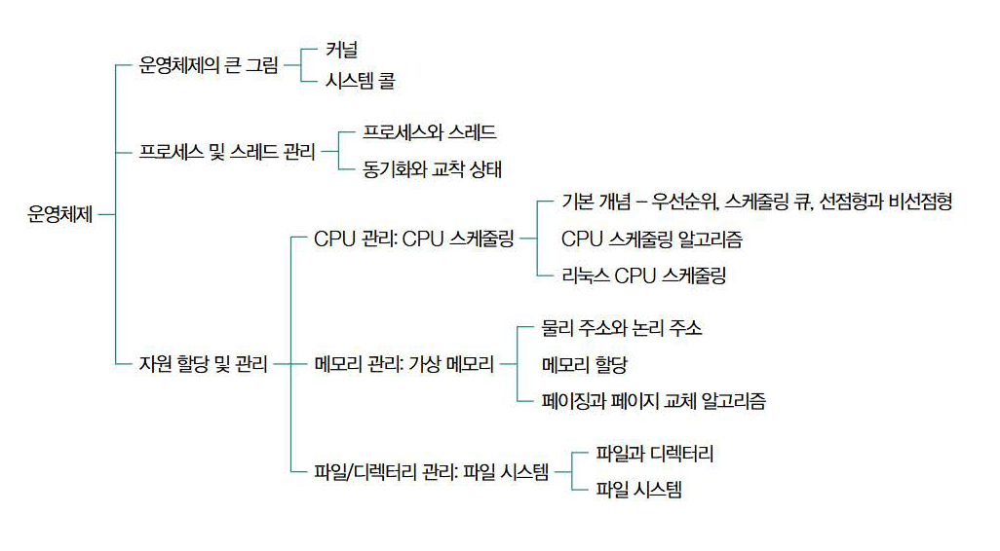

## 시스템 콜과 이중 모드
운영체제는 메모리 내 **커널 영역**에 적재, 응용 프로그램은 **사용자 영역**에 적재되어 실행
-> 응용 프로그램은 CPU, 메모리 등과 같은 자원에 직접 접근 혹은 조작이 불가능하지만, 운영체제가 해당 요청과 관련된 접근 및 조작 코드를 실행하여 대행
-> 이러한 과정을 **시스템 콜**을 호출한다라고 함.
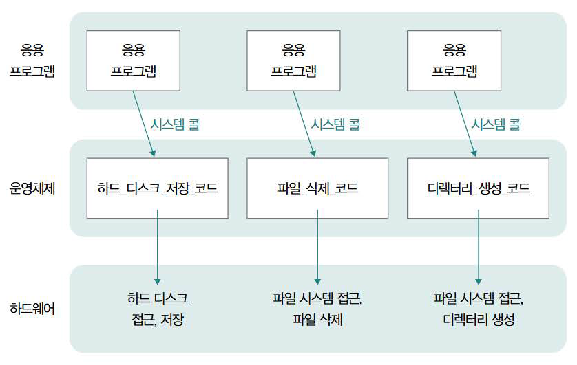

시스템 콜은 소프트웨어 인터럽트의 일종으로 호출 시
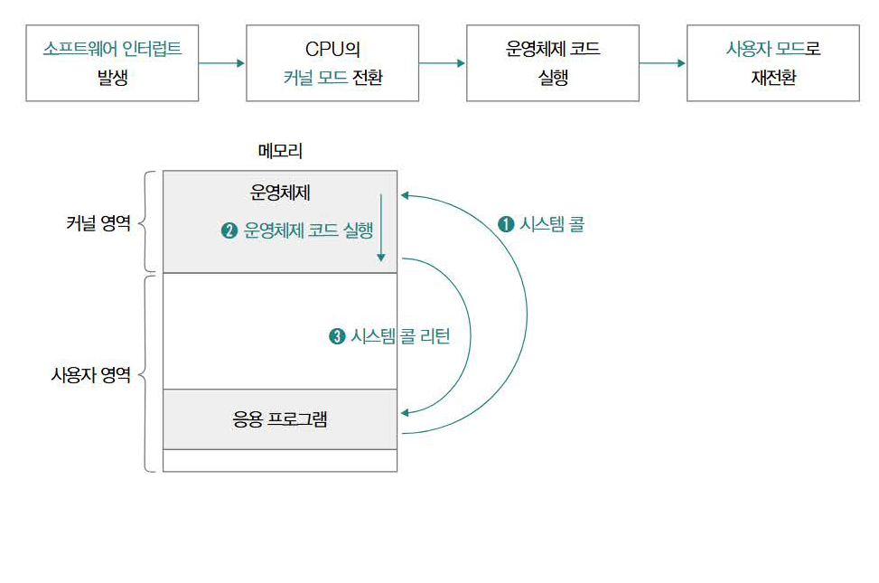
  1. 사용자 영역 실행 과정에서 시스템 콜 호출 시 CPU는 수행 중인 작업 백업
  2. 커널 영역 내 인터럽트 처리하기 위한 코드 실행
  3. 다시 사용자 영역의 코드 실행 재개
의 과정을 거쳐 실행
-> 사용자 영역의 코드를 실행할 때의 **사용자 모드**와 커널 영역의 코드를 실행할 때의 **커널 모드**의 두 모드를 구분하여 실행하는 것을 **이중 모드**라고 함

# 2. 프로세스와 스레드
- 포그라운드 프로세스: 사용자가 보는 공간에서 사용자와 상호작용하며 실행되는 프로세스
- 백그라운드 프로세스: 사용자가 보지 못 하는 공간에서 실행되는 프로세스
- 데몬: 사용자와 상호작용 없이 주어진 작업만 수행하는 백그라운드 프로세스

1. 코드 영역: 실행 가능한 명령어가 저장되는 공간, 텍스트 영역이라고도 불림, read-only, 정적 할당 영역
2. 데이터 영역: 프로그램이 실행되는 동안 유지할 데이터가 저장되는 공간, 정적 할당 영역
3. 힙 영역: 개발자가 직접 할당 가능한 저장공간, 힙 영역에 메모리 공간을 할당했다면 **반드시 반환**해야 함, 하지 않을 시 **메모리 누수**가 발생 가능. 이 문제를 위해 프로그래밍 언어에서 자체적으로 **가비지 컬렉션** 기능을 제공하기도 함
4. 스택 영역: 일시적으로 사용되는 값들(매개변수, 지역변수, 함수 복귀 주소 등)이 저장되는 공간
  -> **stack trace**: 특정 시점에 스택 영역에 저장된 함수 호출 정보
  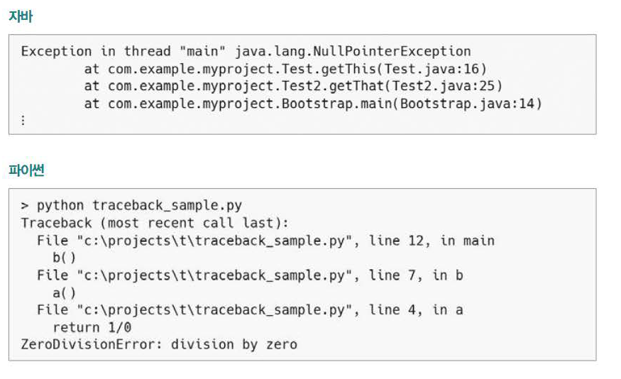

## PCB와 문맥 교환
- PCB(프로세스 제어 블록): 프로세스와 관련된 다양한 정보를 내포하는 구조체, 커널 영역에 만들어지고 폐기됨
  - 프로세스 ID(PID), 실행 과정에서 사용한 레지스터 값, 프로세스 상태, CPU 스케줄링 정보, 메모리 관련 정보 등이 명시됨
  - 프로세스 테이블 형태로 관리되는 경우가 많음

### 문맥 교환
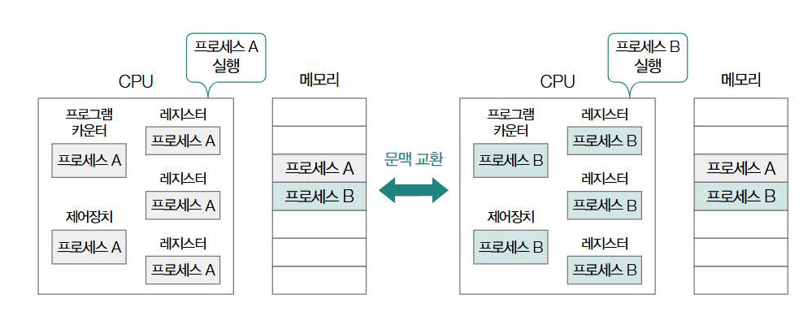
메모리에 적재된 프로세스들은 한정된 시간 동안 번갈아가며 실행(운영체제에 의해 CPU의 자원을 할당)될 때 **타이머 인터럽트(= 타임아웃 인터럽트)**에 의해 관리됨
-> 실행 중 타이머 인터럽트가 발생하여 다른 프로세스에 CPU 사용이 양보될 때 중간정보를 백업해야 하는데, 이 때 백업 대상이 되는 중간 정보를 **문맥**이라고 함
-> 이 문맥은 해당 프로세스의 PCB에 명시되고 후에 다시 해당 프로세스의 차례가 돌아오면 복구됨
-> 이러한 운영체제의 프로세스 실행 과정을 **문맥 교환**이라고 함

* 문맥 교환은 그럼 동시에 여러 프로세스를 사용 가능하게 하니 무조건 좋은 것?
-> 프로세스 간 너무 잦은 문맥 교환 발생 시 캐시 미스가 발생할 가능성이 높아 메모리로부터 프로세스 내용을 가져오는 작업이 빈번해짐
-> 큰 오버헤드로 이어질 수 있는 가능성

### 프로세스의 상태
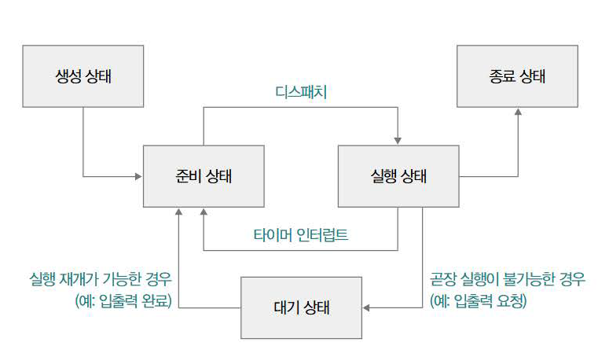
- 생성 상태
  : 프로세스 생성중인 상태, 메모리에 적재되어 PCB 할당받은 상태
- 준비 상태
  : CPU 할당받아 실행될 수 있는 상태, 아직 본인의 차례가 아니라 대기상태, CPU가 할당되어 실행 상태로 전환되는 것(디스패치)을 기다리는 상태
- 실행 상태
  : CPU를 할당받아 실행 중인 상태, 타이머 인터럽트 발생 전까지 CPU 사용, 할당 시간 끝나면 다시 준비상태가 됨, 입출력장치 사용 시 해당 작업 끝날 때까지 대기상태가 됨
- 대기 상태
  : 프로세스가 입출력 작업을 요청하거나 바로 확보할 수 없는 자원 요청 등 곧장 실행이 불가능한 조건에 놓인 경우, 해당 조건이 만족된 후 준비상태가 되어 CPU 할당을 기다림
- 종료 상태
  : 프로세스가 종료된 상태. 운영체제가 해당 프로세스의 PCB와 사용한 메모리 정리

## 멀티 프로세스와 멀티 스레드
- 멀티 프로세스: 동시에 여러 프로세스가 실행되는 것(ex: 크롬의 멀티탭 등)
  -> 각 프로세스들이 자원을 공유하지 않고 독립적으로 실행되어 다른 프로세스에 영향 X
- 멀티 스레드: 프로세스를 동시에 실행하는 여러 스레드
  -> 멀티 프로세스와 달리 자원을 공유

## 프로세스 간 통신
- 프로세스 간 통신(IPC): 기본적으로 자원을 공유하지 않는 프로세스 간 자원을 공유하고 데이터를 주고받는 방법
  - 공유 메모리: 프로세스들이 공통적으로 사용할 메모리 영역을 두는 방식
  - 메시지 전달: 프로세스 간 데이터를 메시지의 형태로 주고받는 방식

### 공유 메모리
: 프로세스 간 공유할 수 있는 메모리를 할당하여 해당 메모리 공간에 데이터를 쓰고 읽는 것
-> 각 프로세스가 자신의 메모리 영역을 읽고  쓰는 것처럼 통신
-> 커널 영역의 개입이 없기 때문에 메시지 전달 방식보다 통신 속도가 빠르다는 장점이 있지만 데이터의 일관성이 훼손될 수 있다.

### 메시지 전달
: 프로세스 간 데이터가 커널을 거쳐 송수신되는 통신 방식
-> 시스템 콜 send()와 recv()를 사용하여 메시지를 송수신
-> 커널을 통해 송수신 되므로 상대적으로 속도가 느리며 프로세스 간 통신 도구를 사용해야 함
  - 파이프: 단방향 프로세스 간 통신 도구
  - 시그널: 프로세스에게 특정 이벤트가 발생했음을 알리는 비동기적 신호. 이 방식은 직접적으로 메시지를 주고받지는 않고 시그널 핸들러를 이용해 통신을 수행
  - 기타: 원격 프로시저 호출(RPC), 네트워크 소켓 등

# 3. 동기화와 교착 상태
- 공유 자원: 프로세스 혹은 스레드가 공유하는 자원
- 임계 구역: 코드 중 동시에 실행했을 때 문제가 발생할 수 있는 코드
- 레이스 컨디션: 프로세스 혹은 스레드가 동시에 임계 구역의 코드를 실행하여 문제가 발생하는 상황

**동기화**란 1. 실행순서 제어: 프로세스 및 스레드를 올바른 순서로 실행하는 것, 2. 상호 배제: 동시에 접근해서는 안 되는 자원에 하나의 프로세스 및 스레드만 접근하기 라는 2가지 조건을 준수하며 실행하는 것을 의미한다.

## 동기화 기법
### 뮤텍스 락
: 동시에 접근해서는 안 되는 자원에 동시 접근이 불가능하도록 상호 배제를 보장하는 동기화 도구
-> 임계 구역에 접근하고자 하면 반드시 락을 획득하고, 작업이 끝났다면 락을 해제한다 라는 원리로 실행
-> 하나의 공유 자원을 고려하는 동기화 도구

### 세마포
: 한 번에 여러 개의 프로세스 및 스레드가 특정 공유 자원을 이용하려는 상황에 사용되며, 사용 가능한 공유 자원의 개수를 변수로 할당하여사용 가능 여부를 신호를 통해 해당 프로세스 및 스레드들의 동작을 제어하는 방식

### 조건 변수와 모니터
- 조건 변수: 실행 순서 제어를 위한 동기화 도구. 특정 조건 하에 프로세스를 실행/일시 중단함으로써 실행 순서를 제어
  -> wait()과 signal()함수를 사용해 제어
- 모니터: 공유 자원과 그 자원을 다루는 함수(인터페이스)로 구성된 동기화 도구
  -> 상호 배제를 위한 동기화 뿐만이 아닌 실행 ㅅ누서 제어를 위한 동기화도 가능
  -> 공유 자원 전 공유 자원 연산(인터페이스)을 통과해야 자원에 접근이 가능하게 하여 순서에 맞지 않는 프로세스는 대기 상태로 둔다거나 해당 자원에 접근해도 되는지를 판단

### 스레드 안전
: 멀티스레드 환경에서 어떤 변수나 함수, 객체에 동시 접근이 이루어져도 실행에 문제가 없는 상태
ex) JAVA의 synchronized 메서드는 모니터 기반의 동기화를 제공하는 메서드, Vector 클래스의 add 메서드는 synchronized가 사용되어 스레드 안전이 보장되지만 ArrayList의 add 메서드는 synchronized가 사용되지 않아 스레드 안전이 보장되지 않는다.

## 교착 상태
: 일어나지 않을 사건을 기다리며 프로세스의 진행이 멈춰버리는 현상
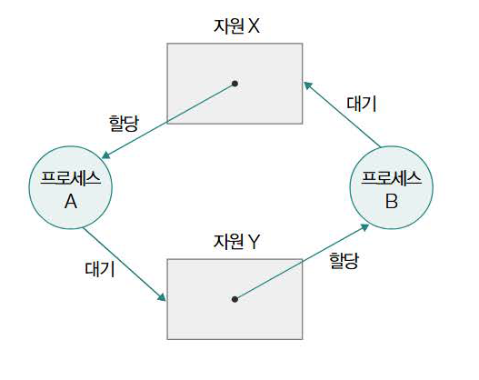
### 발생 조건
: 상호 배제, 점유와 대기, 비선점, 원형 대기의 필요조건이 있으며 하나라도 만족하면 교착상태는 발생하지 않고 모두 만족할 때 **발생할 가능성이 생긴다**
1. 상호 배제
  : 한 프로세스가 사용하는 자원을 다른 프로세스가 사용할 수 없는 상황
2. 점유와 대기
  : 한 프로세스가 어던 자원을 할당받은 상태(점유)에서 다른 자원을 할당받기를 기다리는 상태(대기)
3. 비선점
  : 자원이 비선점되었다는 말은 해당 자원을 이용하는 프로세스의 작업이 끝나야 비로소 자원을 이용할 수 있다는 것. 즉, 다른 프로세스의 자원을 강제로 빼앗지 못 하는 경우
4. 원형 대기
  : 프로세스가 요청한 자원이 원의 형태를 이루는 경우
  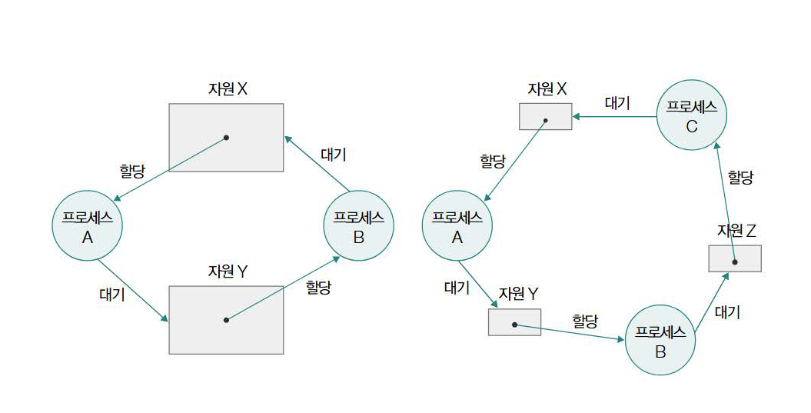

### 해결 방법
1. 교착 상태 예방
  - 교착 상태를 발생시키는 4가지 필요 조건 중 하나를 충족하지 못 하게 하는 방법
  - 한 프로세스에 필요한 자원 몰아주고, 그 뒤 다른 프로세스에 필요한 자원을 몰아주면 대기조건 만족 X
  - 할당 가능한 모든 자원에 번호 매겨 오름차순으로 할당하면 원형 대기 조건 만족 X

2. 교착 상태 회피
  - 교착 상태를 **한정된 자원의 무분별한 할당으로 인해 발생하는 문제**로 간주하여 자원을 조심히 할당
  - 참고(은행원 알고리즘): [만화로 배우는 은행원 알고리즘](https://velog.io/@minu-j/%EC%9A%B4%EC%98%81%EC%B2%B4%EC%A0%9C-%EB%A7%8C%ED%99%94%EB%A1%9C-%EC%95%8C%EC%95%84%EB%B3%B4%EB%8A%94-%EC%9D%80%ED%96%89%EC%9B%90-%EC%95%8C%EA%B3%A0%EB%A6%AC%EC%A6%98-%EA%B5%90%EC%B0%A9%EC%83%81%ED%83%9C-%ED%9A%8C%ED%94%BC-%EC%95%8C%EA%B3%A0%EB%A6%AC%EC%A6%98)

3. 교착 상태 검출 후 회복
  - 운영체제가 주기적으로 교착 상태 발생 여부 검사
  - 교착 상태 검출 시 프로세스를 **자원 선점을 통해 회복**시키거나 해당 프로세스를 **강제종료**함으로써 회복시킴
  자원 선점을 통한 회복이란? - 교착 상태가 해결될 때까지 다른 프로세스로부터 강제로 자원을 빼앗아 한 프로세스에 몰아서 할당하는 것

# 4. CPU 스케줄링
: 운영체제의 CPU 배분 방법
### 우선 순위
: CPU 활용률, 프로세스 종류 등의 기준을 고려하여 할당
- CPU 활용률: 전체 CPU 가동 시간 중 작업 처리 시간의 비율
- 프로세스 종류
  - 입출력 집중 프로세스
    -> 입출력 작업이 많은 프로세스, 입출력장치를 기다리는 작업인 **입출력 버스트**가 많이 일어남
  - CPU 집중 프로세스
    -> 복잡한 수학 연산이나 그래픽 처리 작업 등 CPU를 이용하는 **CPU 버스트**가 많이 일어나는 프로세스
- 입출력 집중 프로세스를 빨리 실행시켜 입출력장치를 끊임없이 작동시키고, CPU 집중 프로세스에 집중적으로 CPU를 할당하는 기준

### 스케줄링 큐
: 운영체제가 프로세스들이 자원을 이용하기 전 줄세우는 큐, 준비 큐와 대기 큐가 존재
- 준비 큐: CPU를 이용하고 싶은 프로세스의 PCB가 서는 줄
- 대기 큐: 대기 상태에 접어든 프로세스의 PCB가 서는 줄
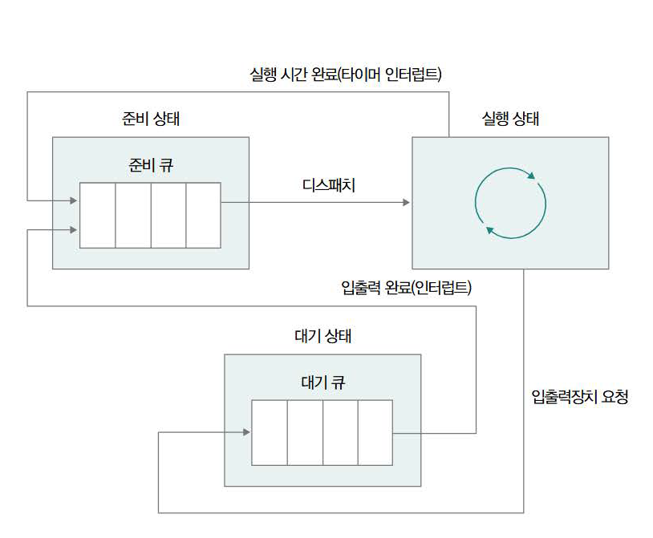

### 선점형 스케줄링과 비선점형 스케줄링
- 선점형 스케줄링
  - 어떤 프로세스가 CPU를 할당받아 사용하고 있어도 **운영체제가 프로세스로부터 CPU 자원을 강제로 빼앗아 다른 프로세스에 할당할 수 있는 스케줄링**
  - 실행 상태 -> 대기 상태(입출력 작업을 위한)의 스케줄링과 실행 상태 -> 준비 상태(타이머 인터럽트)로의 스케줄링 모두 수행되는 유형
  - 한 프로세스의 CPU 독점을 막고 골고루 자원 분배가 가능
  - 문맥 교환 과정에서 오버헤드 발생 가능
- 비선점형 스케줄링
  - 어떤 프로세스가 CPU 사용 중일 때 그 프로세스가 종료되거나 대기 상태에 접어들기 전까지 다른 프로세스가 끼어들 수 없는 방식
  - 문맥 교환 횟수가 적어 오버헤드 발생이 상대적으로 적음
  - 당장 CPU를 사용해야 하는 프로세스가 기다려야 하는 단점

## CPU 스케줄링 알고리즘
1. 선입 선처리 스케줄링
  : 준비 큐에 삽입된 순서대로 CPU 할당하는 방식
  -> 프로세스를 기다리는 시간이 매우 길어질 수 있다(호위 효과)

2. 최단 작업 우선 스케줄링
  : 준비 큐에 삽입된 프로세스 중 CPU 이용 시간이 가장 짧은 프로세스부터 실행하는 방식
  -> 기본적으로 비선점형 스케줄링으로 분류되지만 선점형으로 구현도 가능

3. 라운드 로빈 스케줄링
  : 선입 선처리 스케줄링에 타임 슬라이스라는 개념이 더해진 방식
  -> 타임 슬라이스: 프로세스가 CPU를 사용하도록 정해진 시간
  -> 준비 큐에 삽입된 순서대로 이용하되 정해진 시간만 CPU를 이용하는 선점형 스케줄링

4. 최소 잔여 시간 우선 스케줄링
  : 최단 작업 우선 스케줄링과 로빈 스케줄링을 합친 방식
  -> 정해진 타임슬라이스만큼 CPU를 이용하되 남은 작업시간이 가장 적은 프로세스를 우선 선택

5. 우선순위 스케줄링
  : 프로세스에 우선순위를 부여하고 가장 높은 우선순위를 가진 프로세스부터 실행하는 방식
  -> 우선순위가 낮은 프로세스는 계속해서 실행이 연기될 수 있다는 부작용이 존재(아사 현상)
  -> 에이징(오래 대기한 프로세스의 우선순위를 점차 높이는 방식)을 이용해 아사를 방지함

6. 다단계 큐 스케줄링
  : 우선순위 스케줄링의 발전된 형태, 우선순위 별 여러 개의 준비 큐를 사용하는 방식
  -> 우선순위가 가장 높은 큐에 있는 프로세스 처리하고 그 큐가 비면 그 다음 우선순위의 큐를 처리
  -> 우선순위 낮은 프로세스가 계속 연기될 수 있다는 단점

7. 다단계 피드백 큐 스케줄링
  : 다단계 큐 스케줄링과 비슷하지만 **프로세스들이 큐 사이를 이동할 수 있다**
  -> 새롭게 진입하는 프로세스는 우선순위 가장 높은 큐에 삽입되고 해당 큐에서 실행이 끝나지 않으면 다음 우선순위 큐에 삽입
  -> 이 과정을 반복하여 결국 CPU 사용 시간이 긴 프로세스의 우선순위가 가장 낮아지는 방식

## 리눅스 CPU 스케줄링
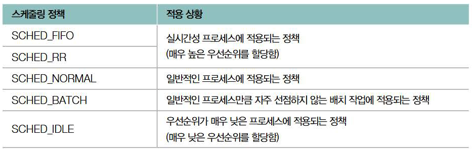
- SCHED\_FIFO, SCHED\_RR
  : RealTime 스케줄러에 의해 이뤄지는 스케줄링
  -> 실시간성이 강조된 프로세스에 적용되는 스케줄링 정책
- SCHED\_NORMAL
  : 일반적인 프로세스에 적용되는 정책
  -> CFS라는 스케줄러에 의해 작동
  -> CFS란? - 프로세스에 대해 완전히 공평한 CPU 시간 배분을 지향하는 스케줄러
  -> 프로세스 별 **가상 실행 시간(vruntime)**이 가장 작은 프로세스부터 스케줄링

# 5. 가상 메모리
## 물리 주소와 논리 주서
- 물리 주소: 메모리의 하드웨어 상 실제 주소
- 논리 주소: 프로세스마다 부여되는 0번지부터 시작하는 주소 체계
**메모리 관리 장치(MMU)**에 의해 CPU와 메모리 간 주소 변환이 이루어짐

## 스와핑과 연속 메모리 할당
### 스와핑
: 입출력 작업을 요구하며 대기 상태가 되었거나 오래 사용되지 않은 프로세스들을 임시로 **스왑 영역**이라는 보조 기억장치의 일부 영역으로 쫓아내고**(스왑 아웃)** 다른 프로세스를 실행하는**(스왑 인)** 메모리 관리 방식을 **스와핑**이라고 함

### 연속 메모리 할당과 외부 단편화
- 연속 메모리 할당: 메모리 내 프로세스들을 연속적으로 배치하는 방식
- 외부 단편화: 연속적으로 프로세스들이 할당된다면 메모리 간 빈 공간이 생겨 큰 프로세스를 적재하지 어려운 상황이 발생하여 메모리 낭비가 생기는 현상

## 페이징을 통한 가상메모리 관리
- 가상 메모리: 실행하고자 하는 프로그램의 일부만 메모리에 적재해 실제 메모리보다 더 큰 프로세스를 실행할 수 있게 하는 메모리 관리 기법
  -> 페이징, 세그멘테이션이 존재

### 페이징
: 프로세스의 논리 주소 공간을 **페이지**라는 단위로 나누고 물리 주소 공간을 **프레임**(페이지와 동일한 크기)이라는 단위로 나눈 뒤 **페이지를 프레임에 할당하는 가상 메모리 관리 기법**
  -> 프로세스를 구성하는 페이지가 물리 메모리 내 불연속적으로 배치될 수 있다는 것을 유의
  -> 불연속적으로 할당하여 빈 공간 없이 배치해 외부 단편화가 발생하지 않음
  -> 페이지 단위로 **페이지 아웃, 페이지 인**이 발생

### 세그멘테이션
: 프로세스를 일정한 크기의 페이지 단위가 아닌 가변 크기의 **세그먼트** 단위로 분할하는 방식
  -> 세그먼트 크기가 일정하지 않아 외부 단편화가 발생할 수 있음

### 페이지 테이블
: 물리 메모리 내 페이지가 불연속적으로 배치되어 있어 CPU가 다음으로 실행할 페이지 위치를 찾기 어려운 문제를 해결하기 위해 페이지와 실제 적재된 프레임을 짝지어주는 정보인 **페이지 테이블**을 활용
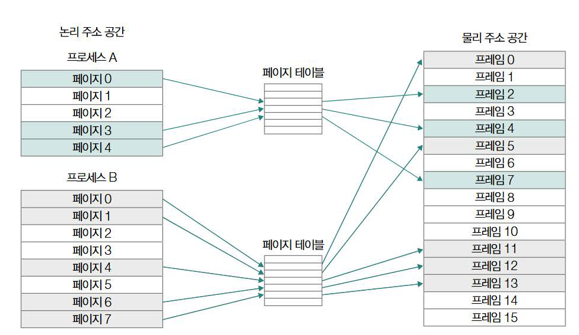
  -> 각각의 행들을 **테이블 엔트리**라고 함
  -> 해당 페이지에 접근이 가능한지 여부를 알려주는 **유효 비트** 포함, 유효 비트가 0인 페이지에 접근 시 **페이지 폴트**라는 예외 발생
  -> 페이지 보호 기능을 위해 존재하는 **보호 비트** 포함
  -> CPU가 해당 페이지에 접근한 적이 있는지 여부를 나타내는 **참조 비트** 포함
  -> 해당 페이지에 데이터를 쓴 적이 있냐 여부를 알려주는 **수정 비트** 포함

* 모든 프로세스의 크기가 페이지의 배수가 아니기 때문에 페이지 하나의 크기보다 작은 크기로 발생하는 메모리 낭비인 **내부 단편화**가 발생 가능

각 프로세스의 페이지 테이블은 메모리에 적재될 수 있으며 특정 프로세스의 페이지 테이블이 적재된 메모리 상의 위치를 가리키는 레지스터는 **페이지 테이블 베이스 레지스터(PTBR)**라고 함
-> 모든 프로세스의 페이지 테이블을 메모리에 두면 메모리 접근 횟수가 많아지고 메모리 용량을 많이 차지하기에 비효율적이므로 다음과 같은 해결책을 사용
1. 메모리 접근 횟수
  -> TLB(Translatoin Look-aside Buffer)라는 페이지테이블의 캐시메모리 사용
  -> CPU가 접근하려는 논리 주소의 페이지 번호가 TLB에 있는 경우 TLB가 CPU에게 해당 페이지 번호가 적재된 프레임 번호를 알려주는 **TBL 히트**가 발생해 한 번만 메모리에 접근이 가능
  -> 페이지 번호가 TLB에 없는 경우 CPU가 메모리에 접근해야 하는 상황을 **TBL 미스**라고 함

2. 메모리 용량
  -> 페이지 테이블을 페이징하는 방식인 **계층적 페이징**을 사용
  -> 모든 페이지 테이블을 항상 메모리에 유지할 필요가 없어 효율적인 사용이 가능

### 페이징 주소 체계
- 페이지 번호: 몇 번째 페이지 번호에 접근할지를 나타냄
- 변위: 접근하려는 주소가 페이지 시작 번지로부터 얼만큼 떨어져 있는지 나타냄
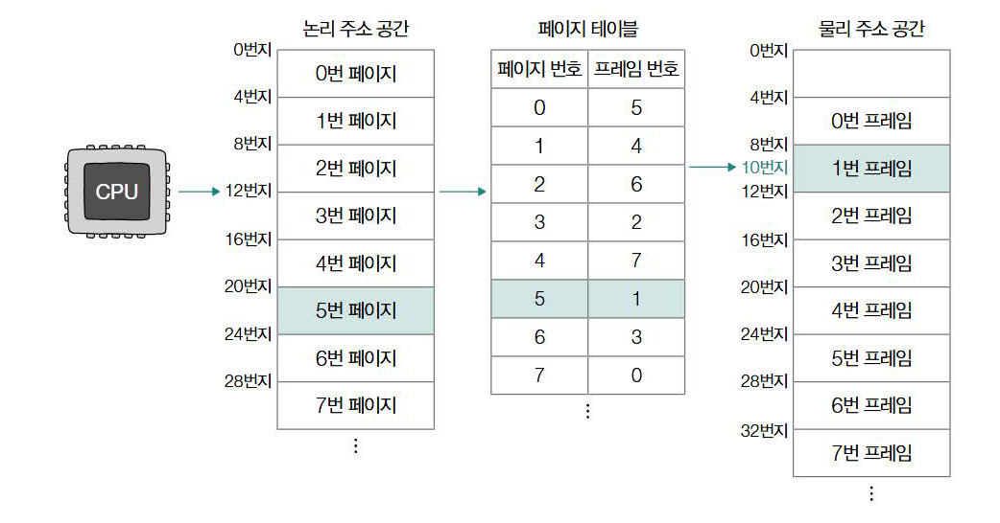

## 페이지 교체 알고리즘
1. 요구 페이징
  : 메모리에 필요한 페이지만 적재하는 기법
  - CPU가 특정 페이지에 접근하는 명령어 실행
  - 해당 페이지가 현재 메모리에 있는 경우(유효 비트가 1인 경우) CPU는 페이지가 적재된 프레임에 접근
  - 해당 페이지가 현재 메모리에 없는 경우(유효 비트가 0인 경우) 페이지 폴트 발생
  - 페이지 폴트 발생 시 처리 루틴을 통해 해당 페이지를 메모리로 적재
  - 다시 접근

2. 순수 요구 페이징
  : 아무런 페이지도 메모리에 적재하지 않은 채 무작정 프로세스 실행하는 것
  - 첫 명령어부터 페이지 폴트가 발생하고 이후 점점 발생 빈도 떨어짐

3. 페이지 교체 알고리즘
  : 메모리에 페이지가 가득 찬 상황에서 메모리에 적재된 페이지 중 보조기억장치로 내보낼 페이지를 선택하는 방법
  - 페이지 폴트 발생 빈도와 관련이 있어 컴퓨터 전체 성능과 직결됨
  - FIFO 페이지 교체 알고리즘: 메모리에 가장 먼저 적재된 페이지부터 순차 스왑아웃, 줄곧 참조되고 있는 페이지를 스왑 아웃할 수 있음
  - 최적 페이지 교체 알고리즘: 사용 빈도가 가장 낮은 페이지를 교체하는 알고리즘, 앞으로 가장 적게 사용될 페이지를 예측하기 어려워 실제 구현이 어려움
  - LRU 페이지 교체 알고리즘: 가장 적게 사용한 페이지를 교체하는 알고리즘

# 6. 파일 시스템
## 파일과 디렉터리
### 파일
: 파일의 이름, 파일을 실행하기 위한 정보, 파일과 관련한 부가 정보(속성 혹은 메타데이터)로 구성되어 있음
- 프로세스는 파일을 구분하기 위해 **파일 디스크립터**라는 정보를 사용

### 디렉터리
: 운영체제가 여러 파일을 관리하기 위해 이용하는 것, 폴더라고도 불림
- 오늘 날의 디렉터리는 여러 계층을 가진 **트리 구조 디렉터리**로 관리됨
- 디렉터리 정보를 활용해 파일 위치를 특정하는 정보를 **경로**라고 함

### 파일 할당
: 운영체제는 파일과 디렉터리를 **블록**이라는 단위로 읽고 쓰는데 파일이 보조기억장치 안에 저장될 때 블록을 할당받아 저장됨
- 연결 할당: 각 블록의 일부에 다음 블록의 주소를 저장하는 형태
- 색인 할당: 파일을 이루는 모든 블록의 주소를 **색인 블록**이라는 블록에 모아 관리하는 방식

## 파일 시스템
- 포매팅: 파일 시스템을 설정하여 어떤 방식으로 파일을 저장하고 관리할지를 결정하고 새로운 데이터를 쓸 준비를 하는 작업

### 아이노드 기반 파일 시스템
: 파일마다 각각의 아이노드를 가지고 아이노드에 각각의 번호를 부여해 관리하는 시스템
- EXT4 파일 시스템이 대표적임
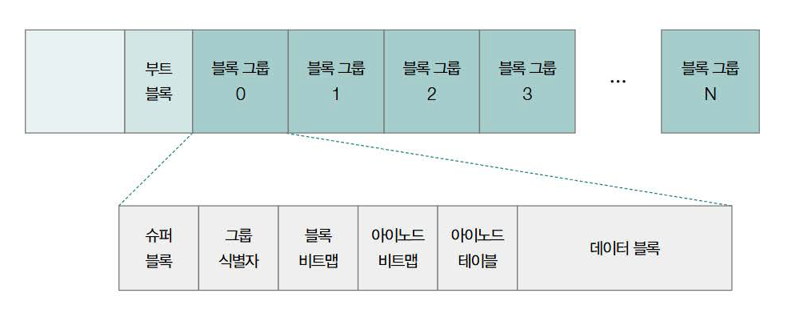
아이도느는 파티션 내 특정 영역에 모여있어 데이터 영역에 공간이 남아있더라도 아이노드 영역이 가득차면 새로운 파일을 생성할 수 없다

### 마운트
: 어떤 저장장치의 파일 시스템에서 다른 저장장치의 파일 시스템으로 접근할 수 있도록 파일 시스템을 편입시키는 작업
ex) USB의 파일 시스템을 컴퓨터의 '/mnt' 경로로 마운트하면 USB의 파일 시스템에 접근할 수 있다.
